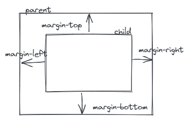

简单回忆以下box model，如下图所示:

从图中可以清晰看到margin是在box board之外的，也就是margin是父子元素，兄弟元素之间的一个距离。




本篇简单说一下margin使用时的一些问题。

## margin 合并
```html
<style type=script/css>
#id1{
	width: 100%;
	height: 200px;
	margin-bottom: 20px
	background-color: black
}
#id2{
	width: 100%;
	height: 200px;
	margin-top: 10px;
	background-color: red
}
</style>


<body>
	<div id=id1></div>
	<div id=id2></div>
</body>
```


如图所示，那两个block之间的距离是多少呢？ 是20px。 为啥不是30px呢？ 这就是margin merge。 margin merge并不是两个margin相加，而是保留其中一个比较大的margin。

margin的合并，只影响上下，不影响左右。
## 负 margin使用

正margin的作用会增加两个block之间的距离，那负margin的作用是什么呢？
总结如下：
**负 margin-top，margin-left 会让当前的block向上，向左移动设置的像素值。**
**负margin-bottom 会让当前block下面的元素向上移动设置的像素值。**
**负margin-right  会让当前block右面的元素向左移动设置的像素值。**

也就是负的margin-top，margin-left作用于当前的元素上，负的margin-bottom作用于下面的元素，负的margin-right作用于右面的元素。


