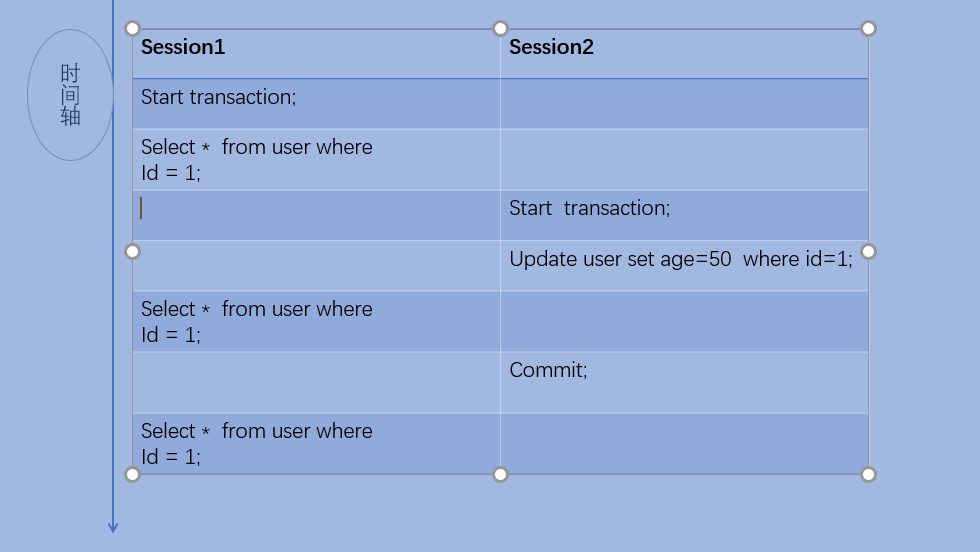
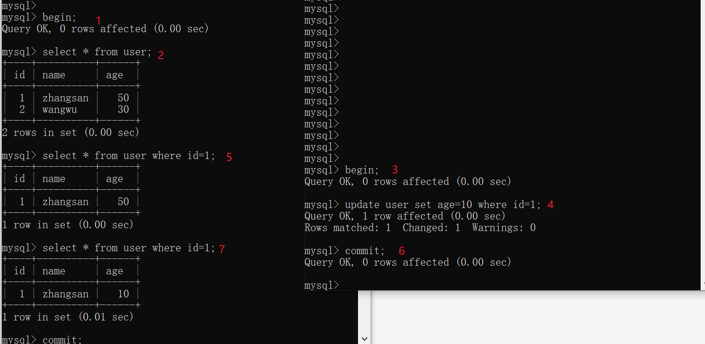
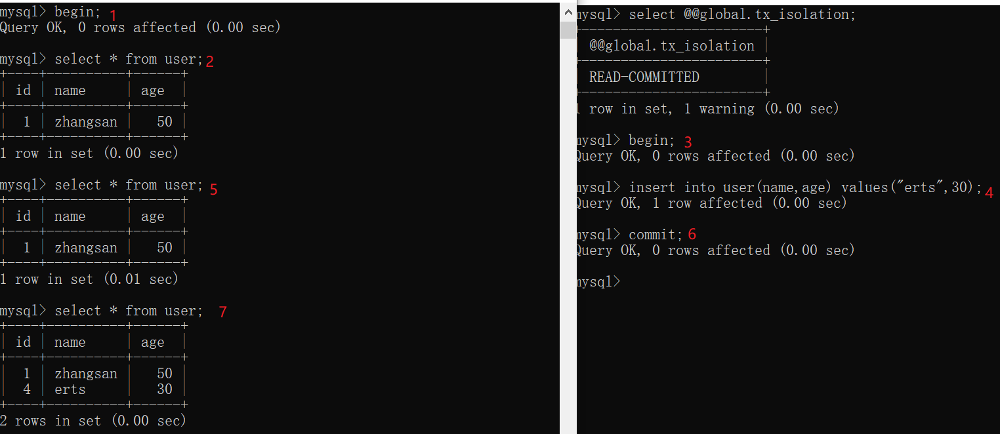
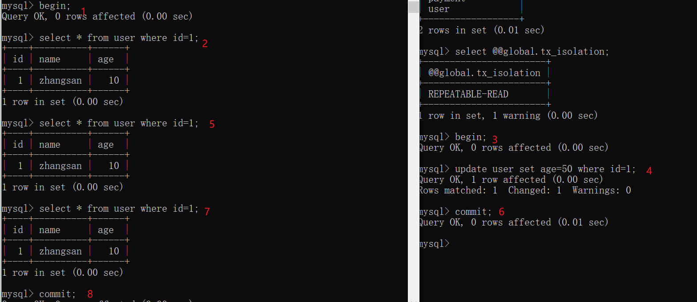
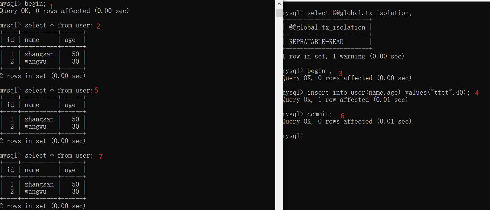
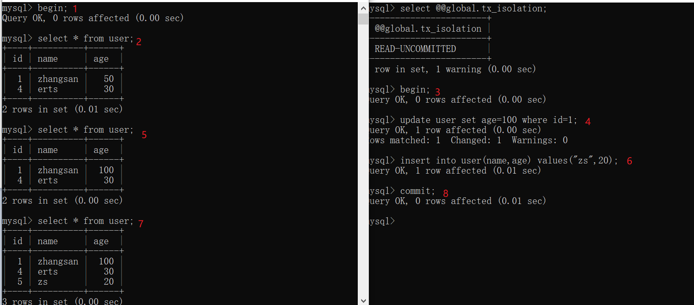

[TOC]

# mvcc

muti-version  Concurrent control(多版本并发控制). mvcc 只在read committed 和 repeatable read两个隔离模式下生效，本篇在看一下在这两个模式下并发演示。

```sql
create table user(
	id int not null AUTO_INCREMENT,
    name varchar(50),
    age int,
    primary key(id)
)engine=InnoDB AUTO_INCREMENT=1 DEFAULT CHARSET=UTF8;

insert into user(name,age) values("zhangsan",20),("wangwu",30);
```

总的操作流程:



read committed操作流程:



插入操作：



在read committed隔离级别下，更新和插入会影响其他的事务，产生不可重复读的现象。因为在read committed级别下，每次查询都会去生成read view，当其他事务提交后，就会影响当前的事务。


repeatable read 更新的操作流程:



写操作：



从这里看出，当隔离级别为repeatable时，更新和插入操作，都没能影响另一个事务的读取。可见mvcc在repeatable read级别下解决了幻读问题。

这里也可以看到read uncommitted 级别下的现象，当然了mvcc在此隔离级别下是不生效的。

read uncommitted: 



可以看到read uncommitted下无论另一个事务是否提交，都能查询到脏数据。因为read committed每次都会去查询最新数据。


参考文档:

https://zhuanlan.zhihu.com/p/66791480

https://zhuanlan.zhihu.com/p/52977862

https://zhuanlan.zhihu.com/p/52312376

https://juejin.im/post/6844904194206351373

https://juejin.im/post/6844903760943120397


