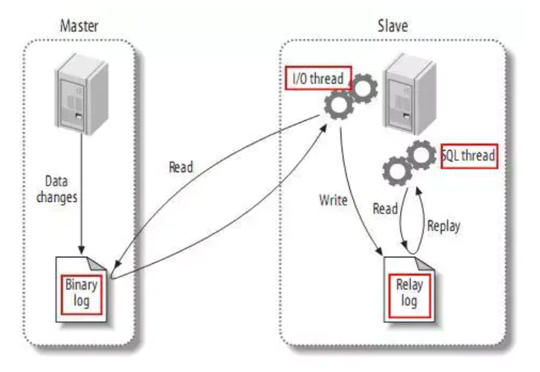
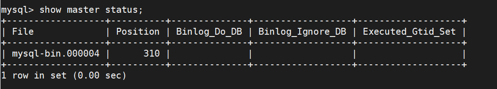

[TOC]

# mysql主从搭建

## 主从复制原理

主从复制是指一台服务器充当主数据服务器，另外一台或多台服务器充当从数据库服务器，主服务器中的数据自动复制到从服务器中。对于多级复制，数据库服务器即可充当主机，也可充当从机。MySql主从复制的基础是主服务器对数据库修改记录到二进制日志，从服务器通过主服务器的二进制日志自动执行更新。


## 主从复制类型

### 基于语句的复制

主服务器上面执行的语句在从服务器上面再执行一遍，在MySQL-3.23版本以后支持。

存在问题：时间上可能不完全同步造成偏差，执行语句的用户也可能不是同一个用户。


### 基于行的复制

把主服务器上面改变后的内容复制过去，而不关心到底改变该内容的是由那条语句引起的，在MySQL-5.0版本中引入。

存在问题：如果修改的行数过多，造成的开销比较大。

**注意：**MySQL默认使用语句语句的复制，当基于语句的复制会引发问题的时候就会使用基于行的复制，MySQL会自动进行选择。

在MySQL主从复制架构中，读操作可以在所有的服务器上运行，而写操作只能在主服务器上面运行。主从复制架构虽然给读操作提供了扩展，可如果写操作也比较多的话（多台从服务器还要从主服务器上同步数据），单主模型的复制中主服务器势必会成为性能瓶颈。

## mysql主从复制的工作原理



如上图所示，主服务器上面的任何修改都会保存到二进制日志Binary log里面，从服务器上面启动一个I/O thread（实际上就是一个主服务器的客户端进程），连接到主服务器上面请求读取二进制日志，然后把读取到的二进制日志写到本地的一个Realy log里面。从服务器上面开启一个SQL thread定时检查Relay log，如果发现有更改立即把更改的内容AI本机上执行一遍。

如果一主多从的话，这时主库既要负责写又要负责为几个从库提供二进制日志。此时可以稍微做调整，将二进制日志只给某一从，这一从再开启二进制日志并将自己的二进制日志再转发给其他从节点。或者干脆这个从不记录只负责将二进制日志转发给其他从节点，这样架构起来性能可能要好得多，而且数据之间的延时性也稍微好一些。

## mysql主从复制的过程

1. slave上面的IO进程连接上master，并请求从指定日志文件的指定位置（或者从最开始的日志）之后的内容
2. master接收到来自slave的IO进程的请求后，负责复制的IO进程会根据请求信息读取日志指定位置后的日志信息，返回给slave的IO进程。返回信息中除了日志所包含的信息之外，还包括本地返回的信息在master端的bin-log文件的名称以及在bin-log的位置
3. slave的IO进程接收到信息后，将接收到的日志内容依次添加到slave端的relay-log文件的最末端，并将读取到的master的bin-log的文件名和位置记录到master-info文件中，以便在下一次读取的时候能够清楚的告诉master从何处开始读取日志
4. slave的sql进程检测到relay-log中新增了内容后，会马上解析relay-log中的内容，把其解析成在master端真实执行时候的那些可执行的内容，并在自身执行。


## 主从复制配置

### master 配置

配置文件：

```properties
[mysqld]
# 同一个局域网内注意id要唯一 
server-id=100
# 开启二进制日志功能，名字随便（关键）
log-bin=mysql-bin
```

修改后重启生效：systemctl restart mysqld

在master数据库创建数据同步用户，授予用于用户replication slave权限和replication client权限，用于在主从库之间同步数据。

```shell
# 创建用户
create user 'slave'@'%' identified by 'admin@123';
# 授权权限
grant replication slave, replication client on *.* to 'slave'@'%;
```

查看状态:

```shell
show master status;
# 记录下file和position的值，用于后面配置slave使用
```




### slave配置

my.cnf 文件：

```properties
[mysqld]
## 同一个局域网需唯一
server-id=101
## 开启二进制日志功能,以备slave作为其他slave的master时使用
log-bin=mysql-slave-bin
## relay_log配置 中继日志
relay_log=mysql-relay-bin
```

修改后重启生效。重启后重新登录：

```shell
# slave节点的配置 
change master to master_host='172.12.0.2',master_user='slave',master_password='admin@123',master_port=3306,master_log_file='mysql-bin.000003',master_log_pos=2320,master_connect_retry=30;

# 参数解析:
master_host: master的地址
master_port: master的端口
master_user: 用于数据同步的用户
master_password: 用于同步的用户的密码
master_log_file: 指定slave从哪个日志文件开始复制数据，即上文中提到的file字段的值
master_log_pos:从哪个position开始读，即上文中提到的position字段的值
master_connect_retry:如果连接失败，重试的时间间隔，单位是秒，默认是60秒。
```

查看状态：

```shell
# 查看主从同步的状态,此时的 slaveIORUnning和slaveSQLRunning都是No,因为还没有卡其主从复制过程
show slave status \G;
# 开始主从复制过程; 此时再次查看同步状态,slaveIORunning和slaveSQLRunning都是yes说明主从复制已经开启.
start slave;
# 关闭主从复制过程
stop slave;
```

```shell

mysql> show slave status \G;
*************************** 1. row ***************************
               Slave_IO_State: Waiting for master to send event
                  Master_Host: 10.163.249.146
                  Master_User: slave
                  Master_Port: 3306
                Connect_Retry: 30
              Master_Log_File: mysql-bin.000004
          Read_Master_Log_Pos: 310
               Relay_Log_File: mysql-relay-bin.000002
                Relay_Log_Pos: 476
        Relay_Master_Log_File: mysql-bin.000004
             Slave_IO_Running: Yes
            Slave_SQL_Running: Yes
              Replicate_Do_DB:
          Replicate_Ignore_DB:
           Replicate_Do_Table:
       Replicate_Ignore_Table:
      Replicate_Wild_Do_Table:
  Replicate_Wild_Ignore_Table:
                   Last_Errno: 0
                   Last_Error:
                 Skip_Counter: 0
          Exec_Master_Log_Pos: 310
              Relay_Log_Space: 683
              Until_Condition: None
               Until_Log_File:
                Until_Log_Pos: 0
           Master_SSL_Allowed: No
           Master_SSL_CA_File:
           Master_SSL_CA_Path:
              Master_SSL_Cert:
            Master_SSL_Cipher:
               Master_SSL_Key:
        Seconds_Behind_Master: 0
Master_SSL_Verify_Server_Cert: No
                Last_IO_Errno: 0
                Last_IO_Error:
               Last_SQL_Errno: 0
               Last_SQL_Error:
  Replicate_Ignore_Server_Ids:
             Master_Server_Id: 100
                  Master_UUID: c6af7127-0d33-11eb-a803-525400b1d6bf
             Master_Info_File: /var/lib/mysql/master.info
                    SQL_Delay: 0
          SQL_Remaining_Delay: NULL
      Slave_SQL_Running_State: Slave has read all relay log; waiting for more updates
           Master_Retry_Count: 86400
                  Master_Bind:
      Last_IO_Error_Timestamp:
     Last_SQL_Error_Timestamp:
               Master_SSL_Crl:
           Master_SSL_Crlpath:
           Retrieved_Gtid_Set:
            Executed_Gtid_Set:
                Auto_Position: 0
         Replicate_Rewrite_DB:
                 Channel_Name:
           Master_TLS_Version:
1 row in set (0.00 sec)

ERROR:
No query specified
```


my.cnf中相关的其他配置：

```properties
# 执行想要主从同步哪个数据库
binlog-do-db=指定mysql的binlog记录哪个db;如果要配置多个,重复配置这个选项即可
replicate-do-db=需要复制的数据库名,如果复制多个数据库,重复设置这个选项即可
replicate-ignore-db=需忽略的数据库名,如果复制多个数据库,重复设置这个选项

example: 
# 复制test  jj  xx数据库
binlog-do-db=test
binlog-do-db=jj
binlog-do-db=xx
```

修改同步所有的库和表：

```shell
stop  slave SQL_THREAD;
change replication filter replicate_do_db=();
start slave SQL_THREAD;
```

如果有什么问题，可以查看msyql的日志。


