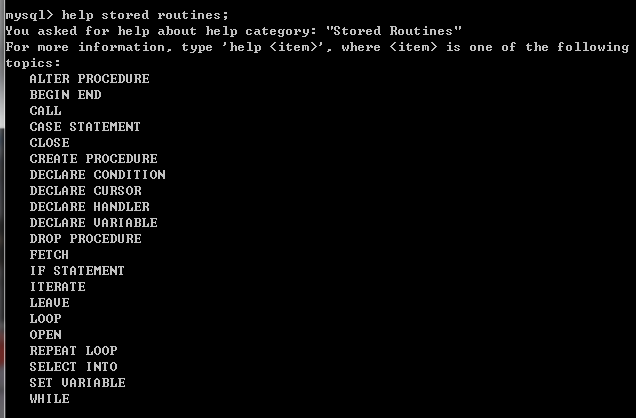

[TOC]

# MySql-function-procedure

老样子，看一下命令行中关于procedure存储过程的帮助：



可以看出来，这些关键字大都是关于编写存储过程和函数的语句。

那看也看了，来个示例把：

```shell
## 此是把结束符号设置为$$,这样在编写存储过程时，";"就不会被解析为结束,等存储过程编写完，再修改回来
delimiter $$;
delimiter ;
```

## Procedure

### 示例一(最简单的存储过程)

```shell
# 示例一(创建一个简单的存储过程)
drop procedure if exists sp1;   # 如果存在sp1存储过程，则删除
create procedure sp1() select 1;   # 创建一个存储过程
## 调用:
call sp1();
```

### 示例二(带参数的存储过程)

```shell
# 带输入参数的存储过程
delimiter @   # 设置的结束符号
CREATE PROCEDURE sp2(IN p int)
comment 'insert into a int value'
begin
## 声明一个整型变量
declear v1 int;
## 将输入参数赋值给变量
set v1 = p;
## 把数据插入到表中
insert into user1(age) values(v1);
end  # 结束
@   # 表示结束
delimiter ;  # 把结束符修改回来

# 调用
call sp2(20);
# 查看表数据
select * from user1;
```


### 示例三(带输出参数的存储过程)

```shell
drop procedure if exists sp2;  # 如果已经存在，就删除掉
delimiter @    # 设置结束符号
# 创建存储过程
CREATE PROCEDURE sp2(OUT p int)
# deterministic 此字句表示输入和输出的值都是确定的， 不会改变，目前mysql没有实现
# 故加不加 都是  no deterministic的
DETERMINISTIC
begin
# 选择最大值 并存储到p中
select max(id) into p from user1;
end
@

delimiter ;  # 结束符修改回来
# 调用
call sp2(@pv)
select @pv;
```


### 示例四(带输入和输出参数)

```shell
delimiter @
# 创建
create procedure sp3(IN p1 int, OUT p2 int)
begin
declare v1 int;
# if判断语句
if p1=1 then
set v1 = 10;
else
set v1 = 20;
end if;
insert into user1(age) values(v1);
select max(age) into p2 from user1;
end @

delimiter ;

# 调用
call sp3(1,@ret)
select @ret
```


### 示例五(即做输入又做输出参数的存储过程)

```shell
create procedure sp4(INOUT p4 int)
begin
declare v1 int;
if p4=4 then
set v1 = 400;
else
set v1 = 500;
end if;
set p4=v1;
end @

# 调用
## 先设置一个变量
set @tmp=4;
call sp4(@tmp)
select @tmp;
```


## function

直接上一个例子：

```shell
delimiter $$
drop function if exists genPerson;
# 创建函数
create function genPerson(name varchar(50)) return varchar(50)
begin
declare str varchar(50);
set @table=name;
set str=concat('create table ',@table);
return str;
end $$
# 结束符修改回来
delimiter ;

# 调用
select genPerson('student');
```

## trigger

直接上示例

在触发器中有before insert, after insert , after delete 等事件。

在insert插入事件时，NEW表示新插入的值

update事件时，NEW表示新值，OLD表示旧值

关键点:

1. 监视地点：table
2. 监视事件：insert 、update、delete
3. 触发时间：after，before
4. 触发时间：insert，update，delete
5. 引用变量：new 新行，old 旧行

```shell
delimiter $$
drop trigger if exists t1 $$
create trigger t1 after insert
on user1 for each row
begin
# 实现表数据的一个同步，插入user1一条数据  就把相同的数据插入到user2一份
insert into user2(age) values(NEW.age);
end $$
```

