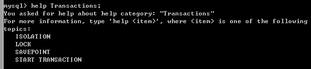
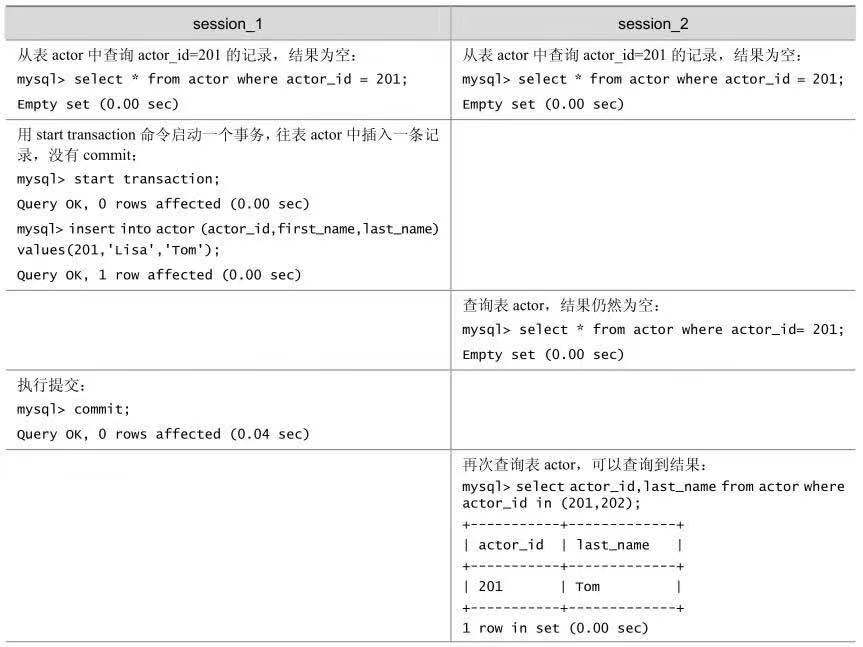
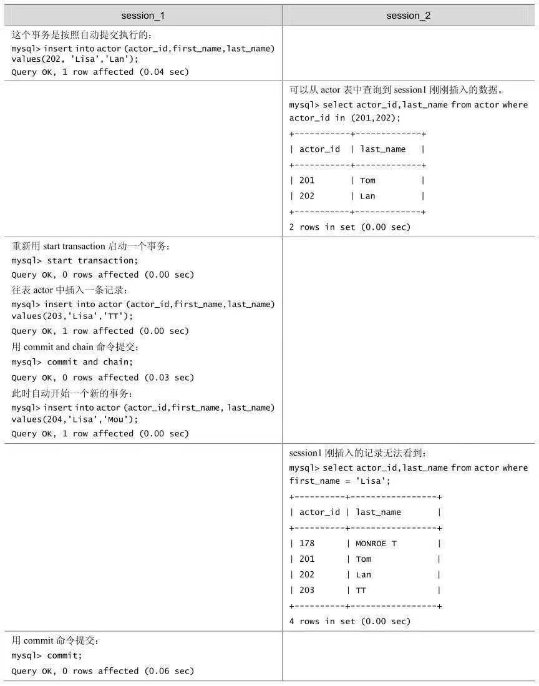
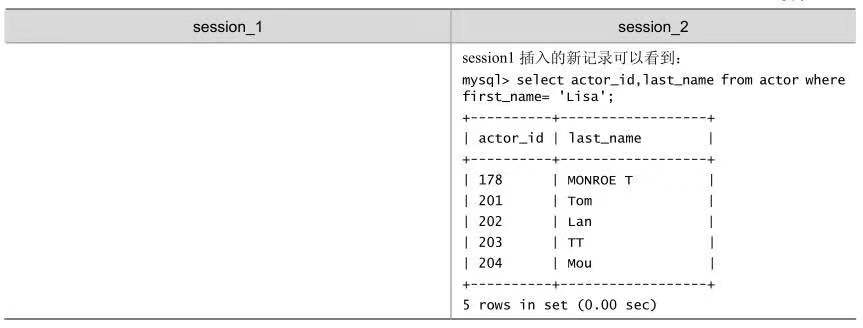
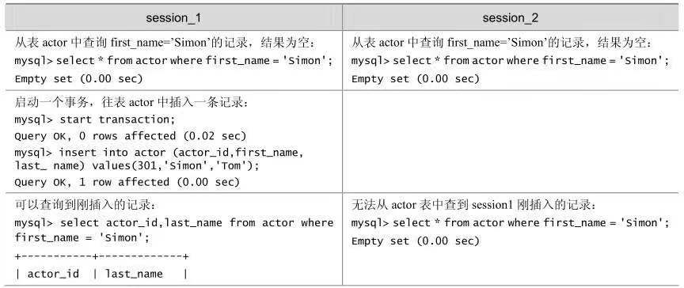
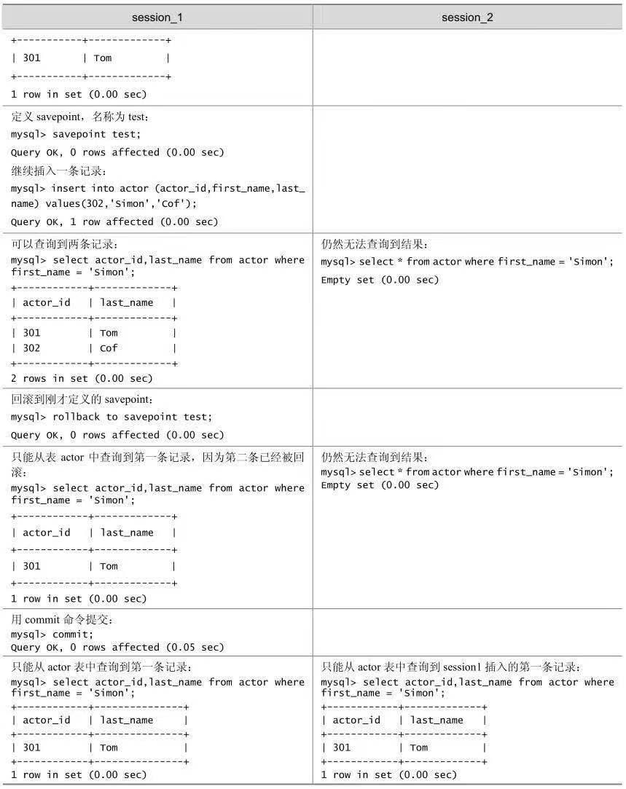
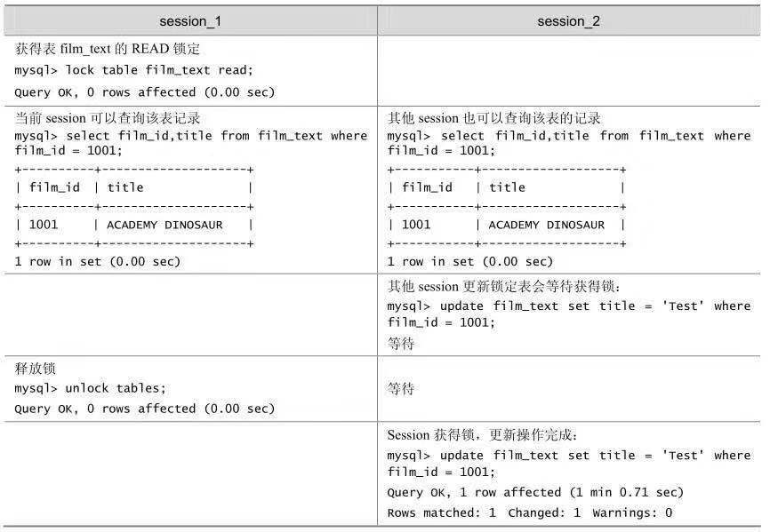
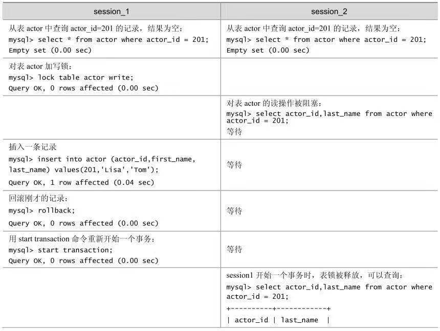
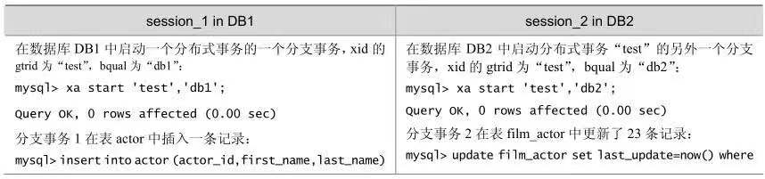
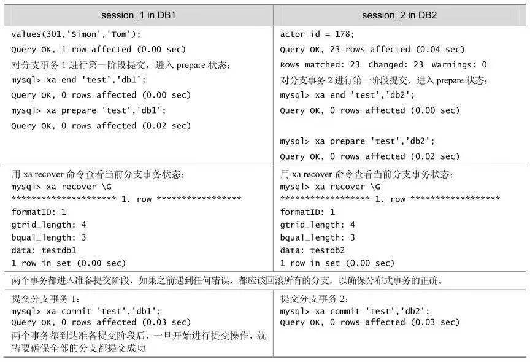

[TOC]

# MySql-transaction-lock

本篇说一下命令行中的事务和锁的使用以及一些示例。

还是老样子了，看一下自带的帮助文档中关于事务和lock的支持的命令或者叫关键字。（此操作也是为了到时在线上环境操作时，万一忘了命令，可以快速找一些提示，而且这还是官方的呢。什么，你说你不会忘？嗯好吧，我承认，我会忘。。。。），好了，废话到此，接来下看书说话。

看一下事务的帮助文档把：



可以看到，一种就只有四个关键字，关于事务的2个(SAVEPOINT，START TRANSACTION)，锁一个(LOCK)，隔离级别一个(ISOLATION)。

## 1.事务

老规矩，直接看一下语法：

```shell
savepoint 使用语法:
Syntax:
	# 设置一个回滚点
	SAVEPOINT identifier
	# 会滚到一个回滚点
	ROLLBACK [WORK] TO SAVEPOINT idendtifier
	# 释放回滚点
	RELEASE	SAVEPOINT identifier
start transaction使用语法:
Syntax:
	# 开启一个事务
	START TRANSACTION | BEGIN [WORK]
	# 提交事务
	# commit and chain 提交并开启一个新事物
	COMMIT [WORK] [AND [NO] CHAIN] [[NO] RELEASE]
	# 回滚
	ROLLBACK [WORK] [AND [NO] CHAIN] [[NO] RELEASE]
	# 设置是否自动提交
	SET AUTOCOMMIT = {0 | 1}
```

看几个示例把：

1.一个简单的事务操作



2.提交并开启一个新事物





3.设置回滚点





## 2.锁

接下来看一下锁把。

先看语法：

```shell
Syntax:
	# 加锁
	LOCK TABLES tbl_name [AS alias] {READ [local] | [low_priority] WRITE}
		[,tbl_name [AS alias] {READ [local] | [low_priority] WRITE}]
	
	# 解锁
	UNLOCK TABLES
```

语法看起来比较简单了，看几个示例：






## 3.设置隔离级别

这个就比较简单了，直接看语法把：

```shell
Syntax:
SET [GLOBAL | SESSION] TRANSACTION ISOLATION LEVEL {READ UNCOMMITTED |
	READ COMMITTED | REPEATABLE READ | SERIALIZABLE}
```


## 4. mysql分布式事务

看一下个mysql的分布式事务示例，了解一下:



