[TOC]

# MySql的一些优化策略

## 1.根据状态查看当前数据库是那种操作多

```shell
# 使用命名查看当前数据库中哪种操作多，好去定位做些什么优化
--> show [sessoin | global ] status
--> show status like 'Com_%';    # 进行一些过滤
# 也可以使用此命令进行查看
mysqladmin extended-status -h host -p password
```

显示如图：

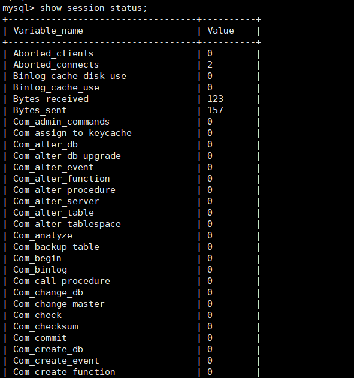

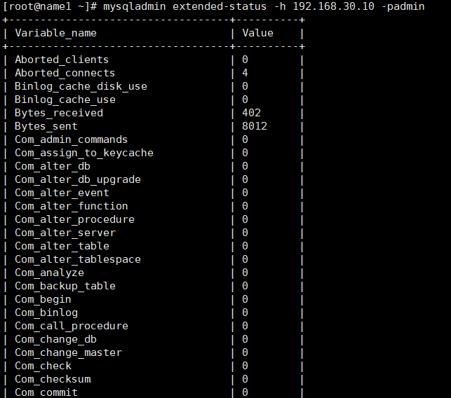


从上图结果中可以看到有很多都是很多的统计数据。不过这里主要看Com_select，Com_delete，Com_insert，

Com_update这些统计值，以此来评估此数据库查询操作多，还事插入删除更新操作多。

一些其他统计值：

```shell
Innodb_rows_read：执行select查询的行数
Innodb_rows_inserted: 执行inserted插入的行数
Innodb_rows_updated: 执行update更新的行数
Innodb_rows_deleted:执行delete操作删除的行数
Connections: 试图连接mysql服务器的次数
Uptime:服务器工作时间
Slow_queries:慢查询次数
```

## 2.定位效率较低的SQL

方式一：通过慢查询日志定位那些执行效率较低的SQL语句。

```shell
# 在启动mysql时，使用如下参数启动，mysql会写一个包含所有执行时间大于long_query_time秒的sql语句的日志文件.
--log-slow-queries[=file_name]
```

慢查询日志在查询结束以后才记录，所以在应用反应执行效率出现问题的时候查询慢日志并不能定位问题。

方式二：使用命令行定位问题。

```shell
# 使用此命令查看当前mysql在进行的线程，包括线程的状态，是否锁表，可以实时查看sql的执行情况，同时对一些锁表操作进行优化.
--> show processlist
```


## 3. EXPLAIN分析

通过Explain 或desc 查看sql语句执行计划，先看一个示例：

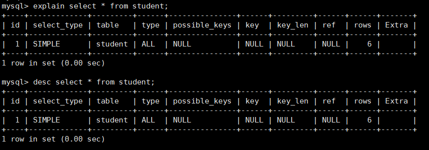

对每个列的内容简单说一下：

```shell
select_type:表示SELECT的类型，常见的取值有SIMPLE(简单表，即不适用表连接或子查询)，PRIMARY(主查询，即外层的查询)，UNION(UNION中的第二个或者后面的查询)，SUBQUERY(子查询中的第一个SELECT)
table:输出结果集的表
type:表示MYSQL在表中查找到所需行的方式，或者叫访问类型（有七种类型，下面进行介绍）
passible_keys:表示查询时可能使用的索引
key:表示实际使用的索引
key_len:使用的索引字段的长度
rows:扫描行的数量
Extra:执行情况的说明和描述，包含不适合在其他列中显示但是对执行计划非常重要的额外信息
```

type类型：

1, type=ALL，全表扫描。如上表所示。

2, type=index，索引全扫描，MySql遍历整个索引来查询匹配的行。

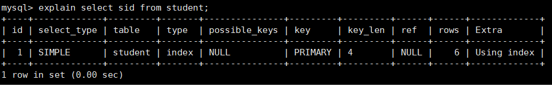

3, type=range，索引范围扫描，常见于<，<=，>，>= ，between等操作符号.

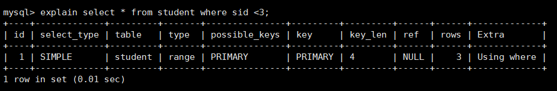

4, type=ref，使用非唯一索引扫描或唯一索引的前缀扫面，返回匹配某个单独值的记录行。

```shell
# 对表创建一个索引
mysql> create index idx_sname_1 on student (sname);
Query OK, 6 rows affected (0.11 sec)
Records: 6  Duplicates: 0  Warnings: 0
```

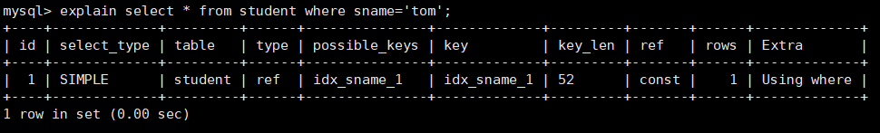

5, type=eq_ref，类似ref，区别就在使用的索引唯一索引，对于每个索引键值，表中只有一条记录匹配；简单来说就是多表连接中使用primary key 和 unique index 作为关联条件

6，type=const/system，单表中最多有一个匹配行，查询起来非常迅速，所以这个匹配行中的其他列的值可以被优化器在当前查询中当作常量来处理，例如根据主键primary key 或者唯一索引 unqiue index进行查询。

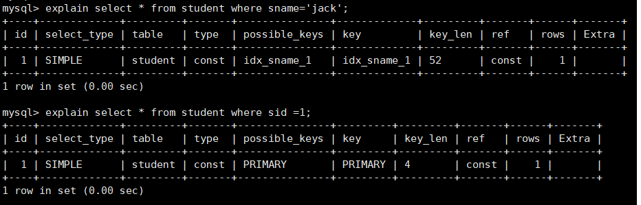

第一个sname时unique index，第二个sid为主键。

7，type=null，mysql不用访问表或者索引，直接就能得到结果

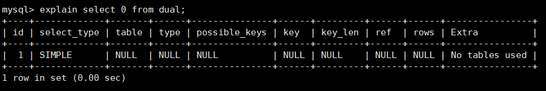

### 3.1 explain extended

通过explain extended 加 show warnings可以查看sql在执行前优化器对其作了那些优化。

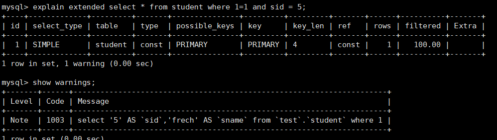

可以看到查询时的语句和开始有很大的不一样，像1=1直接变为了1。

## 4.show profile分析

通过profile，能够更清楚的了解SQL的执行过程。mysql从5.0.37开始增加了多show profiles 和show profile语句的支持。此功能默认时关闭的:

```shell
# 查看状态
mysql> select @@profiling;
+-------------+
| @@profiling |
+-------------+
|           0 |
+-------------+
1 row in set (0.00 sec)
# 打开状态
mysql> set @@profiling=1;
Query OK, 0 rows affected (0.00 sec)

# 再次查看
mysql> select @@profiling;
+-------------+
| @@profiling |
+-------------+
|           1 |
+-------------+
1 row in set (0.00 sec)
```

查看一个使用示例，查询一个Innodb表的数量:

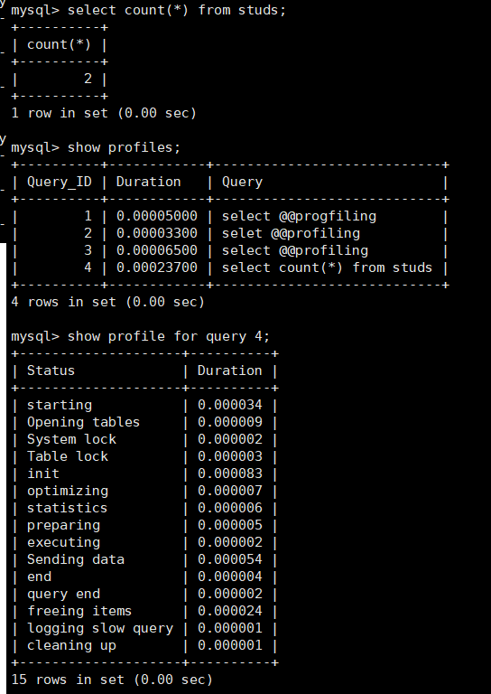

通过最后的show profile的输出，可以看出来查询中在各个阶段花费的时间。也可以从information表中查询.

```shell

mysql> select state,sum(duration) as total_r,round(100*sum(duration)/(select sum(duration) from information_schema.profiling where query_id=1),2) as pct_r,count(*) as calls,sum(duration)/count(*) as 'r/call' from information_schema.profiling where query_
id=1 group by state order by total_r desc;
+--------------------+----------+-------+-------+--------------+
| state              | total_r  | pct_r | calls | r/call       |
+--------------------+----------+-------+-------+--------------+
| freeing items      | 0.000038 | 28.57 |     1 | 0.0000380000 |
| starting           | 0.000030 | 22.56 |     1 | 0.0000300000 |
| Sending data       | 0.000026 | 19.55 |     1 | 0.0000260000 |
| Opening tables     | 0.000008 |  6.02 |     1 | 0.0000080000 |
| init               | 0.000006 |  4.51 |     1 | 0.0000060000 |
| statistics         | 0.000005 |  3.76 |     1 | 0.0000050000 |
| preparing          | 0.000004 |  3.01 |     1 | 0.0000040000 |
| Table lock         | 0.000003 |  2.26 |     1 | 0.0000030000 |
| cleaning up        | 0.000002 |  1.50 |     1 | 0.0000020000 |
| executing          | 0.000002 |  1.50 |     1 | 0.0000020000 |
| optimizing         | 0.000002 |  1.50 |     1 | 0.0000020000 |
| logging slow query | 0.000002 |  1.50 |     1 | 0.0000020000 |
| System lock        | 0.000002 |  1.50 |     1 | 0.0000020000 |
| end                | 0.000002 |  1.50 |     1 | 0.0000020000 |
| query end          | 0.000001 |  0.75 |     1 | 0.0000010000 |
+--------------------+----------+-------+-------+--------------+
15 rows in set (0.00 sec)
```

**注意:**sending data状态标识mysql线程开始访问数据行并把结果返回给客户端，而不仅仅时返回结果给客户端。由于在sending data状态下，mysql线程往往需要做大量的磁盘读取操作，所以经常是整个查询中耗时最长的状态。

在获取到最消耗时间的线程状态后，mysql支持进一步选择 all，cpu，block io，context switch，page faults等明细类型来查看mysql在使用什么资源上耗费了过高的时间，如：

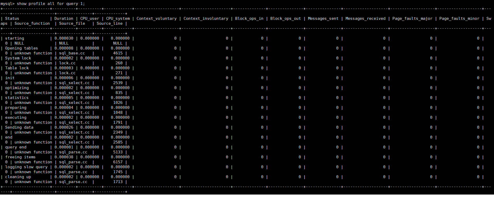

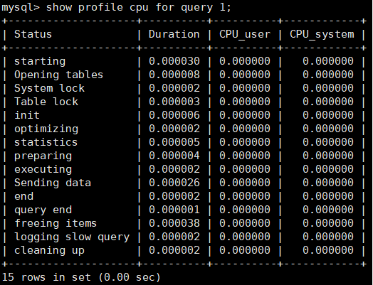

如果喜欢查看源码，可以进一步查看对应的具体源码：


## 5.索引优化

