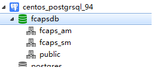
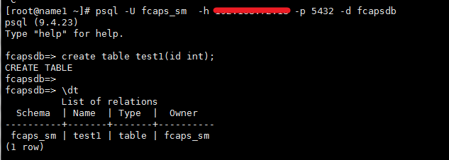
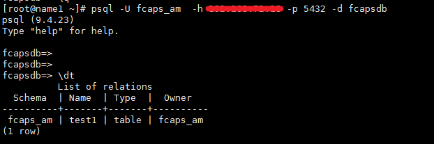
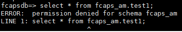

# schema

## 1. schem相关的cmd 

```shell
\dg	:	list roles
\dn	:	list schemas
\l	:	list database
\x	:	列模式显示
\du	:	list roles
\ds	:	list sequences
\dt	:	list tables
# 创建用户
create user userName with password 'pwd';

# 创建数据库
create database dbName owner user;
owner : 指定数据库属主

# 创建schema
create schema schemaName authorization userName;
create schema authorization userName; # 不指定schemaName就是和用户名一样
#搜索路径
show search_path
set search_path  to schema
# 修改数据库属主
alter database dbName owner to newName;

# 给用户赋予数据库权限
GRANT ALL PRIVILEGES ON DATABASE exampledb TO dbuser;

# 查看所有用户
select * from pg_user;

# 查看所有角色
select * from pg_roles;

# 修改用户密码
alter user userName password "new pwd";
### 登陆后 使用  \password  修改密码
```

## 2. schema作用

schema 在postgresql中就是起到一个隔离作用。简单说：多个用户可以使用同一个数据库，同一个数据库下可以针对不同的用户建立不同的schema，各个用户在自己的schema下可以创建、修改、删除表，并且不影响其他schema中的表，好像自己在使用一个数据库一样。

举个栗子把：

两个用户：fcaps_am，fcaps_sm

两个shema：fcaps_am,fcaps_sm

这样每个用户分配不同的schema：

```shell
# 此都是命令行操作
create database fcapsdb ;
create user fcaps_am password 'pwd';
create user fcaps_sm password 'pwd';

## 创建schema时，先连接上的指定的数据库
\c fcapsdb;
create schema authorization fcaps_am;
create schema authorization fcaps_sm;
```



使用不同的用户登录，并创建表:

```shell
psql -U fcaps_am  -h host -p 5432 -d fcapsdb
create table test1(id int);

psql -U fcaps_sm  -h host -p 5432 -d fcapsdb
create table test1(id int);

```





可以看到不同的用户登录后，使用不同的schema，并且可以创建同名的表，互相不影响。



并且互相之间没有访问的权限。