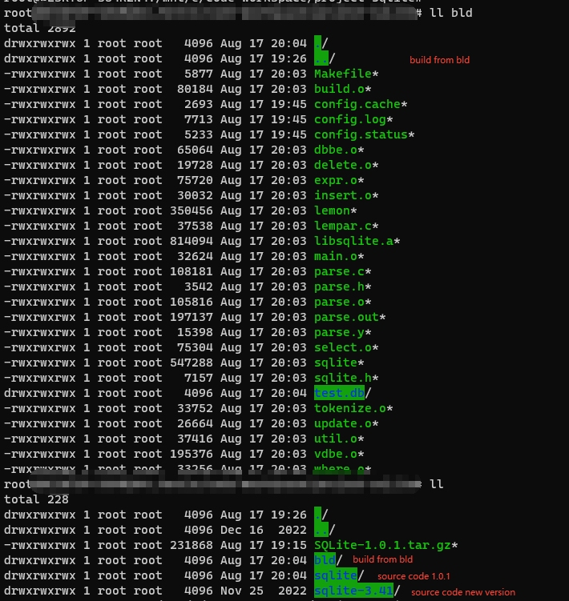
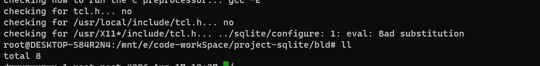
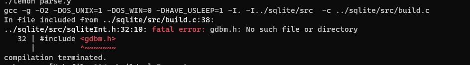
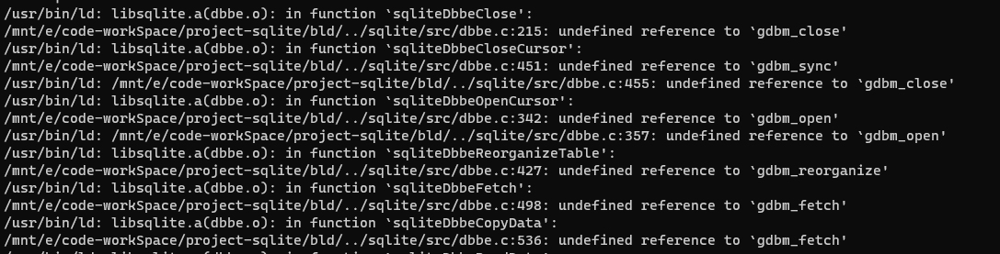
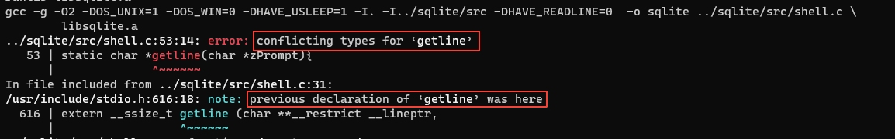
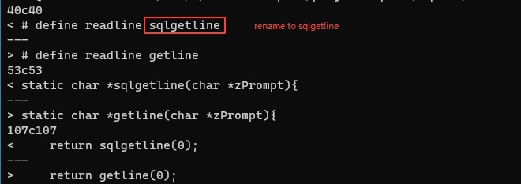
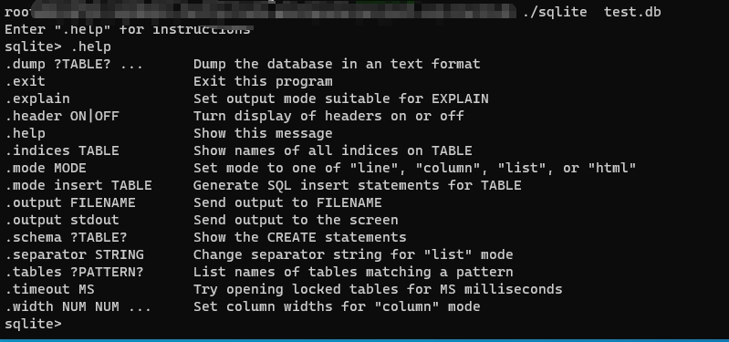

## 1. download source code

```
https://www.sqlite.org/src/info/e8521fc10dcfa02f
```


## 2. begine build on linux server

### step 1:  read the README 
```
For example:

    tar xzf sqlite.tar.gz    ;#  Unpack the source tree into "sqlite"
    mkdir bld                ;#  Build will occur in a sibling directory
    cd bld                   ;#  Change to the build directory
    ../sqlite/configure      ;#  Run the configure script
    make                     ;#  Run the makefile.

The primary build products are left in the build directory.  The
primary build products are:

    libsqlite.a        The SQLite library file

    sqlite.h           A header file for SQLite

    sqlite             Command line program for accessing SQLite databases

There are some other make targets of interest:


   make test              This runs a regression test on the library.

   make gdbmdump          This builds a utility named "gdbmdump" that
                          writes out the contents of a GDBM file in a
                          readable format.  It is useful for testing and
                          debugging the library.

```

do as the README said to create build folder.
mine build folder as below:



### step 2 begine build
```
../sqlite/configure

```


the error encounter:
error 0:
there are many error with Lemon parser,  so i copy 'tools' folder from version 3.41 to overwrite the 'tools' folder.


**error1**: 
missing tcl-dev library:


resolve method:
1, install  tcl liibrary
```
apt install tcl8.6-dev
```

2, update 'configure'  point to installed tcl


error 2:
missing  GDBM


```
apt install libgdbm-dev
```

error 3:  GDBM link error


resolve:

update Makefile to link GDBM linrary when build binary.

```
# Compiler options needed for programs that use the GDBM library.
#
GDBM_FLAGS = -lgdbm

# The library that programs using GDBM must link against.
#
LIBGDBM = -lgdbm
```

added '-lgdbm' to link with GDBM when build.


error 4:
duplicate 'getline' function.


the function 'getline' already defined in stdio.h, so we need to rename the function name.




## step 3:  run sqlite

after all the function done, then the build should be good, you can run the sqlite now.



