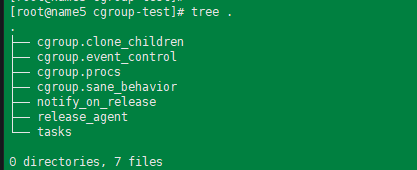
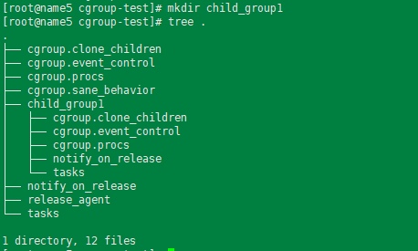
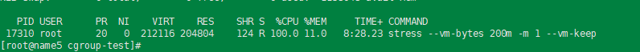
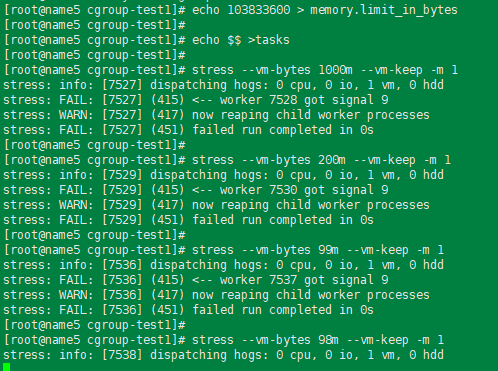

---
tags:
  - linux
  - cgroups
  - docker
---

cgroup的挂载:
```shell
mount -t cgroup -o none,name=cgroup-text cgroup-test ./cgroup-test
```

挂载后文件目录内容如下: 

> cgroup.clone_children: cpuset 和subsystem会读取这个配置文件, 值为1, 子 cgroup才会继承父cgroup的cpuset的配置
> cgroup.event_control: 
> group.procs:  是树中当前节点cgroup中的进程组ID. 现在的位置是在根节点, 这个文件中会有现在系统中所有进程组的ID
> cgroup.sane_behavior: 
> notify_on_release: 会和 release_agent一起使用. notify_on_release标识当这个cgroup最后一个进程退出的时候是否执行了release_agent;   release_agent则是一个路径,  通常用作进程退出之后自动清理掉不再使用的cgroup.
> release_agent:
> tasks:  标识该cgroup下面的进程ID, 如果一个进程ID写入tasks中,  便会把相应的进程加入到这个cgroup中. 
> 


在此cgroup中创建子目录 child_group1会如何呢?
```
mkdir child_group1
```



可见子目录回是一个子cgroup.

通过stress使用memory cgroup.
```shell
yum install -y stress

stress -vm-bytes 200m -m 1 -vm-keep

```


```shell
cd /sys/fs/cgroup/memory
mkdir cgroup-test1 && cd cgroup-test1
echo $$ > tasks
echo 103833600 > memory.limit_in_bytes
```
当限制了资源后, 超过资源会被kill.

