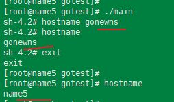
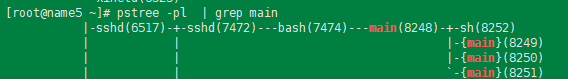
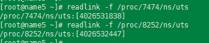
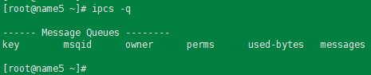
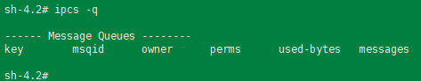
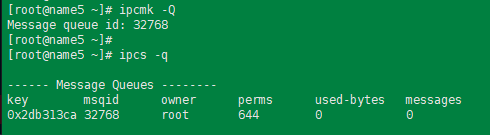
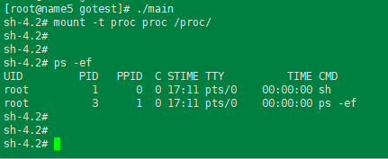
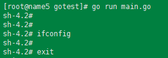

---
tags:
  - linux
  - namespace
  - docker
---

>  测试环境:
>  centos7 
>  Linux 3.10.0-957.el7.x86_64 #1 SMP Thu Nov 8 23:39:32 UTC 2018 x86_64 x86_64 x86_64 GNU/Linux

模拟域名隔离: CLONE_NEWUTS
```go
package ns

import (
    "log"
    "os"
    "os/exec"
    "syscall"
)

func NewNsProcess() {
// 要运行的命令
    cmd := exec.Command("sh")
    // 设置命令的 系统属性
    cmd.SysProcAttr = &syscall.SysProcAttr{
        Cloneflags: syscall.CLONE_NEWUTS,
    }

    cmd.Stdin = os.Stdin
    cmd.Stdout = os.Stdout
    cmd.Stderr = os.Stderr

    if err := cmd.Run(); err != nil {
        log.Fatal(err)
    }
}
```


当程序运行后,  设置新的域名, 并不会影响到宿主机本身的设置.



可以看到新的 sh 进程的UTS是新的.


IPC namesace
```go
package ns

import (
    "log"
    "os"
    "os/exec"
    "syscall"
)

func NewNsProcess() {
    // 要运行的命令
    cmd := exec.Command("sh")
    // 设置命令运行时的 属性
    cmd.SysProcAttr = &syscall.SysProcAttr{
        Cloneflags: syscall.CLONE_NEWUTS | syscall.CLONE_NEWIPC,
    }

    cmd.Stdin = os.Stdin
    cmd.Stdout = os.Stdout
    cmd.Stderr = os.Stderr

    if err := cmd.Run(); err != nil {
        log.Fatal(err)
    }
}
```





创建也给IPC queue


 但是在新的sh进程中是看不到新创建的IPC queue的.

PID 隔离 CLONE_NEWPID
```go
package ns

import (
    "log"
    "os"
    "os/exec"
    "syscall"
)

func NewNsProcess() {
    // 要运行的命令
    cmd := exec.Command("sh")
    // 设置命令运行时的 属性
    cmd.SysProcAttr = &syscall.SysProcAttr{
        Cloneflags: syscall.CLONE_NEWUTS | syscall.CLONE_NEWIPC|syscall.CLONE_NEWPID,
    }

    cmd.Stdin = os.Stdin
    cmd.Stdout = os.Stdout
    cmd.Stderr = os.Stderr

    if err := cmd.Run(); err != nil {
        log.Fatal(err)
    }
}
```


通过pstree看到进程ID是8493,  但是在进程中查看, 得到的PID为1.  说明新的PID namespace创建成功.

mount:  CLONE_NEWNS
```go
package ns

import (
    "log"
    "os"
    "os/exec"
    "syscall"
)

func NewNsProcess() {
    // 要运行的命令
    cmd := exec.Command("sh")
    // 设置命令运行时的 属性
    cmd.SysProcAttr = &syscall.SysProcAttr{
        Cloneflags: syscall.CLONE_NEWUTS | syscall.CLONE_NEWIPC|syscall.CLONE_NEWPID|syscall.CLONE_NEWNS,
    }

    cmd.Stdin = os.Stdin
    cmd.Stdout = os.Stdout
    cmd.Stderr = os.Stderr

    if err := cmd.Run(); err != nil {
        log.Fatal(err)
    }
}
```


启动进程后,  重新挂载一下proc fs,  运行ps 可以看到展示的只有 新的namespace中的进程.  说明mount创建成功.

```shell
# remount proc
mount -t proc proc /proc
```

USER : CLONE_NEWUSER

```go
package ns

import (
    "log"
    "os"
    "os/exec"
    "syscall"
)

func NewNsProcess() {
    // 要运行的命令
    cmd := exec.Command("sh")
    // 设置命令运行时的 属性
    cmd.SysProcAttr = &syscall.SysProcAttr{
        Cloneflags: syscall.CLONE_NEWUTS | syscall.CLONE_NEWIPC|syscall.CLONE_NEWPID | syscall.CLONE_NEWNS | syscall.CLONE_NEWUSER,
    }

    cmd.Stdin = os.Stdin
    cmd.Stdout = os.Stdout
    cmd.Stderr = os.Stderr

    if err := cmd.Run(); err != nil {
        log.Fatal(err)
    }
}
```

报错:
```
[root@name5 gotest]# go run main.go 
2024/07/07 17:35:20 fork/exec /usr/bin/sh: invalid argument
exit status 1
```
step1 : centos7 默认是关闭user namepspace
```
echo 640 >> /proc/sys/user/max_user_namespaces
```

报错2:
```
2024/07/07 17:37:12 fork/exec /usr/bin/sh: operation not permitted
exit status 1
```

修改代码：
```go
package ns
import (
    "log"
    "os"
    "os/exec"
    "syscall"
)

// mount -t fstype device dir
func NewNsProcess() {
    // 要运行的命令
    cmd := exec.Command("sh")
    // 设置命令运行时的 属性
    cmd.SysProcAttr = &syscall.SysProcAttr{
        Cloneflags: syscall.CLONE_NEWUTS | syscall.CLONE_NEWIPC | syscall.CLONE_NEWPID | syscall.CLONE_NEWNS | syscall.CLONE_NEWUSER,
        UidMappings: []syscall.SysProcIDMap{
            {
                ContainerID: 0,
                HostID:      0,
                Size:        1,
            },
        },
        GidMappings: []syscall.SysProcIDMap{
            {
                ContainerID: 0,
                HostID:      0,
                Size:        1,
            },
        },
    }

    // cmd.SysProcAttr.Credential = &syscall.Credential{
    //  Uid: uint32(0),
    //  Gid: uint32(0),
    // }
  
    cmd.Stdin = os.Stdin
    cmd.Stdout = os.Stdout
    cmd.Stderr = os.Stderr

    if err := cmd.Run(); err != nil {
        log.Fatal(err)

    }
}
```


net namespace: CLONE_NEWNET
```go
package ns
import (
    "log"
    "os"
    "os/exec"
    "syscall"
)

// mount -t fstype device dir
func NewNsProcess() {
    // 要运行的命令
    cmd := exec.Command("sh")
    // 设置命令运行时的 属性
    cmd.SysProcAttr = &syscall.SysProcAttr{
        Cloneflags: syscall.CLONE_NEWUTS | syscall.CLONE_NEWIPC | syscall.CLONE_NEWPID | syscall.CLONE_NEWNS | syscall.CLONE_NEWUSER|syscall.CLONE_NEWNET,
        UidMappings: []syscall.SysProcIDMap{
            {
                ContainerID: 0,
                HostID:      0,
                Size:        1,
            },
        },
        GidMappings: []syscall.SysProcIDMap{
            {
                ContainerID: 0,
                HostID:      0,
                Size:        1,
            },
        },
    }

    // cmd.SysProcAttr.Credential = &syscall.Credential{
    //  Uid: uint32(0),
    //  Gid: uint32(0),
    // }
    cmd.Stdin = os.Stdin
    cmd.Stdout = os.Stdout
    cmd.Stderr = os.Stderr

    if err := cmd.Run(); err != nil {
        log.Fatal(err)
    }
}
```


可以看到新的namespace中一个网卡设备都没有,  由此可见创建net space是成功的


