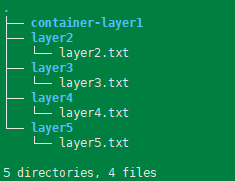
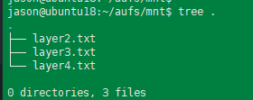
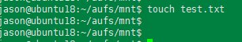
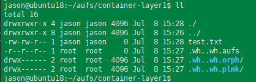

---
tags:
  - linux
  - docker
  - aufs
  - images
---
docker的基础依赖于三个基础设施来实现, 分别是`namespace, cgroups, aufs`, 其中namespace实现资源的隔离,  cgroup实现资源的限制,  aufs实现文件系统的共享.

本篇只要通过一个实验来了解aufs的使用。
环境：
```
# 刚开始使用centos, 不过centos对于union fs推荐使用redhat的deviceMapper(overlayFS), 对aufs支持不好,尝试多种方法都失败了.
CentOS Linux release 7.6.1810


# 后面切换为 ubuntu 系统.
Linux ubuntu1 6.8.0-31-generic #31-Ubuntu SMP PREEMPT_DYNAMIC Sat Apr 20 00:40:06 UTC 2024 x86_64 x86_64 x86_64 GNU/Linux

## 并且安装  aufs-tools依赖, 没有解决
sudo apt install -y aufs-tools linux-image-extra-virtual


# 替换成ubuntu18.04    -- 最终环境
sudo apt install aufs-tools -y  

```

AUFS 全称: Another Union File System, 是 UnionFs的实现.  正如其名字, 这是一个联合文件系统,  它可以把多个文件系统挂载到同一个挂载点, 并且默认其中只有一个是 read-write, 其他都是read-only.  

这跟docker 镜像基于各个layer构建是不是很相似,  没错, 其就是基于Aufs 来实现的.

第一步： 我们首先创建几个目录用来模拟多个文件系统:




第二步： 创建一个目录作为挂载点
```
/mnt/aufs_point
```

此时挂载点为空目录.

第三步:  挂载aufs

```shell
sudo mount -t aufs -o dirs=./container-layer1:./layer2:./layer3:./layer4 none ./mnt/
```

> 通过上面挂载后, 默认 container-layer1 就是RW 层. 其他层为只读层

查看mnt 目录


创建一个测试文件, 可以看到最终的文件是创建到了 contain-layer1里.




aufs挂载时的其他选项了解
```shell
mount -t aufs -o dirs=./container-lay1=rw:./layer2=rw:./layer3=rw  -o udba=reval none ./mnt

# layer2=rw 设置为读写层
udba=reval:  With this option, aufs will re-loopup the branches and update it.  So any changes done on any directories within the branch, will reflected in 'mnt'
udba=none: 使用此选项Aufs会快点.  buy may show incorrect data, if the user create any files/directories without going through th AUFS.
udba=notify: With this option, the Aufs will register for inotify for all the directories in the branches,  this affect the preformances of AUFS.


mount -t aufs -o dirs=/tmp/dir1=rw:/tmp/dir2=rw -o udba=reval -o create=rr  none ./mnt

# create=rr 创建4个文件, 两个在dir1下,  两个在dir2下.
```


