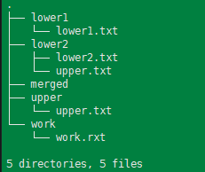
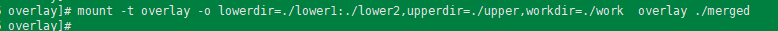
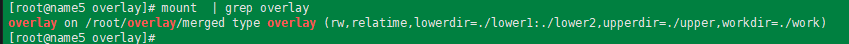
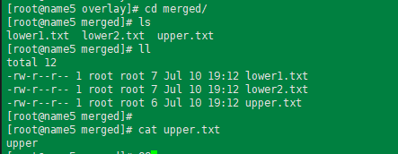

---
tags:
  - overLay
  - filesystem
  - docker
---
记录通过实验使用一下layoverFS.
overlayFS文件系统有几个特点: 
1. 分为lowerdir,  upperdir, workdir, merged; 其中merged是对外展示的文件目录
2. upperdir是rw, lowerdir为read-only. 其中upperdir会覆盖lowerdir中同名的文件.   
3. lowerdir不是必须的.
4. lowerdir可以是多个目录
5. workdir需要和upperdir在同一个文件系统下.


创建目录:
```shell
## 目录创建
mkdir lower1 lower2 upper work merged

## 创建文件
touch lower1/lower1.txt  lower2/lower2.txt lower2/upper.txt  upper/upper.txt work/work.rxt
echo "lower1" >> lower1/lower1.txt ; echo "lower2" >> lower2/lower2.txt; echo "lower2 upper" >> lower2/upper.txt ;  echo "upper" >> upper/upper.txt

### 目录挂载
mount -t overlay -o lowerdir=./lower1:./lower2,upperdir=./upper,workdir=./work  overlay ./merged


```


 进行挂载, 并查看:
 


可以看到upper.txt 文件是属于upper目录的, 即upper目录中upper.txt覆盖了lower2中的同名文件.


