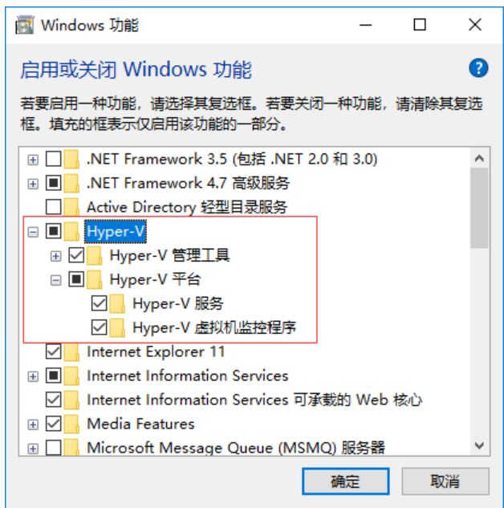
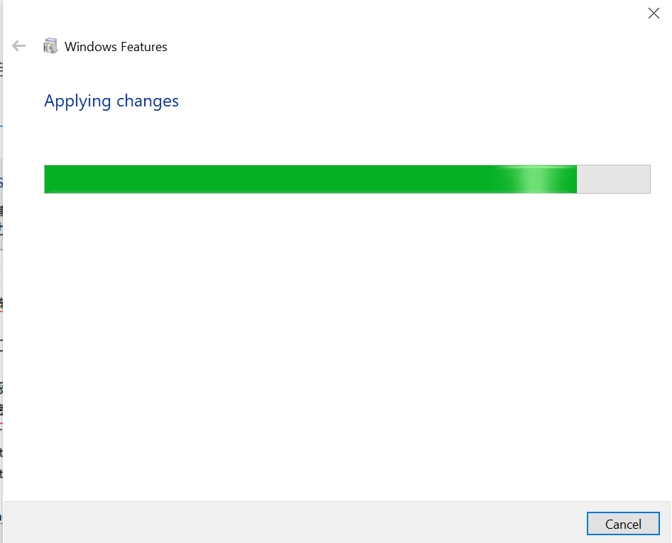
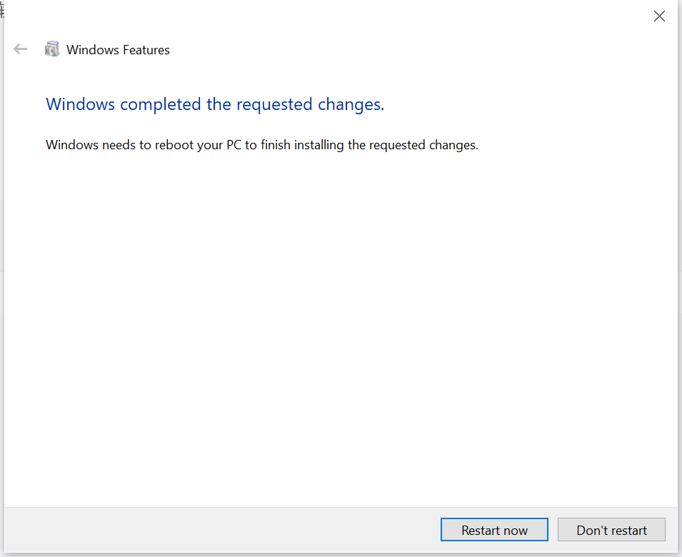
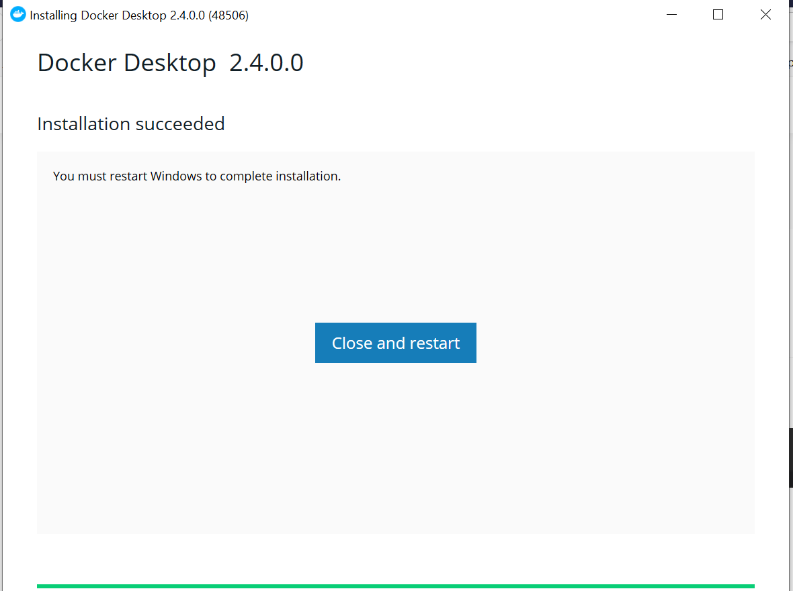

[toc]

# docker在win10上的安装

本次使用的是win10企业版，在公司电脑上进行的安装。

## 第一步: 打开win10的Hyper-V







安装完成后，系统需要重启。

## 第二步: 下载镜像

```shell
https://store.docker.com/editions/community/docker-ce-desktop-windows
```


## 第三步: 进行安装

直接单击exe文件进行安装操作。



到此就安装完成docker了。

win10使用时的问题:

1, 打开配置时特别慢

目前没有解决。


2, 下载镜像失败

```shell
$ docker pull centos
Using default tag: latest
latest: Pulling from library/centos
no matching manifest for windows/amd64 10.0.17763 in the manifest list entries
```

网上同样问题的解决是切换为 linux container，还没有验证。

3, 切换为linux container重启时，一直在重启


