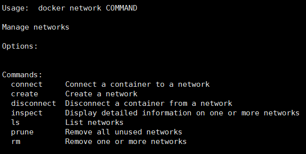
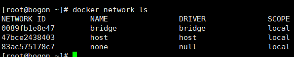

# Docket-Network

## 查看网络环境

```shell
docker network ls  # 查看网络环境
```

其他网络相关命令：



默认网卡解析：



这是docker默认实现的三个网卡，bridge网络是docker容器中默认使用的网络。

默认情况下，创建的容器会被docker连接到bridge网络，这个网络使用的正是宿主机中的docker0网络。如果想改变容器使用的网络，可以在创建容器时使用--network参数进行修改。

```shell
docker run -it --name nonenetwork --network none ubuntu /bin/bash
```

none表示不使用网络。容器如果绑定在none网络上，则docker不会为容器分配带有网络连接的网络栈，而是通过一个无连接的网络让容器处于与外界环境完全隔离的状态。

host网络直接使用宿主机的网络环境。容器如果绑定在host网络中，则docker会直接采用宿主机内的网卡作为容器的网络连接对象。也就是说，其他与宿主机同在一个子网的机器也能发现容器的存在。

查看网络详细信息：

```shell
docketr network inspect bridge
```


## 自定义网络环境

对于由数个容器组成的一个小型模块，我们希望这些容器只能相互访问，而不能访问其他容器，也不能被其他容器访问。此时，就需要为这个几个容器单独分配网络，让他们连接到一个独立的容器中，从而隔绝其他网络中的容器对这几个容器的链接。

创建网络:

```shell
docker network create --driver bridge isolate
# 创建isolate网络，--driver用来指定网络所基于的网络驱动，也可写为-d

# 查看
docker network ls

## 查看详细信息
docker network inspect isolate

# 在创建容器时指定网络
dockerrun -it -name myNetwork --network isolate ubuntu /bin/bash
```

## 容器与外部链接

要使容器和外部通信正常运作，最关键的就是要保证网络数据转发，也就是IP forward 功能正常启用。docker daemon 启动时，可以通过--ip-forward 参数来控制docker是否适用IP forward，默认是开启的，一般不需要设置。如果docker daemon 已经启动了对ip forward的支持，但容器仍然无法链接外部网络，可以检查宿主机系统中的ip forward是否被禁用。

```shell
sysctl net.ipv4.conf.all.forward    # 查看是否禁用，如果是0表示禁用
# 开启
sysctl net.ipv4.conf.all.forward=1
```

开启了转发，启动docker容器时，还需要实现端口映射才能正常访问。-p和-P参数来指定端口映射，-p让我们能选定宿主机上指定的端口进行绑定，-P参数则会让docker从宿主机中寻找可以绑定的端口进行绑定。如何从宿主机找到可以被映射的端口呢？ **/pro/sys/net/ipv4/ip_local_port_range 这个文件中查看**。

## 配置docker0网桥

```shell
# 创建拥有指定子网范围的容器网络
docker network create --subnet 10.10.200.0/24 cnet

# 查看
docker netwoek ls 

# 删除
docker network rm cnet

# 创建容器时指定网络
docker run -it --network cnet busybox

# 还可以通过connect让容器链接到指定的网络上
docker network connect cnet busybox

# 断开网络连接
docker network disconnect cnet busybox
```


## 自定义网桥

docker管理者docker0网络的配置，如ip地址，子网掩码，网段信息等基本信息。由于docker服务一启动，就表示随时会有容器运行在docker中，为了避免容器运行时修改网络带来的不稳定，配置docker0的工作只能在docker服务启动时运行。

通过docker daemon 或 dockerd命令启动docker daemon时，可以指定docker管理的docker0网络相关的配置。

```shell
# 指定docker0适用的ip
dockerd --bip=192.168.1.1/24

# 修改子网网段
dockerd --fix-cidr=192.168.1.0/24

# 设置最大数据包
dockerd --mtu=65536
```

#### 自定义网桥

```shell
brctl addr wkbr0
ip addr add 192.168.99.1/24 dev wkbr0
ip link  set dev wkbr0 up

# 查看创建的网桥信息
ip addr show wkbr0

# 使用网桥
dockerd --bridge wkbr0
```

## 配置DNS

与DNS解析相关的配置文件主要有三个,etc目录下的: hostname,hosts, resolve.conf。

Docker对这三个文件进行了特殊的处理，在容器中运行mount命令可以看到端倪。这三个文件都以挂载的形式存在，也就是docker通过挂载覆盖了容器文件系统中的对应文件，以让docker能够更方便的对这三个文件及其中的内容进行管理。

当使用-h 或 --hostname参数配置容器的主机名时，这一配置会写入/etc/hostname文件中。默认情况下，docker会采用容器ID的前一部分作为容器的主机名。

通过--link参数可以连接其他容器，建立容器间网络通信。使用这个配置会在/etc/hosts文件中生成基于给定的连接容器名称或别名字段，而其指向的是被连接容器的实际ip地址。

通过--dns参数能够为容器指定新的DNS服务器，这个配置会写入/etc/resolv.conf中，每一个参数在/etc/resolv.conf文件中占一行。

通过--dns-search参数可以指定DNS的搜索域，这个配置也会写入/etc/resolv.conf中。

 ## 使用IPv6

```shell
dockerd --ipv6   # 启动时，开启对ipv6的支持

# 为docker0设置一个ipv6地址
dockerd --ipv6 --fixed-cdir-v6=2001:db0:1::/64  
```

