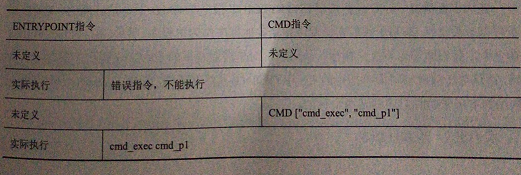
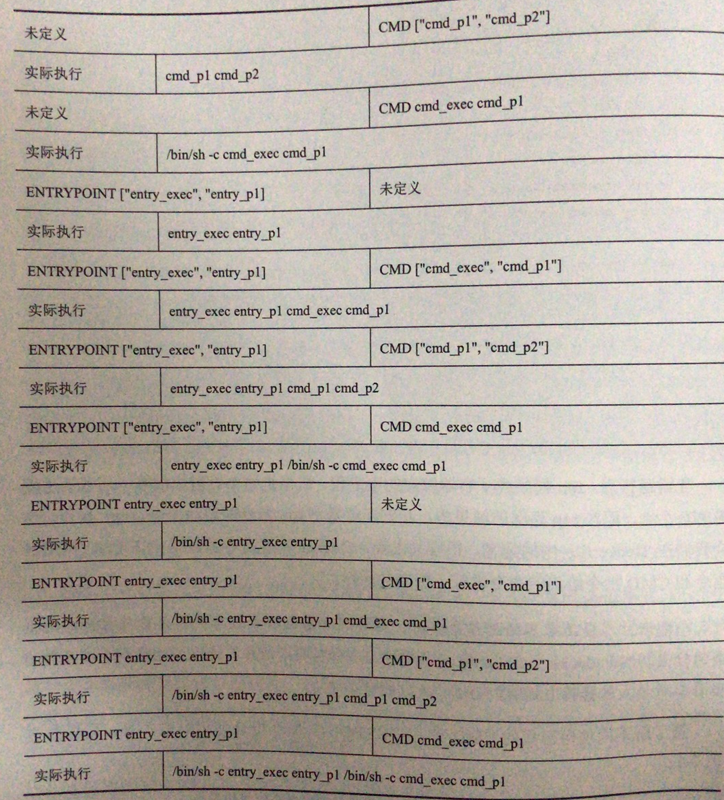

# Dockerfile

## 基础指令

### FROM

Docker镜像都是在bootfs层上实现的，但是不必每次构建镜像都从boofs层开始，可以直接在其他已经搭建好的镜像上进行修改，**FROM指令就是用来指定所要构建的镜像是基于哪个镜像建立的**。

FROM指令必须作为第一个条指令，也就是说，它应该出现在除注释外的第一行里。

```shell
FROM <image>
FROM <image>:<tag>
FROM <image>@<digest>
```

使用FROM指令，<tag>和<digest>都是可选的，当不指定时，docker会选择latest这个tag的镜像作为基础镜像。

### MAINTAINER

MAINTAINER指令的用处是提供镜像的作者信息

```shell
MAINTAINER <name>
```

## 控制指令

### RUN

在构建镜像的过程中，需要在基础镜像上做很多操作，RUN指令就是用来给定这些需要被执行的操作的。

```shell
RUN command param1 param2...
RUN ["executable","param1","param2",...]
```

这两种格式代表意义不同，适用场景也有些区别。

第一种形式，实际上是以shell程序来执行操作，如：RUN mkdir data，实际执行会是 /bin/sh -c mkdir data。Dokcer默认使用/bin/sh作为其shell程序，当然了可以使用SHELL进行切换。**其非常大的优势就是：支持书写换行**。如:

```shell
RUN apt-get install -y \
	autoconf \
	file \
	g++ \
	gcc \
```

第二种形式，是将命令及全部参数逐个传入到方括号中，命令及参数都是用双引号进行引用。这种方式执行命令，可以有效规避某些基础镜像中没有shell程序，或者用于需要临时切换shell程序的时候。

```shell
RUN ["/bin/bash","-c","echo hello"]
```

需要注意的是：使用RUN指令时，Docker判断是否使用缓存构建的依据是给出的指令是否与生成缓存使用的指令一致。也就是说，若本次执行的结果与缓存不一致，也会采用缓存中的数据而不再执行命令。这时可以在 docker build 命令后加 --no-cache 参数决定不适用缓存。

### WORKDIR

WORKDIR指令用于切换构建过程中的工作目录，在使用RUN，ADD，COPY以及容器在运行时才会执行的CMD，ENTRYPOINT指令中使用了相对目录，相对目录所基于的就是当前的工作目录

指令给出的工作目录可以时绝对目录，也可以时相对目录：

```shell
WORKDIR /usr
WORKDIR  local
```

如果给出的相对目录，那么在切换目录时，会参考当前的工作目录进行。如上例使用WORKDIR local时，实际上时切换到的工作目录是 /usr/local，因为切换时参考了之前定义的工作目录/usr

也可以在WORKDIR中使用环境变量:

```shell
ENV BASEDIR /project
WORKDIR $BASEDIR/www
```

### ONBUILD

ONBUILD指令允许指令另外一条指令，这条指令不会在构建当前镜像时执行，而是在构建其他镜像并使用FROM指令把当前镜像作为基础镜像时执行。

把我们需要的执行的指令放在ONBUILD指令之后，就能设置一个构建触发器，当其他Dockerfile把这个镜像作为基础镜像并进行构建时，执行完FROM指令后，通过ONBUILD指令设置的指令都将被触发。

```shell
ONBUILD instruction arguments
```

## 引入指令

### ADD

在构建容器的过程中，可能需要将一些软件源码，配置文件，执行脚本等导入到镜像中，这时可以使用ADD指令将文件从外部传递到镜像内部。

```shell
ADD <src>... <dest>
ADD ["<src>",... "<dest>"]
```

两种形式并无太大差别，只是ADD["<src>",... "<dest>"] 这种形式可以规避在文件路径中带有空格的情况。ADD指令能够将我们在<src>里指定的文件，目录乃至通过URL指定的远程文件复制到镜像的<dest>目标路径中。可以分别指定多个src文件或目录，也可以使用通配符指定多个文件或目录。

```shell
ADD hom* /mydir
ADD hom*.txt  /mydir
```

设置src路径时，需要使用相对路径，是相对于镜像的构建路径而言，也就是在docker build命令中所传入的路径。通常情况下，这个路径就是Dockerfile的路径。另外src给出的路径不能脱离docker build命令所给出的路径，也就是说，不能使用../../some或类似的路径来访问上级路径。

所有被复制进镜像的文件都将被放置到dest目录下，这个目录可以是绝对路径，也可以是相对于镜像的工作目录而言的相对目录。镜像的工作目录可以通过WORKDIR指令来设置，也可以通过RUN和cd命令来修改。被复制进来的文件和目录的所有者ID和用户组ID都是0，也就是root用户，修改权限，所有者，所属组需要使用RUN指令。注意，如果给出的src是一个目录，目录本身是不会被复制进镜像的，被复制的是目录中的内容。

另外，如果src是网络地址，docker会有一些特殊处理。比如在利用其他方式复制时，即使文件已经修改或者构建缓存被更新，文件的修改时间不会被带入。如果网络文件HTTP请求的响应头中出现Last-Modified，Docker会采用其给出的时间来设置被复制文件的修改时间。

ADD还能自动完成对压缩文件的解压。能识别的格式gzip，bzip2，xz。如果复制的是上述格式文件，则将其中的内容加压到dest中，而不是直接复制。Docker识别文件是否是压缩文件，是通过文件内容中的特征码来识别，而不是文件的扩展名。

### COPY

COPY指令和ADD指令非常相似，在原路径，目标路径以及文件通配符的使用上，与ADD指令的规则是几乎一致的。主要区别就在于COPY指令不能识别网络地址，也不会对压缩文件进行解压。

```shell
COPY <src>,... <dest>
COPY ["<src>",... "<dest>"]
```

## 执行指令

### CMD

CMD指令来指定由镜像创建的容器中的主体程序。

```shell
CMD ["executable","param1","param2",...]
CMD ["param1","param2",...]
CMD command param1 param2 ...
```

CMD ["executable","param1","param2",...] 和CMD command param1 param2 ...的用法和RUN指令的使用方法是类似的，都是取决于是否使用shell程序来执行命令，而CMD ["param1","param2",...]这种格式则是将给出的参数传给ENTRYPOINT指令给出的程序。

注意的是，因为容器中只会绑定一个应用程序，所以在Dockerfile中只存在一个CMD命令，如果我们给出了多个CMD指令，之后的指令会覆盖掉之前的指令。

虽然CMD指令指定了基于这个镜像所创建的容器在默认情况下运行的程序，但这个程序，准确的说是启动这个程序的命令，并非是不变了。在创建容器时，可以重新指令应用程序的启动指令，也就是说，可以修改需要运行的应用程序，而容器中给出的CMD指令会被覆盖掉。

```shell
# docker run -it nginx  /bin/bash

这条指令创建和运行nginx容器，容器启动后执行的是/bin/bash，也就是一个shell程序，并通过-it参数绑定到了/bin/bash程序上，可以在容器中进行操作，而nginx程序并没有运行。
```

### ENTRYPOINT

ENTRYPOINT专门用于主程序启动前的准备工作。也可以使用CMD指令启动，但是这样做会让启动程序服务的命令和启动主程序的命令糅合在一起，显得比较混乱。

```shell
ENTRYPOINT ["executable","param1","param2",...]
ENTRYPOINT command param1 param2 ...
```

这两种格式在效果上于CMD是一样的。

注意的是：当ENTRYPOINT指令被指定时，所有的CMD指令或通过docker run等方式指定的应用程序启动命令，不会再容器启动时被直接执行，而是被这些命令当作参数，拼接到ENTRYPOINT指令给出的命令之后，传入ENTRYPOINT指令给出的程序中。





## 配置指令

### EXPOSE

ECPOSE指令指定了将要生成的镜像的容器对外敞开的端口。

```shell
EXPOSE <port> <port> ...
```

要从外部访问容器内部程序监听的端口，首先需要通过EXPOSE指令将这些端口标记为对外敞开，再根据实际访问的来源进行配置；从其他容器中访问容器时则需要创建该容器时使用--link 连接到此容器；从宿主机外访问则需要创建该容器时使用-p或-P参数建立宿主机对外端口与容器端口的转发

### ENV

ENV可以指定环境变量，环境变量能替换dockerfile中其他指令出现的参数，使用ENV指令就能很轻松的设置dockerfile中的环境变量。

```shell
ENV <key> <vaue>
ENV <key>=<value> ...
docker run --env <key>=<value> ...
# 如果只在一条指令中使用的环境变量，可以使用这种形式的RUN指令
RUN <key>=<value>  command param1 param2 ...
```

### LABEL

使用LABEL指令，可以为即将生成的镜像提供一些元数据作为标记，这些标记能帮助我们更好的展示镜像的信息.

```shell
LABEL <key>=<value> <key>=<value> ...
```

在键和值中，如果带有空格，可以使用引号包裹，避免与分割符产生歧义。

### USER

USER指令用于设置执行用户，可以传入用户的名称或UID作为USER的参数:

```shell
USER nginx
```

注意的是，USER指令对其后的RUN指令，CMD指令和ENTRYPOINT指令都会起作用，也就是说，使用USER指令，不但会影响基于此镜像的容器主主程序的运行用户，也会影响在USER指令之后在构建过程中通过RUN指令给出的命令。

### ARG

ARG指令只用于镜像的构建过程中，其效果不会作用于基于此镜像的容器，而覆盖参数的方法也是通过docker build的--build-arg进行的。ARG和ENV有很大不同，ENV指令用于配置环境变量，它的值会影响镜像的编译，也会体现在容器的运行中，需要改变环境变量时，要在容器启动时进行赋值。而且**ENV的指令永远都会覆盖ARG指令所定义的变量，即使它们定义的顺序是相反的。**

```shell
ARG <name>
ARG <name>=<default>  # 没有定义变量值时，默认时default的值

## 参数赋值
docker build --build-arg user=root ./busybox
```

### STOPSIGNAL

当停止容器时，docker会向容器中的应用程序传递停止信号，我们可以通过STOPSINGAL指令来修改docker所传递的信号。

STOPSINGAL 支持两种格式定义的信号，一种时linux内核syscall信号的数字表示，一种是信号名字表示。

```shell
STOPSINGAL 9
STOPSINGAL SIGKILL
```

### SHELL

docker中CMD，ENTRYPOINT等指令都支持以shell形式执行，而SHELL指令可以为它们选定shell程序：

```shell
SHELL ["executable","parameters"]
```

docker默认使用的shell程序是/bin/sh，若要修改为/bin/bash，可以使用如下SHELL:

```shell
SHELL ["/bin/bash","-c"]
```


## 特殊用法

### 环境变量

通过ENV指令指定环境变量后，就可以再之后的命令中进行环境变量的替换了。环境变量的解析支持ADD , COPY , ENV, EXPOSE, LABLE, USER, WORKDIR, VOLUME, STOPSIGNAL， ONBUILD这几个指令。

```shell
ENV variable value
RUN echo $variable  # 输出value # 普通的环境变量替换方法时 "$ + 变量名" 的方式
RUN echo ${variable} # 输出value  # 也可以使用 花括号把变量名包裹起来，以避免出现歧义
# 也可以使用转义字符，不进行变量的解析
RUN echo \$variable 	# 输出 $variable
RUN echo ${variable:-word} # 表示当环境变量variable不存在时，word会进行替换
RUN echo ${variable:+word} # 表示如果环境变量variable被定义和赋值后，word会替换占位符
```

### 指令解析

之前说，使用RUN指令时，可以通过\来进行命令的换行，这对于linux或MAC os都是比较适用的。但是windows系统本身的目录分隔符就是\，这样书写就会造成歧义。要解决这个问题，就要适用Dockerfile中注释的一种特殊用法：**解析指令行**。

```shell
# escape = `
```

把这个指令方法都一行，也就是FROM前面，就可以使用了。

### 忽略文件

忽略文件的名称应该是.dockerignore，是一个没有文件名只有扩展名的文件。在构建镜像前，docker会先扫描给出的环境目录中是否存在.dockerignore文件，如果文件存在，docker会先读取其中的内容，并根据给出的规则对文件和目录进行忽略处理。

```shell
#comment		备注信息，不会被看出规则处理
temp			忽略所有名称为temp的文件或目录
*/temp*			可以匹配并忽略/filedir/temporaey.temp这样的文件，也可以
				忽略/filedir/temp这样的文件
temp?			忽略以temp开头的文件或目录
!temp.keep		不论规则是什么，temp.keep这个文件一定会保留
```

