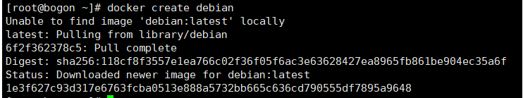
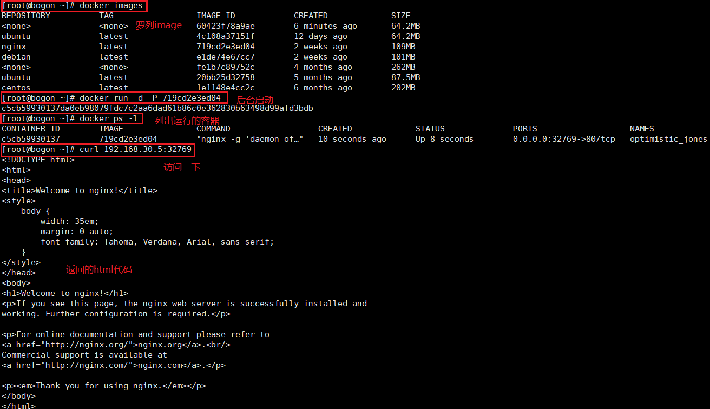
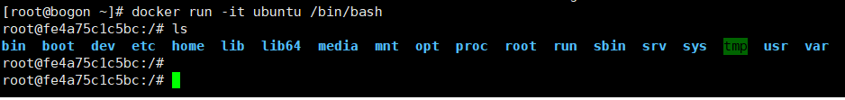

# 容器管理

## 1. 创建容器

```shell
[root@bogon ~]# docker create debian
```



## 2. 运行容器

```shell
# 后台运行
[root@bogon ~]# docker run -d imageId

# 前台交互
[root@bogon ~]# docker run -i -t imageId /bin/bash   # 或者docker run -it imageId /bin/bash
```

后台启动一个nginx测试:



启动ubuntu前台交互:



## 3. 列出容器

```shell
# --latest 列出最近创建的容器
[root@bogon ~]# docker ps -l
# 列出所有容器
[root@bogon ~]# docker ps -a
# --last 2 ,列出最近创建的2个容器
[root@bogon ~]# docker ps -n 2
# 进行一定形式的过滤过滤好多方式
# id=b2b93ed894
# label 容器的标记
# name  容器的名字
# status 容器的状态
# ancestor 创建容器的镜像
# before  给出一个容器名或id,返回所有在给定容器之前创建的容器
# since   给出一个容器名或id,返回所有在给定容器之后创建的容器
# isolation 隔离性,default,process,hyperv,只对windows有效
# volume 给出数据卷的名称或挂载点.返回使用指定数据卷的容器
# network 给出网络ID或网络名称,返回连接到指定网络的容器
[root@bogon ~]# docker ps -f "name=phpfm"
```


## 4. 启动和停止

```shell
[root@bogon ~]# docker start 容器ID

[root@bogon ~]# docker stop  容器ID

[root@bogon ~]# docker kill 容器ID
```


## 5. 暂停和恢复

```shell
[root@bogon ~]# docker pause mysql

[root@bogon ~]# docker unpause mysql
```


## 6. 容器命名

```shell
## 使用 --name指定名称
[root@bogon ~]# docker run -d --name web nginx:1.0.2
```


## 7. 重启容器

```shell
[root@bogon ~]# docker restart mysql
```


## 8. 删除容器

```shell
[root@bogon ~]# docker rm mysql
```


## 9. 查看进程信息

```shell
[root@bogon ~]# docker top  容器ID/name
```

## 10.  查看容器信息

```shell
[root@bogon ~]# docker inspect 容器ID/name
```


## 11. 容器日志

```shell
[root@bogon ~]# docker logs  容器ID/name
```

## 12. 衔接到容器

容器后台执行后，需要连接到容器内进行查看或操作，此时就需要衔接到容器内

```shell
[root@bogon ~]# docker attach 容器ID/name
```

不过，此时容器就会相当于是前台交互模式，衔接退出后，容器也停止了。

## 13. 在容器中执行命令

```shell
# 在容器中执行一个ps指令
[root@bogon ~]# docker exec web(容器name) ps

# 让容器在后台执行一条指令
[root@bogon ~]# docker exec -d web(容器name) ps
```


## 14.提交容器更改

```shell
[root@bogon ~]# docker commit 容器id/name
```


## 15. 容器的导入/导出

```shell
# 容器导出
[root@bogon ~]# docker export web.tar 容器ID/name
# 容器导入
[root@bogon ~]# docker import web.tar
# 容器导入,并设置别名
[root@bogon ~]# docker import web.tar ssh:ubuntu
```

