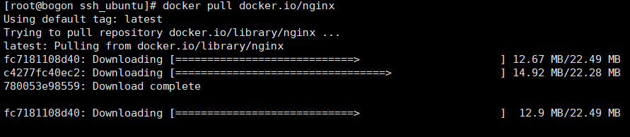
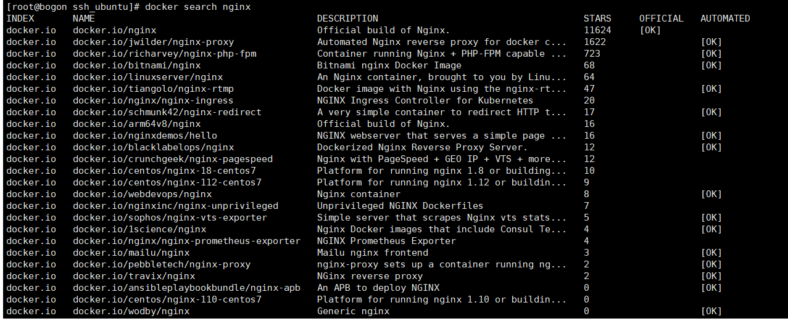
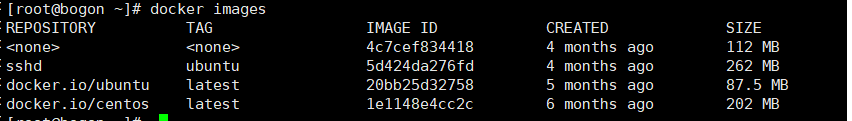
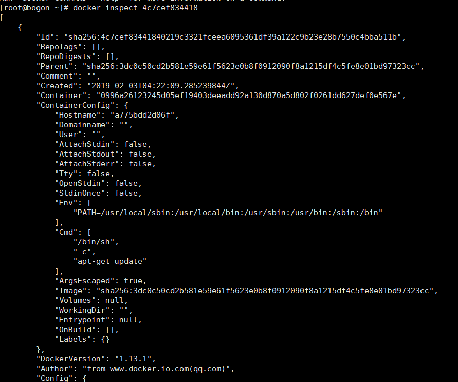

# Docker镜像管理

## 1. 获取镜像

```shell
docker pull name
```



## 2. 搜索镜像

```shell
docker search name
# 这里的name可以使用正则表达式,如
docker search ng*
```




```shell
NAME: 名称
DESCRIPTION: 简介
STARS: 推荐星数
OFFICAL: 是否是官方
AUTOMATED: 镜像是否使用了自动构建
```


## 3. 列出镜像

```shell
docker images
```



```shell
REPOSITORY: 镜像名称
TAG: 镜像标签
IMAGE ID:镜像id
CREATED: 创建时间 
SIZE: 大小
```


## 4.获取镜像详细信息

```shell
docker inspect name/id
```



## 5.删除镜像

```shell
docker rmi -f name/imageId
-f: 表示强制删除
```

## 6. 镜像迁移

镜像导出:

```shell
# 通过输出流,保存镜像
docker save ubuntu:latest >ubuntu.tar

# 同时保存多个镜像
docker save -o images.tar ubuntu:latest centos:latest
```

镜像恢复:

```shell
# 通过文件,恢复镜像
docker load -i ubuntu.tar
-i/--input : 两个参数意义一样,指定输入文件

docker load ubuntu.tar
```

