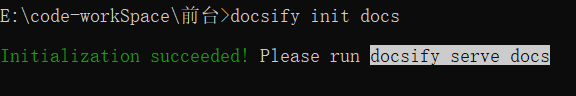

# docsify+github搭建自己的学习记录web

## 依赖软件

1. 下载好nodeJS，git（操作上传下载等操作）

2. 依赖于nodejs，我是在windows10搭建的，nodejs安装也是比较简单的。下载好，一步一步来就可以了。

3. ```shell
   # 安装docsify文件
   npm i docsify-cli -g
   ```

4. ```shell
   # 创建一个docs工程目录
   docsify  init docs
   ```

5. 

6. 

7. 此时再哪个目录运行如下命令，就可以再浏览器浏览了，

   ```shel
   # 本地运行
   docsify serve docs
   
   # 浏览器浏览地址
   http://localhost:3000
   ```

   

## 本地搭建

当运行了docsify serve docs， 并且在浏览器进行浏览时，本地就已经算是搭建好了。

那么本地文件如何进行链接呢？

举一个栗子：

比如在创建了一个文件docs/jdk/java.md

那么在README.md中这样写就好：

```markdown
[java](jdk/java.md)       ## 这样在首页中浏览时，单机这个链接就可以查看对应的文档了，就是markdown链接使用
```


## github准备

1. 准备就是创建一个库了如pageWeb，并且初始化一个README.md文件。
2. 把库克隆到本地

## 上传github

1. 把创建好docs目录剪切到pageWeb的本地库中
2. 修改pageWeb首页中README.md文件，创建浏览的链接（也就是链接到写好的各个总结文件，使用上面列举的markdown语法）。此文件和docs中README.md文件内容查不到，就是到每个文件的链接地址不是很一样，应该多了一个docs目录
3. 上传到库中，浏览器打开此库，就可以查看了。

当然了，docs剪切到了库文件，这样在本地docsify 启动浏览就会出问题，需要在docs所在目录重新初始化一下，就可以了。

```shell
# 初始化命令
docsify init docs
```


##  关于图片显示

1. 在docs目录下创建一个image文件夹
2. 把需要的图片放到image目录中
3. 在需要引入文件的地址使用markdown图片引入就可以了，不过这里的图片路径是docs下的image路径。

``` markdow
# 图片导入的markdown语法

```

