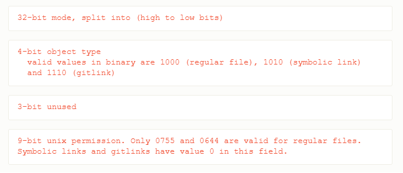

---
tags:
  - git-index
---
检查文件类型:
```
git ls-files -s path/file
100644 9c7999124945d55e0cea7faed66a0d68bc95a859 0    README.md
# 字段解使
100644    第一个字段 表示文件属性, 详细信息如下接释
9c7999124945d55e0cea7faed66a0d68bc95a859  该文件在对象库中对应的ID,一个40位的SHA1值
0         暂存区编号
README.md   文件名字
```

第一个字段文件模式是一个32-bit的值,具体分为三部分: 

[git index-format解释](https://git-scm.com/docs/index-format)

所以此处100644分为两部分,  **第一部分**(0)100表示此是一个regular file, **第二部分**: 644 表示文件权限, 同linux文件权限一致.

文件类型同Linux类似 (参考: man 2 inode)


