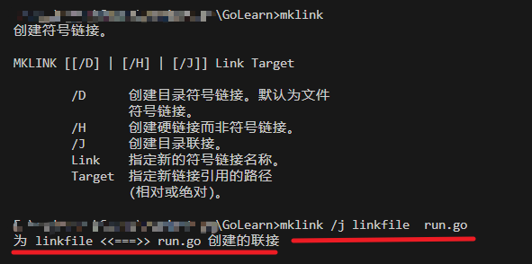
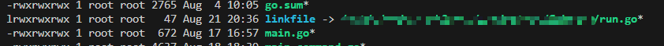
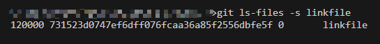
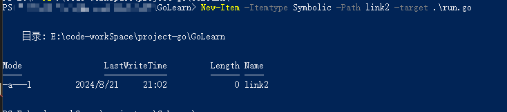
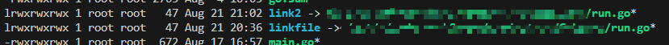

---
tags:
  - git
  - symbolic
---
### Linux

如果是类Unix系统, 直接在repo中创建symbolic link, 之后提交就可以了.


### windows
大家肯定想到了在git bash中使用l`ln`创建软链, 然后提交.  这种方式经测试 **是不可以的**.

>方法一:  mklink  需要admin权限

```bat
mklink
创建符号链接。

MKLINK [[/D] | [/H] | [/J]] Link Target     

        /D      创建目录符号链接。默认为文件
                符号链接。
        /H      创建硬链接而非符号链接。    
        /J      创建目录联接。
        Link    指定新的符号链接名称。      
        Target  指定新链接引用的路径        
                (相对或绝对)。
```

使用`mklink`创建软链, 之后提交就可以.   



下载下来到Linux中





> 2. power-shell New-Item


使用powershell中的 New-Item来创建软链, 需要 admin权限.

```powershell
New-Item -ItemType  symbolic  -Path lin2 -target run.go
```





