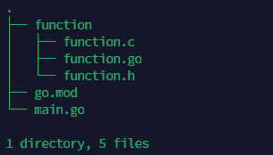

---
tags:
  - CGO
  - Golang
---
CGO是Go语言用来和C语言交互的一种机制, 相比于java以及nodejs来说,  cgo就简单多了.  cgo调用C有这种集中方式:
1. 直接调用comment中的C 函数
2. 编写好对应的C 文件(其实就是C编程),   然后通过cgo来调用
3. 调用C的共享库, windows 中dll文件,  类unix中的 so文件

#### 1. 直接调用
当需要调用的C函数比较短小, 可以直接写在文件的comment 开头, 直接调用. 

> 此处要注意: 
> C函数和 import "C" 之间不可以有空格
```go
package main

// 这里直接把C函数写在 comment中, 并且需要和 import "C" 放在一起, 不可以有空格
/*
#include <stdio.h>
void Hello() {
        printf("hello world from cgo\n");
}
*/
import "C"

// 推荐 把直接调用C函数的地方 封装为Go函数
func CallCHello() error {
        Hello()
        return nil
}

func Hello() error {
        _, err := C.Hello()

        return err
}

func main() {
    C.Hello()
    Hello()
    CallCHello()
}


```

#### 2. 通过文件调用
> 注意:
> 当放在同一个文件夹时, 需要使用go run .来进行调用. 否则会找不到 Sum HelloWorld符号
```go
// 三个文件在同一个文件夹内
// function.c
#include <stdio.h>
#include "function.h"

void HelloWorld() {
    printf("hello world from another C\n");
}

int Sum(int a, int b) {

    return a+b;
}

// function.h
#ifndef __FUNCTION__
#define __FUNCTION__

void HelloWorld();

int Sum(int a, int b);
#endif

// mian.go
package main

//#include "function/function.h"
import "C"

import (
"fmt"
)

func main() {

  C.HelloWorld()
  res, _ := C.Sum(C.int(1), C.int(2))
  sum := int(res)
  fmt.Println("sum: ", sum)
}
```


##### 2.1 C函数在不同文件夹中
作为工程开发时, 一般不会把所有文件放在一起,  而是会根据功能或开发要求进行单独放置.  像C函数肯定也会放到自己的一个目录中, 这种情况下如何调用呢? 

针对这种情况我们会在在同目录中**编写对应的Go 函数来封装好对应的C函数**, 之后就可以直接调用对应的Go函数, 而不用关心底层的C调用.


```go
//  function.c  function.h 和上面一样

// function.go
package function


// #include "function.h"
import "C"

import (
        "fmt"
)

func Hello() {
        C.HelloWorld()
}

func Sum(a,b int){
        sum, _ := C.Sum(C.int(a), C.int(b))

        fmt.Println("sum: ", sum)
}

//main.go
package main

//#include "function/function.h"
//import "C"

import (
"fmt"
"com.wk/GLearn/function"
)

func main() {

 /* C.HelloWorld()
  res, _ := C.Sum(C.int(1), C.int(2))
  sum := int(res)
  fmt.Println("sum: ", sum)
*/

function.Hello()

function.Sum(1,2)
fmt.Println("End")
}
```


#### 3.调用c库
此处使用uuid来测试.
> yum install -y libuuid-devel

```go
package main


// #cgo LDFLAGS: -luuid      // 表示编译时 链接 UUID共享库
// #include <uuid/uuid.h>
// #include <stdlib.h>
import "C"

import (
"fmt"
"unsafe"
"com.wk/GLearn/function"
)

// 把UUID的调用封装为go函数
func Uuid() {
  var uuid *C.uchar
  var uuid_str *C.char
  uuid = (*C.uchar)(C.malloc(16))
  uuid_str = (*C.char) (C.malloc(37))
  C.uuid_generate_random(uuid)
  C.uuid_unparse(uuid, uuid_str)
  fmt.Println(C.GoString(uuid_str))

// 释放内存
  C.free(unsafe.Pointer(uuid))
  C.free(unsafe.Pointer(uuid_str))
}

func main() {
function.Hello()
function.Sum(1,2)

Uuid()

fmt.Println("End")
}


```

除了这三种调用外, 其实大家还会注意到在调用C函数时, 会对类型做一些转换, 其实是因为C的类型和Go类型不一样导致的.  
具体我们在[[15-cgo-types]]中分析.


