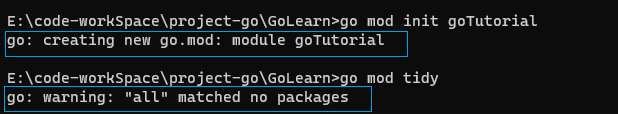
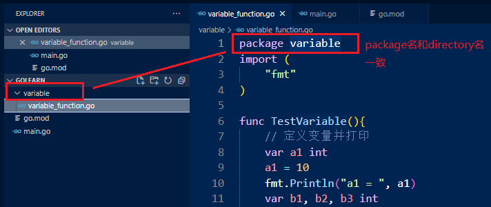
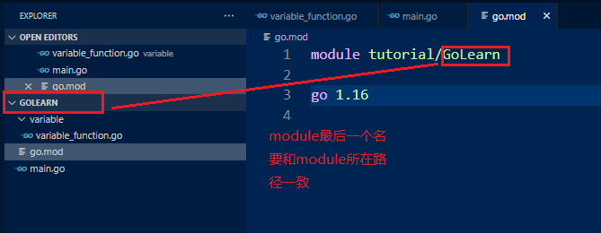

# go 模块使用
## 1. go mod的使用
go使用go mod命令来管理一个项目的模块, 我们看一下此命令的帮助:
```shell
go mod help

Usage:
        go mod <command> [arguments]
The commands are:

        download    download modules to local cache
        edit        edit go.mod from tools or scripts
        graph       print module requirement graph
        init        initialize new module in current directory
        tidy        add missing and remove unused modules
        vendor      make vendored copy of dependencies
        verify      verify dependencies have expected content
        why         explain why packages or modules are needed
```

## 2. 创建一个go项目
下面通过使用go mod来创建一个go项目.

```shell
# 此步骤就会创建好一个对应的模块管理的项目
step 1: init project directory
go mod init goTutorial

# 添加或移除不再使用的module
step 2: 整理项目
go mod tidy
```


通过上面两步就已经创建好了一个module了.下面说几个关于创建packag时要注意的点:
1. package 的名字和package所在的目录要一致
   
2. module名要和module所在的目录一致
   
3. GO111MODULE需要设置为on或者是auto
```shell
go env -w GO111MODULE=on
```
4. go.mod文件要在根目录


