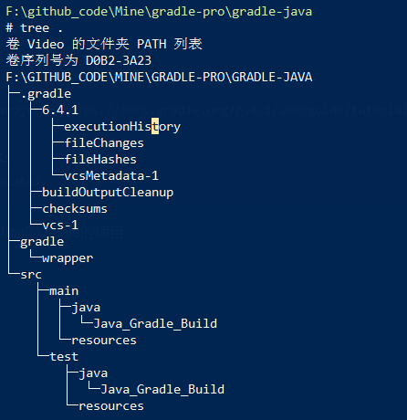
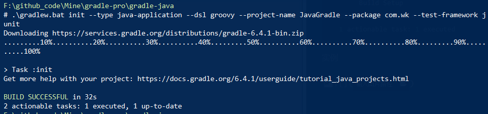
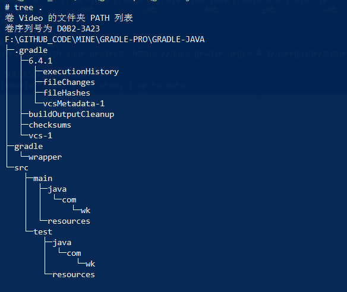
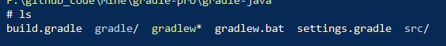

[TOC]

# 创建一个gradle工程 

此系列文档使用的是gradle-6.4.1

## 1. 使用交互式命令创建工程

```shell
F:\github_code\Mine\gradle-pro\gradle-java
# gradle.bat init		# 在工程目录开始创建
Starting a Gradle Daemon (subsequent builds will be faster)

Select type of project to generate:	# 创建什么类型的工程
  1: basic
  2: application
  3: library
  4: Gradle plugin
Please enter a value between 1 and 4: 2   # 此处选择的是 application

Select implementation language:	# 选择开发的语言
  1: C++
  2: Groovy
  3: Java
  4: Kotlin
  5: Swift
Enter selection (default: Java) [1..5] 3

Select build script DSL:	# gradle的DSL语言
  1: Groovy
  2: Kotlin
Enter selection (default: Groovy) [1..2] 1

Select test framework:	# 测试框架
  1: JUnit 4
  2: TestNG
  3: Spock
  4: JUnit Jupiter
Enter selection (default: JUnit 4) [1..4] 1

Project name (default: gradle-java): Java_Gradle_Build

Source package (default: Java_Gradle_Build):


> Task :init
Get more help with your project: https://docs.gradle.org/6.4.1/userguide/tutorial_java_projects.html

BUILD SUCCESSFUL in 1m 12s
2 actionable tasks: 2 executed
```

这样就创建好了一个java application的gradle的项目,目录结构如下:



创建好的 warpper的配置如下:

```properties
# cat gradle\wrapper\gradle-wrapper.properties
distributionBase=GRADLE_USER_HOME
distributionPath=wrapper/dists
distributionUrl=https\://services.gradle.org/distributions/gradle-6.4.1-bin.zip
zipStoreBase=GRADLE_USER_HOME
zipStorePath=wrapper/dists
```

此处gradle-wrapper.properties的内容有运行的gradle版本一致。可以通过任务指定。

## 2.命令行制定参数的创建

常用的参数：

```shell
# gradle init 任务的参数，用于快速创建工程
--type: 要创建的工程的类型。
--dsl: 描述语言; groovy,kotlin
--project-name: 工程的名字
--package: 初始化的package路径
--test-framework: 使用的测试框架
```


查看任务的帮助

```shell
# 从命令行查看一个task的帮助,此处查看 init 任务的帮助
$ gradle help --task  init

F:\github_code\Mine\gradle-pro\gradle-java 
# .\gradlew.bat help --task init                    
> Task :help         
Detailed task information for init         
Path                         
     :init               
Type                
     InitBuild (org.gradle.buildinit.tasks.InitBuild)           
Options         
     --dsl     Set the build script DSL to be used in generated scripts. 
               Available values are:  
                    groovy    
                    kotlin 
     --package     Set the package for source files.  
     --project-name     Set the project name. 
     --test-framework     Set the test framework to be used.  
                          Available values are:  
                               junit  
                               junit-jupiter  
                               kotlintest  
                               scalatest  
                               spock  
                               testng  
     --type     Set the type of project to generate. 
                Available values are:      
                     basic   
                     cpp-application    
                     cpp-library        
                     groovy-application   
                     groovy-gradle-plugin 
                     groovy-library    
                     java-application  
                     java-gradle-plugin   
                     java-library  
                     kotlin-application  
                     kotlin-gradle-plugin 
                     kotlin-library     
                     pom  
                     scala-library    
                     swift-application  
                     swift-library             
Description                          
     Initializes a new Gradle build.                         
Group                                      
     Build Setup                                     
BUILD SUCCESSFUL in 32s                             
1 actionable task: 1 executed                                                       
```

实例



目录结构:



​	顶层目录中的文件：




