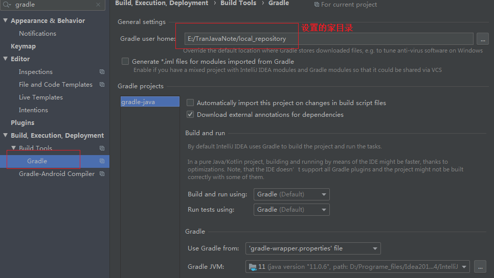

[TOC]

# 设置gradle的jar包下载路径

## 1. 设置环境变量

设置一个gradle的环境变量: GRADLE-USER-HOME， 但是要重启系统才能生效：

```properties
key: GRADLE_USER_HOME
value: 为jar包下载的路径
```


## 2. 命令行参数指定

```shell
-g, --gradle-user-home
    Specifies the Gradle user home directory. The default is the .gradle directory in the user’s home directory.

```


## 3.  在idea中设置gradle的jar包目录



## 4. 在gradle.properties中配置

此中方式只是对当前项目有效，不是针对所有项目。

```shell
gradle.user.home=D:\Users\shaowei\.gradle
```

## 5. 在gradle启动脚本中设置

```shell
set GRADLE_OPTS="-Dgradle.user.home=D:\Users\shaowei\.gradle"
```

