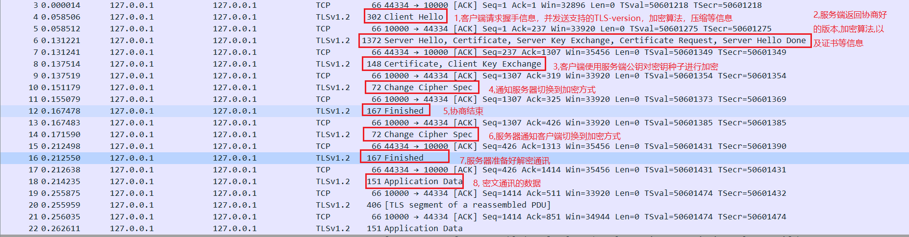
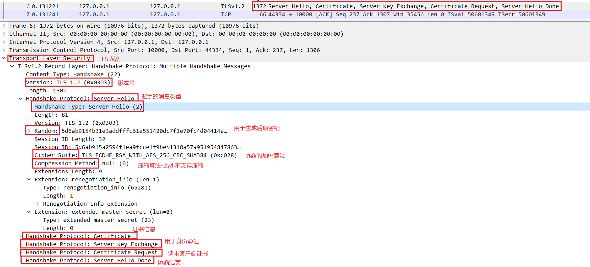
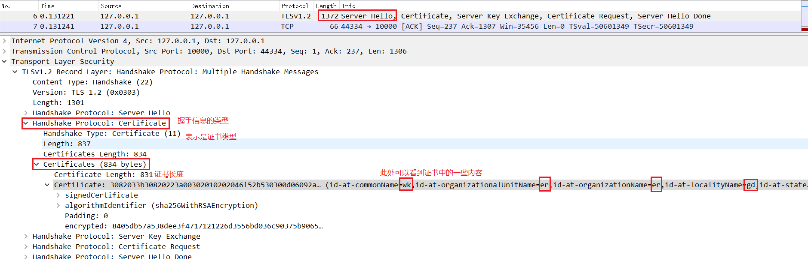
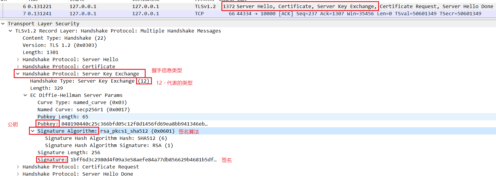
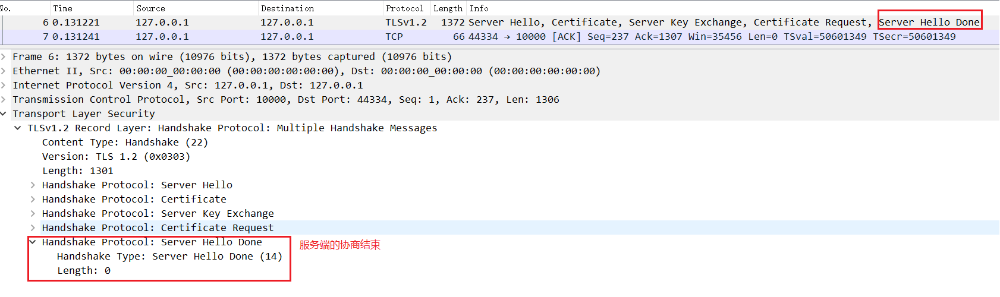
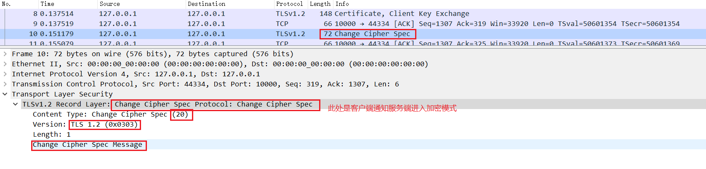
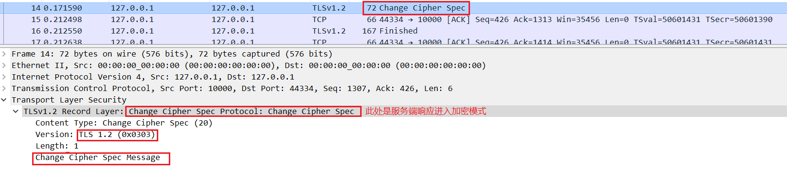
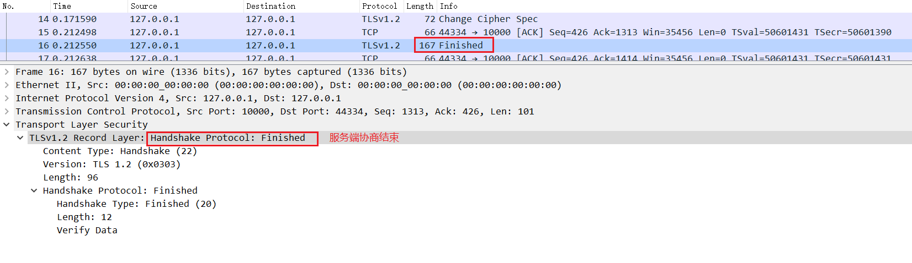
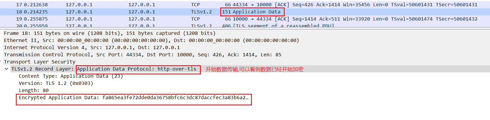

# SSL/TLS协议

SSL(Secure Sockets layer)和TLS(Transport Layer Security)是比较成熟的通信加密协议，它们通常被用于在客户端和服务端之间建立加密通信通道。各种开发语言都给出了SSL/TLS协议的具体的实现，在JDK中有一个JSSE(javax.net.ssl)包，提供了对SSL和TLS的支持。通过JDK提供的一系列API，开发者可以像使用普通socket一样使用基于SSL或TLS的安全套接字，而不用关心SSL和TLS协议的细节，例如握手的过程等。

## 协议过程介绍

SSL/TLS协议处于TCP/IP协议与各种应用协议之间，为数据通讯提供安全支持。

从协议内部的功能层面看，SSL/TLS协议可分为两层：

1.SSL/TLS记录协议(SSL/TLS Record Protocol)，它建立在可靠的传输层协议协议(TCP)之上，为上层协议提供数据封装，压缩，加密等基本功能。

2.SSL/TLS握手协议(SSL/TLS Handshake Protocol)，它建立在SSL/TLS记录协议之上，用于在实际的数据传输开始前，通讯双方进行身份认证，协商加密算法，交换加密密钥等初始化协商功能。

从协议使用方式看，又可以分为两种类型:

1.SSL/TLS单向认证，就是用户到服务器之间只存在单方面的认证，即客户端会认证服务端身份，而服务端不会去对客户端身份进行验证。首先，客户端发起握手请求，服务端收到握手请求后，会选择适合双方的协议版本和加密方式。然后，再将协商的结果和服务器端的公钥一起发放给客户端。客户端利用服务器端的公钥，对要发送的数据进行加密，并要发送的数据进行加密，并发送给服务端。服务端收到后，会利用本地私钥对收到的客户端加密数据进行解密。然后，通讯双方都会使用这些数据来产生双方之间通讯的加密密钥。接下来，双方可以开始安全通讯过程了。

2.SSL/TLS双向认证，就是双方互相认证，也就是两者之间将会交换证书。基本过程和单向认证完全一样，只是在协商阶段多了几个步骤。在服务器将协商的结果和服务器端的公钥一起发送给客户端后，会请求客户端的证书，客户端则会将证书发送给服务器端。然后，在客户端给服务器端发送加密数据后，客户端会将私钥生成的数字签名发送给服务端。而服务端则会用客户端证书中的公钥来验证数字签名的合法性。建立握手之后过程则和单向通讯完全一致。

基本流程如下：

步骤1. ClientHello --客户端发送所支持的SSL/TLS最高协议版本号和所支持的加密算法集合以及压缩方法集合等信息给服务端。

步骤2. ServerHello--服务端收到客户端信息后，选定双方都能支持的SSL/TLS协议版本和加密方法及压缩方法，返回给客户端。

步骤3.  SendCertificate--- 服务端发送服务端证书给客户端.

步骤4(可选). RequestCertificate--如果选择了双向认证，服务端像客户端请求客户端的证书

步骤5. ServerHelloDone-- 服务端通知客户端初始协商结束

步骤6(可选). ResponseCerificate--如果选择双向认证，客户端向服务端发送客户端证书

步骤7. ClientKeyExchange -- 客户端使用服务端的公钥，对客户端公钥和密钥种子进行加密，再发送给服务端。

步骤8(可选). CertificateVerify-- 如果选择双向认证，客户端用本地私钥生成数字签名，并发送给服务端，让其通过收到的客户端公钥进行身份验证。

步骤9. CertSecuretKey-- 通讯双向基于密钥种子等信息生成通讯密钥。

步骤10. ChangeCipherSpec -- 客户端通知服务端已将通讯方式切换到加密模式。

步骤11. Finished --  客户端做好加密通讯的准备。

步骤12. ChangeCipherSpec -- 服务器通知客户端已经通讯方式切换到加密模式

步骤13. Finished -- 服务端做好加密通讯的准备

步骤14. Encrypted / DecryptedData -- 双方使用协商好的密钥，通过对此加密算法对通讯内容进行加密

步骤15. CloseConnection -- 通讯结束后，任何一方发出断开SSL连接的消息。

名词解析:

**对此算法(symmetric cryptography)：**就是需要双方使用一样的key来加密解析消息，常用密钥算法有:Data Encryption Standard(DES)， triple-strength DES(3DES),Rivest Cipher 2(RC2)和Rivest Cipher 4(RC4)。因为对称算法效率相对高，因此SSL会话中的敏感数据都使用密钥算法加密。

**非对称算法(asymmetric cryptography)：**就是key的组成是公钥私钥对(key-pair)，公钥传递给对方，私钥自己保留。公钥私钥算法是互逆的，一个用来加密另一个可以解密。常用的算法有Rivest Shamir Adleman(RSA)，Diffie-Hellman(DH)。非对称算法计算量大，因此仅适用于少量数据加密，如对密钥加密，而不适合大量数据的通讯加密。

**公钥证书(public key certificate)：**公钥证书类似数字护照，由受信机构颁发。受信阻止的公钥证书就是certificate authority(CA)。多证书可以连接成证书串，第一个是发送人，写一个是给其颁发证书实体，往上到根证书是世界范围受信组织，包括Versign，Entrust和GTE CyberTrust。公钥证书让非对称算法的公钥传递更安全，可以避免身份伪造，比如C创建了公钥私钥，并冒充A将公钥传递给B，这样C和B之间的的通讯会让B误认是A和B之间的通讯。

**加密哈希功能(Cryptographic Hash Functions)：**加密哈希功能与checksum功能相似。不同之处在于，checksum用来侦测意外的数据变化而加密哈希用来侦测数据是否篡改。数据被hash后产生一小串比特字符串，微小的数据改变将导致hash串的变化。发送数据时，SSL会使用加密hash功能来确保数据的一致性，用来阻止第三方破坏通讯数据完整性。SSL常用的hash算法由Message Digest 5(MD5)和Secure Hash Algorithm(SHA)。

**消息认证码(Message Authentication Code)：**消息认证码与加密hash功能相似，除了它需要基于密钥。密钥信息与加密hash功能产生的数据结合就是哈希消息认证码(HMAC)。如果A要确保给B发送的消息不被C篡改，他要按如下步骤做--首先：A要计算吃一个HMAC值，将其添加到原始信息后面。用于A与B之间通讯的密钥加密消息体，然后发送给B。B收到信息后用密钥解密，然后重新计算出一个HMAC，来判断消息是否再传输中被篡改，SSL用HMAC来确保数据传输的安全。

**数字签名(Digital Signature)：**一个消息加密哈希被创建后，哈希值用发送者的私钥加密，解密的结果就叫做数字签名。

## SSL/TLS单向认证抓包分析

先从抓的包中大体分析流程:

第一步:  ClientHello -- 客户端发送支持的TLS版本，加密，压缩等算法信息。

第二步: 此阶段发送了多个握手信息，分别是:serverHello，certificate，ServerKeyExchange，Certificate Request，ServerHelloDone。咱们一一分析：

​	ServerHello:

​	certificate：

​	ServerKeyExchange：

​	Certificate Request：

​	ServerHelloDone：

第三步: 此步骤同样是包含多个握手信息，分别是:Certificate, clientKeyExchange；那分别看看把。

certificate:

clientKeyExchange：

第四步: 客户端通知服务端进入加密模式

第五步: 客户端协商结束

第六步: 服务端响应进入加密模式

第七步: 服务器协商结束

第八步: 开始密文传输

到此一个TLS握手以及密文传输的一个过程就分析完了。

下篇分析如何通过wireshark解析https密文。

参考资料:

[Java SSL/TLS 安全通讯协议介绍]: https://www.ibm.com/developerworks/cn/java/j-lo-ssltls/
[什么是数字证书、公钥私钥]: https://blog.csdn.net/weixin_39986856/article/details/82385450
[java ssl调试打开ssl debug日志]: https://blog.csdn.net/kevin_mails/article/details/84559906
[Java Secure(SSL/TLS) Socket实现]: https://blog.csdn.net/a19881029/article/details/11742361

