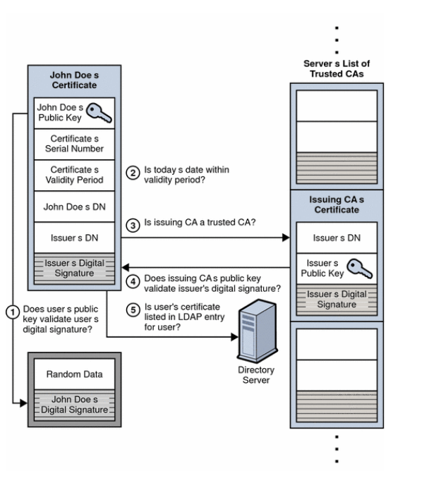
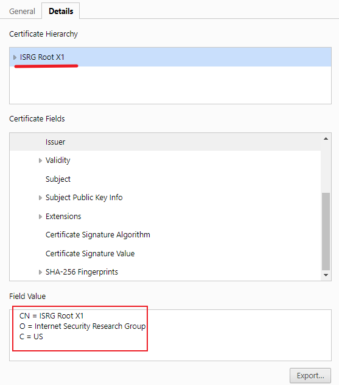
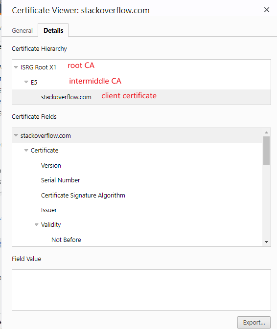

---
tags:
  - https
  - SSL/TLS
---

### 1. how client verify server certificate ?  (客户端如何校验服务器端证书)
当client 接收到server发送过来的证书后, 会做一下几件事:
1. 读取证书中的 `issuer`, 然后从 trustCertificateList 中找到对应的CA证书
2. 如果没找到,  则直接发送 alert.  
3. 找到CA后, 会用CA中的 公钥 解密证书中的签名. **digital certificate=CSR + encrpted(hash(CSR))**
4. 读取证书中的 CSR (certificate signing  Request), 并根据 证书中`签名算法` 做 hash操作.
5. 如果hash后的值  == 解密后的签名, 那么证书校验通过
6. (optional) DNS校验, 即 证书中的DNS域名和 访问的 server的域名一致. 


### 2. Do server need send certificate chan to client ? need or no need, explain the reason.  (服务器端需要发送证书链到客户端吗?  请接释原因)
首先说一下, 证书的三种分类.
证书可以简单分为 两种:
`CA 证书`:  用于签发其他 client证书的证书, 称为CA证书, 也成为 根证书
`client certificate`:  有 CA 颁发的 client 证书.
再细分, 就是`CA`还有一种.  
`intermediate CA`: 即有 根证书(root CA) 签发的 中间证书.  中间证书也可用于签发 client 证书.

> 从下图可以看到,  root CA 是属于自签名的证书


然后再接释一下, 什么是证书链.
> 证书链:  就是证书文件中, 不光包含了client certificate, 同时包含了对其签名的 intermediate certificate.  也可以包含 root CA.

下面是一个浏览器展示的证书链. 既包含了root CA,  intermediate CA 以及 End-User certificate.


```shell
## 证书文件中(PEM) 的证书链, 格式和下面类似
## 第一个为 客户端证书
1.end-user-certificate  issued to: baidu.com - issued by: Authority1
2.Authority1-cert      issued to: Authority1 - issued by: Authority2
3.Authority2-cert      issued to: Authority2 - issued by: Authority3
4.Authority3-cert     issued to: Authority3 - issued by: Authority4
5.Authority4-cert     issued to: Authority4 - issued by: root CA
```
那么回到正题, server会发送证书链吗?
如果server的证书由 intermediate CA 签名,  那么就会发送证书链到client.

为什么呢?
因为签名的 intermediate CA有可能没有存储在client 端,  那为了校验成功, 就会进行证书链的校验, 同 **问题4 证书链校验**.   如果不发送证书链的话, 那么在 client 端 trustCertificateList中找不到 对应的CA证书,  校验会失败.

### 3. when server send certificate chan to client, which need include root CA certificate as well?   (当服务器发送证书链时,  需要发送root CA证书吗? )
了解了为什么发送证书链,  就可以判断,  其实不发送root CA也没有关系.  
1.  不发送root CA.  那么通过证书链中的 intermediate CA 也可以在 client端找到签名的根证书,  也能保证handshake 成功.
2. 发送root CA. 因为root CA是 自签名证书, 那么发送root CA, 也能使 client找到对应的CA证书 来进行 handshake.
### 4. how client verify server certificate chan? (客户端如何校验服务器端的证书链?)
以一个栗子来说明校验的流程. 
假设server端发送以下的一个证书链
```shell
1.end-user-cert  issued to: baidu.com - issued by: Authority1
2.Authority1-cert      issued to: Authority1 - issued by: Authority2
3.Authority2-cert      issued to: Authority2 - issued by: root CA1
```

客户端拥有以下 trustCA list:
```shell
1. root CA1
2. root CA2
3. root CA3
```

校验流程如下:
1. end-user-cert先发送过来, 由此client 知道此是 server端证书.  并拿着 `Authority1`去  trustCAList中查找此对应的CA证书. 但没有找到
2.  client会沿着证书链继续向上校验.  此时准备校验 `Authority1-cert`, 同样去 trustCAList中查找  `Authority2`. 同样没有找到. 
3. 继续向上, 此时校验: `Authority2-cert`, 并去查找 `root CA1`. 通过`root CA1` 知道此 `Authority2-cert`是可信的证书,  由此使用`Authority2-cert` 校验`Authority1-cert`,  并确认是可信的证书.  最后通过`Authority1-cert`校验`end-user-cert`


### 5. when server send a certificate chan to client, how client knows which one is server certifcate ? (服务器发送了证书链到客户端, 那么客户端如何才能知道哪个证书是服务器证书?  )
> certificate_list
      This is a sequence (chain) of certificates.  The sender's
      certificate MUST come first in the list.  Each following
      certificate MUST directly certify the one preceding it.  Because
      certificate validation requires that root keys be distributed
      independently, the self-signed certificate that specifies the root
      certificate authority MAY be omitted from the chain, under the
      assumption that the remote end must already possess it in order to
      validate it in any case.
      
由此可知, 当server 发送一个证书链时,  证书链是一个排序好的, 并且第一个就是 server自己的证书.
> As indicated in the standard, the server is supposed to send a complete, ordered _chain_ of certificate, starting with the server's certificate proper, then a certificate for the intermediate CA that issued it, then a certificate for the intermediate CA that issued the previous intermediate CA certificate, and so on. At the end of the chain, the server has the option to include or not include the root CA certificate; if the chain is to be of any use to the client, then the client must already know the root, and thus does not need a new copy of it


### 6. As we know, client have many CA certificates, when client begin verify server certificate, how client knows which CA certificate to user ? ( 我们都知道, 客户端有很多的CA证书,  那么当client需要对 服务器证书校验时,  如何知道要使用那个CA 证书?)
client 会通过 server证书中的 `issuer`来查找对应的 CA.

### 7. 当server端要校验client端证书, 而且客户端keystore中有多个entry,  客户端如何知道要选择哪一个 entry? 


### 8. what need to do when CA certificate expires?   (如果CA证书过期了, 那么怎么做?)
当root CA过期, 我们怎么做呢?

method 1:  
从更新生成根证书,  并让client重新使用根证书签名.   (影响太大. 不好实行)


method 2:
保持根证书 私钥不变(私钥不变,  意味着公钥也不变),  重新签名一个根证书. (可行.)

可行的原因:
所有由 旧根证书 签名的cert,  其上的签名 就是使用 root cert 的 私钥签名的. 新root CA的 私钥同 旧 rootCA 是一样的,  故原先的 client cert 不会受影响.

验证查看 [[3-renew-CA]]

### 9. 原先使用的自签名证书上线了系统,  现在要转换到CA 签名的证书,  要如何操作?


### 10. 当stunnel中加载两个相同 `Subject`的证书, 会报错. why ?
由上面所知,  当client 校验证书时, 会通过 `issuer DN` 去CAList 查找. 其实 `Issuer DN` 对应 CA中的 Subject.  如果两个Subject 一样, 那么就会导致 不知道使用哪个证书来进行校验. 
当然`stunnel`中的实现中, 可能对此种情况有处理. (没有深入了解此部分)


> reference

[CA expires](https://serverfault.com/questions/306345/certification-authority-root-certificate-expiry-and-renewal)
[server send CA certifcate? ](https://security.stackexchange.com/questions/93157/in-ssl-server-handshake-does-server-also-send-ca-certificate)
[how client verify server certificate](https://stackoverflow.com/questions/35374491/how-does-the-client-verify-servers-certificate-in-ssl)
[client verify server certificate](https://docs.oracle.com/cd/E19693-01/819-0997/aakhb/index.html)
[client verify server certificates](https://web.archive.org/web/20230810153801/https://docs.oracle.com/cd/E19693-01/819-0997/aakhb/index.html)
[which certifcate to select when client have multiple cert](https://stackoverflow.com/questions/58590849/which-ssl-certificate-will-be-selected-if-client-has-multiple-certificates-in-ke)