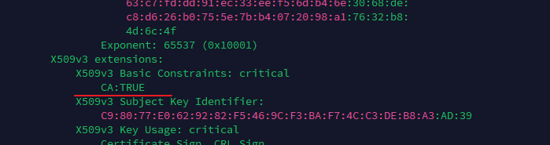

---
tags:
  - CA
  - openssl
  - SSL/TLS
  - certificate
---
当加载client发过来的CA证书时,  发现报错:
```shell
....Unknown CA....
```

之后发现是 证书中的 `CA:TRUE` extension 没有.  


```
# X.509v3 certificate extension "Basic Constraints"


A certificate can contain several different extensions, so called "x509v3 extensions". One of them is the "Basic Constraints" extension that, depending on the version of a security library, can play a role in the TLS handshake. While older versions may not require that this extension is present in certificates, newer versions often do. The "Basic Constraints" extension can have two attributes: the attribute "critical" may be present or absent, the attribute "CA" can have two values, "true" or "false". While the "critical" attribute does not yet seem to be a required attribute with commonly used versions of security libraries, the attribute "CA" is required by some. Notably, current versions of IBM's GSKit as well as OpenSSL 1.1 require the "CA" attribute to be "true" for CA certificates. This means, a certificate that does not have the extension "Basic Constraints: CA:TRUE" is not considered a CA certificate and therefore ignored in a keystore.

It is good practice to make sure that all CA certificates as well as self-signed user certificates of database servers contain this extension "Basic Constraints: CA:TRUE". When using "openssl" to create certificates or certificate requests, the extension normally is inserted correctly by default. However, if you notice that your certificate creation or signing commands produce a CA certificate or self-signed certificate without the correct extension, then it may be worth the effort to figure out, why this happens and how to correct it.

The first check probably is in the OpenSSL configuration file, "openssl.cnf", located in the directory shown by command "openssl version -d". This file normally has different sections marked with "[ section_label ]". It is normal to have a configuration parameter "basicConstraints=CA:FALSE" in section "[ usr_cert ]", as this section is used when creating user certificates. Also section "[ v3_req ]" usually contains the parameter "basicConstraints=CA:FALSE". This section is used when creating certificate requests, and it is assumed that certificate requests are generally created for user certificates. On the other hand, section "[ v3_ca ]" is the section used by CAs and therefore has the parameter "basicConstraints = critical,CA:true". In addition, section "[ req ]" normally contains a parameter "x509_extensions = v3_ca" which tells the "openssl req" command to use section "[ v3_ca ]" also when creating self-signed certificates and therefore self-signed certificates normally get the correct extension.

If the default OpenSSL configuration file does not have the correct configuration parameters, or some other change is deemed necessary, then the default configuration file can be copied to a local file and modified. Then this locally modified file can be used at least to test changes. A local configuration file can be specified with option "-config ..." for "openssl req" commands, and with option "-extfile ..." for "openssl x509 -req" commands when signing certificates. Both commands also accept an option "-extensions ..." that can be used to specify a specific configuration file section to be used for the command.
```


>reference

[CA:TRUE](https://www.ibm.com/docs/en/informix-servers/14.10?topic=openssl-x509v3-certificate-extension-basic-constraints)
