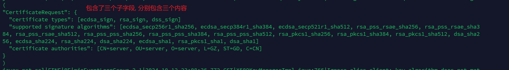

---
tags:
  - zookpeeper
  - handshake
  - tls
  - certificate
---
zookeeper-3.8.4

> sun.security.ssl.CertificateRequest -->  T10CertificateRequestProducer

```java
  @Override  
    public void consume(ConnectionContext context,  
            ByteBuffer message) throws IOException {  
        // The consuming happens in client side only.  
        ClientHandshakeContext chc = (ClientHandshakeContext)context;  
		.....
        //  
        // validate        //        // blank  
        //        // update        //  
// An empty client Certificate handshake message may be allow.  
chc.handshakeProducers.put(SSLHandshake.CERTIFICATE.id,  
                SSLHandshake.CERTIFICATE);  
  
        X509ExtendedKeyManager km = chc.sslContext.getX509KeyManager();  
        // 此处是选择证书的具体操作:
        String clientAlias = null;  
        if (chc.conContext.transport instanceof SSLSocketImpl) {  
            clientAlias = km.chooseClientAlias(crm.getKeyTypes(),  
                crm.getAuthorities(), (SSLSocket)chc.conContext.transport);  
        } else if (chc.conContext.transport instanceof SSLEngineImpl) {  
            clientAlias = km.chooseEngineClientAlias(crm.getKeyTypes(),  
                crm.getAuthorities(), (SSLEngine)chc.conContext.transport);  
        }  
  
  
        if (clientAlias == null) {  
            if (SSLLogger.isOn && SSLLogger.isOn("ssl,handshake")) { 
                SSLLogger.warning("No available client authentication");  
            }  
            return;  
        }  
  
        PrivateKey clientPrivateKey = km.getPrivateKey(clientAlias);  
        if (clientPrivateKey == null) {  
            if (SSLLogger.isOn && SSLLogger.isOn("ssl,handshake")) {  
                SSLLogger.warning("No available client private key");  
            }  
            return;  
        }  
  
        X509Certificate[] clientCerts = km.getCertificateChain(clientAlias);  
        if ((clientCerts == null) || (clientCerts.length == 0)) {  
            if (SSLLogger.isOn && SSLLogger.isOn("ssl,handshake")) {  
                SSLLogger.warning("No available client certificate");  
            }  
            return;  
        }  
  
        chc.handshakePossessions.add(  
                new X509Possession(clientPrivateKey, clientCerts));  
        chc.handshakeProducers.put(SSLHandshake.CERTIFICATE_VERIFY.id,  
                SSLHandshake.CERTIFICATE_VERIFY);  
    }  
}
```

> sun.security.ssl.X509KeyManagerImpl  >  chooseEngineClientAlias
```java
@Override  
public String chooseEngineClientAlias(String[] keyTypes,  
        Principal[] issuers, SSLEngine engine) {  
    return chooseAlias(getKeyTypes(keyTypes), issuers, CheckType.CLIENT,  
                    getAlgorithmConstraints(engine));  
}
```


```java
/*  
 * Return the best alias that fits the given parameters. 
 * The algorithm we use is: 
 *   . scan through all the aliases in all builders in order 
 *   . as soon as we find a perfect match, return 
 *     (i.e. a match with a cert that has appropriate key usage, 
 *      qualified endpoint identity, and is not expired). 
 *   . if we do not find a perfect match, keep looping and remember   *     the imperfect matches 
 *   . at the end, sort the imperfect matches. we prefer expired certs 
 *     with appropriate key usage to certs with the wrong key usage.  *     return the first one of them. */

private String chooseAlias(List<KeyType> keyTypeList, Principal[] issuers,  
        CheckType checkType, AlgorithmConstraints constraints) {  
  
    return chooseAlias(keyTypeList, issuers,  
                                checkType, constraints, null, null);  
}
```


```java
private String chooseAlias(List<KeyType> keyTypeList, Principal[] issuers,  
        CheckType checkType, AlgorithmConstraints constraints,  
        List<SNIServerName> requestedServerNames, String idAlgorithm) {  
  
    if (keyTypeList == null || keyTypeList.isEmpty()) {  
        return null;  
    }  
  
    Set<Principal> issuerSet = getIssuerSet(issuers);  
    List<EntryStatus> allResults = null;  
    for (int i = 0, n = builders.size(); i < n; i++) {  
        try {  
        //  getAliases 是具体的比较函数
            List<EntryStatus> results = getAliases(i, keyTypeList,  
                        issuerSet, false, checkType, constraints,  
                        requestedServerNames, idAlgorithm);  
            if (results != null) {  
                // the results will either be a single perfect match  
                // or 1 or more imperfect matches                // if it's a perfect match, return immediately                EntryStatus status = results.get(0);  
                if (status.checkResult == CheckResult.OK) {  
                    if (SSLLogger.isOn && SSLLogger.isOn("keymanager")) {  
                        SSLLogger.fine("KeyMgr: choosing key: " + status);  
                    }  
                    return makeAlias(status);  
                }  
                if (allResults == null) {  
                    allResults = new ArrayList<EntryStatus>();  
                }  
                allResults.addAll(results);  
            }  
        } catch (Exception e) {  
            // ignore  
        }  
    }  
    if (allResults == null) {  
        if (SSLLogger.isOn && SSLLogger.isOn("keymanager")) {  
            SSLLogger.fine("KeyMgr: no matching key found");  
        }  
        return null;  
    }  
    Collections.sort(allResults);  
    if (SSLLogger.isOn && SSLLogger.isOn("keymanager")) {  
        SSLLogger.fine(  
                "KeyMgr: no good matching key found, "  
                + "returning best match out of", allResults);  
    }  
    return makeAlias(allResults.get(0));  
}
```


此处查找主要是根据 certificateRequest中的数据要作为条件的. certificateRequest数据 展示如下:

```java
/*  
 * Return a List of all candidate matches in the specified builder 
 * that fit the parameters. 
 * We exclude entries in the KeyStore if they are not: 
 *  . private key entries 
 *  . the certificates are not X509 certificates 
 *  . the algorithm of the key in the EE cert doesn't match one of keyTypes 
 *  . none of the certs is issued by a Principal in issuerSet 
 * Using those entries would not be possible or they would almost 
 * certainly be rejected by the peer. 
 * 
 * In addition to those checks, we also check the extensions in the EE 
 * cert and its expiration. Even if there is a mismatch, we include 
 * such certificates because they technically work and might be accepted 
 * by the peer. This leads to more graceful failure and better error  * messages if the cert expires from one day to the next. 
 * 
 * The return values are: 
 *   . null, if there are no matching entries at all 
 *   . if 'findAll' is 'false' and there is a perfect match, a List   *     with a single element (early return) 
 *   . if 'findAll' is 'false' and there is NO perfect match, a List  *     with all the imperfect matches (expired, wrong extensions) 
 *   . if 'findAll' is 'true', a List with all perfect and imperfect  *     matches 
 */

 private List<EntryStatus> getAliases(int builderIndex,  
        List<KeyType> keyTypes, Set<Principal> issuerSet,  
        boolean findAll, CheckType checkType,  
        AlgorithmConstraints constraints,  
        List<SNIServerName> requestedServerNames,  
        String idAlgorithm) throws Exception {  
  
    Builder builder = builders.get(builderIndex);  
    KeyStore ks = builder.getKeyStore();  
    List<EntryStatus> results = null;  
    Date date = verificationDate;  
    boolean preferred = false;  
    for (Enumeration<String> e = ks.aliases(); e.hasMoreElements(); ) {  
        String alias = e.nextElement();  
        // check if it is a key entry (private key or secret key)  
        if (!ks.isKeyEntry(alias)) {  
            continue;  
        }  
		  // 获取证书链
        Certificate[] chain = ks.getCertificateChain(alias);  
        if ((chain == null) || (chain.length == 0)) {  
            // must be secret key entry, ignore  
            continue;  
        }  
  
        boolean incompatible = false;  
        // 证书链中的证书 必须时 X509格式的
        for (Certificate cert : chain) {  
            if (cert instanceof X509Certificate == false) {  
                // not an X509Certificate, ignore this alias  
                incompatible = true;  
                break;  
            }  
        }  
        if (incompatible) {  
            continue;  
        }  
  
        // check keytype  
        int keyIndex = -1;  
        int j = 0;  
        // 检查证书是否符合 certificateRequst中的 certificate types
        /*
CertificateRequest": {
  "certificate types": [ecdsa_sign, rsa_sign, dss_sign]
		*/
        for (KeyType keyType : keyTypes) {  
            if (keyType.matches(chain)) {  
                keyIndex = j;  
                break;  
            }  
            j++;  
        }  
        // 不符合则报错
        if (keyIndex == -1) {  
            if (SSLLogger.isOn && SSLLogger.isOn("keymanager")) {  
                SSLLogger.fine("Ignore alias " + alias  
                            + ": key algorithm does not match");  
            }  
            continue;  
        }  
        // check issuers  
	// 检查证书是否符合 certificateRequest中的 certificate authorities
        if (issuerSet != null) {  
            boolean found = false;  
            for (Certificate cert : chain) {  
                X509Certificate xcert = (X509Certificate)cert;  
                if (issuerSet.contains(xcert.getIssuerX500Principal())) {  
                    found = true;  
                    break;  
                }  
            }  
            if (found == false) {  
                if (SSLLogger.isOn && SSLLogger.isOn("keymanager")) {  
                    SSLLogger.fine(  
                            "Ignore alias " + alias  
                            + ": issuers do not match");  
                }  
                continue;  
            }  
        }  
  
        // check the algorithm constraints  
//此处主要是检查是否符合 certificateRequest中的"supported signature algorithms"
        if (constraints != null &&  
                !conformsToAlgorithmConstraints(constraints, chain, 
                        checkType.getValidator())) {  
  
            if (SSLLogger.isOn && SSLLogger.isOn("keymanager")) {  
                SSLLogger.fine("Ignore alias " + alias +  
                        ": certificate list does not conform to " +  
                        "algorithm constraints");  
            }  
            continue;  
        }  
  
        if (date == null) {  
            date = new Date();  
        }  
        CheckResult checkResult =  
                checkType.check((X509Certificate)chain[0], date,  
                                requestedServerNames, idAlgorithm);  
        EntryStatus status =  
                new EntryStatus(builderIndex, keyIndex,  
                                    alias, chain, checkResult);  
        if (!preferred && checkResult == CheckResult.OK && keyIndex == 0) {  
            preferred = true;  
        }  
        if (preferred && (findAll == false)) {  
            // if we have a good match and do not need all matches,  
            // return immediately            return Collections.singletonList(status);  
        } else {  
            if (results == null) {  
                results = new ArrayList<>();  
            }  
            results.add(status);  
        }  
    }  
    return results;  
}
```

如果三个条件都不符号, 即没有找到符合的证书, 则client 会发送一个空的 证书给server端.


