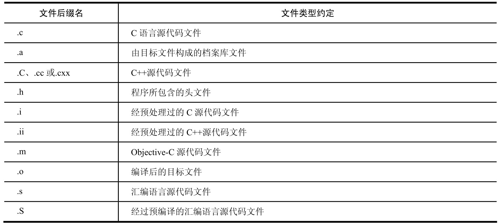
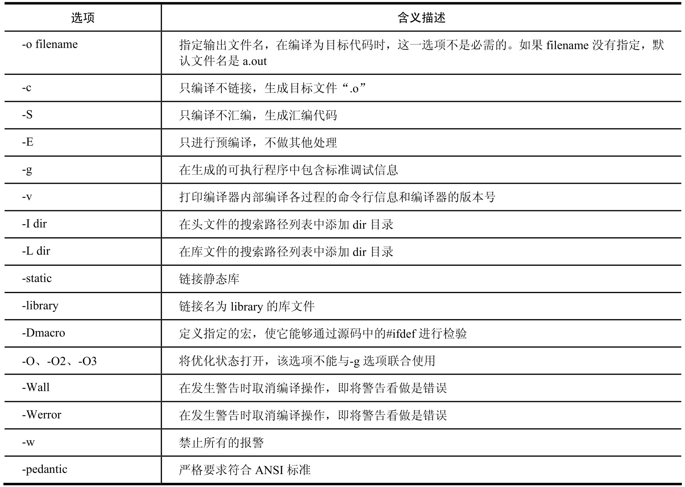
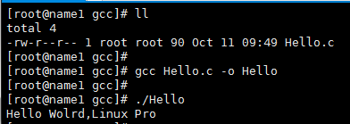

# GCC 

## 1.简介

gcc是一款交叉平台编译器，它能够在当前CPU平台上为多种不同体系结构的硬件平台开发软件，因此尤其适合在嵌入式软件领域的开发编译。

编译过程可以被细分为4个阶段：

* 预处理(Pre-Processing)
* 编译(Compiling)
* 汇编(Assembling)
* 链接(Linking)

### 1.1 部分约束规则

文件类型约定规则:



### 1.2 常用选项

常用命令行选项:



-ggdb : 生成gdb专用的调试符号信息

## 2. 编译

列举一个示例:

```c
#include<stdio.h>
int main(){
    printf("Hello Wolrd,Linux Pro\n");
    
    return 0;
}
```



编译过程: **首先 gcc 需要调用预处理程序cpp，由它负责展开在源文件中定义的宏，并向其中插入"#include"语句包含的宏； 接着 gcc会调用ccl 和 as 将处理后的源代码编译成目标代码； 最后，gcc会调用链接程序 ld，把生成的目标代码链接成一个可执行程序。**

单独分析，观察每一步操作:

1.预处理。

在预处理阶段，gcc把预处理命令扫描处理完毕，输入c语言的源文件，通常为*.c，它们通常带有.h之类的头文件的包含文件。这个阶段主要处理源文件中的 #ifdef , #include 和#define等预处理命令。该阶段会生成一个中间文件 *.i，但实际工程中通常不会专门生成这种文件，因此基本上用不到。可以使用-E参数让gcc在预处理后结束编译过程:

```shell
gcc -E hello.c  -o hello.i
```

```c
## 此处只是截取一部分,可以看到 stdio.h 文件展开了
extern char *ctermid (char *__s) __attribute__ ((__nothrow__));
# 908 "/usr/include/stdio.h" 3 4 
extern void flockfile (FILE *__stream) __attribute__ ((__nothrow__));
extern int ftrylockfile (FILE *__stream) __attribute__ ((__nothrow__)) ;
extern void funlockfile (FILE *__stream) __attribute__ ((__nothrow__));
# 938 "/usr/include/stdio.h" 3 4 

# 2 "Hello.c" 2
int main(){
    printf("Hello Wolrd,Linux Pro\n");

    return 0;

```

2.编译阶段。

在编译阶段，gcc把预处理后的结果编译成汇编  或者 目标模块。输入的是中间文件 *.i，编译后生成汇编语言文件 *.s。

```shell
gcc -S hello.i -o hello.s
```

编译后的结果:

```assembly

        .file   "Hello.c"
        .section        .rodata
.LC0:
        .string "Hello Wolrd,Linux Pro"
        .text
.globl main
        .type   main, @function
main:
.LFB0:
        .cfi_startproc
        pushq   %rbp
        .cfi_def_cfa_offset 16
        .cfi_offset 6, -16
        movq    %rsp, %rbp
        .cfi_def_cfa_register 6
        movl    $.LC0, %edi
        call    puts
        movl    $0, %eax
        leave
        .cfi_def_cfa 7, 8
        ret
        .cfi_endproc
.LFE0:
        .size   main, .-main
        .ident  "GCC: (GNU) 4.4.7 20120313 (Red Hat 4.4.7-23)"
        .section        .note.GNU-stack,"",@progbits
```

3.汇编。

在汇编阶段，编译器把编译出来的结果汇编成具体CPU上的目标代码模块。输入汇编文件 *.s，输出机器语言 *.o。

```shell
gcc -c hello.s  -o hello.o
```

```assembly
[root@name1 gcc]# hexdump hello.o
0000000 457f 464c 0102 0001 0000 0000 0000 0000
0000010 0001 003e 0001 0000 0000 0000 0000 0000
0000020 0000 0000 0000 0000 0140 0000 0000 0000
0000030 0000 0000 0040 0000 0000 0040 000d 000a
0000040 4855 e589 00bf 0000 e800 0000 0000 00b8
0000050 0000 c900 00c3 0000 6548 6c6c 206f 6f57
0000060 726c 2c64 694c 756e 2078 7250 006f 4700
0000070 4343 203a 4728 554e 2029 2e34 2e34 2037
0000080 3032 3231 3330 3331 2820 6552 2064 6148
0000090 2074 2e34 2e34 2d37 3332 0029 0000 0000
00000a0 0014 0000 0000 0000 7a01 0052 7801 0110
00000b0 0c1b 0807 0190 0000 001c 0000 001c 0000
00000c0 0000 0000 0015 0000 4100 100e 0286 0d43
00000d0 5006 070c 0008 0000 2e00 7973 746d 6261
00000e0 2e00 7473 7472 6261 2e00 6873 7473 7472
00000f0 6261 2e00 6572 616c 742e 7865 0074 642e
0000100 7461 0061 622e 7373 2e00 6f72 6164 6174
0000110 2e00 6f63 6d6d 6e65 0074 6e2e 746f 2e65
0000120 4e47 2d55 7473 6361 006b 722e 6c65 2e61
0000130 6865 665f 6172 656d 0000 0000 0000 0000
0000140 0000 0000 0000 0000 0000 0000 0000 0000
*
0000180 0020 0000 0001 0000 0006 0000 0000 0000
0000190 0000 0000 0000 0000 0040 0000 0000 0000
00001a0 0015 0000 0000 0000 0000 0000 0000 0000
00001b0 0004 0000 0000 0000 0000 0000 0000 0000
00001c0 001b 0000 0004 0000 0000 0000 0000 0000
00001d0 0000 0000 0000 0000 05a0 0000 0000 0000
00001e0 0030 0000 0000 0000 000b 0000 0001 0000
00001f0 0008 0000 0000 0000 0018 0000 0000 0000
0000200 0026 0000 0001 0000 0003 0000 0000 0000
0000210 0000 0000 0000 0000 0058 0000 0000 0000
0000220 0000 0000 0000 0000 0000 0000 0000 0000
0000230 0004 0000 0000 0000 0000 0000 0000 0000
0000240 002c 0000 0008 0000 0003 0000 0000 0000
0000250 0000 0000 0000 0000 0058 0000 0000 0000
0000260 0000 0000 0000 0000 0000 0000 0000 0000
0000270 0004 0000 0000 0000 0000 0000 0000 0000
0000280 0031 0000 0001 0000 0002 0000 0000 0000
0000290 0000 0000 0000 0000 0058 0000 0000 0000
00002a0 0016 0000 0000 0000 0000 0000 0000 0000
00002b0 0001 0000 0000 0000 0000 0000 0000 0000
00002c0 0039 0000 0001 0000 0030 0000 0000 0000
00002d0 0000 0000 0000 0000 006e 0000 0000 0000
00002e0 002e 0000 0000 0000 0000 0000 0000 0000
00002f0 0001 0000 0000 0000 0001 0000 0000 0000
0000300 0042 0000 0001 0000 0000 0000 0000 0000
0000310 0000 0000 0000 0000 009c 0000 0000 0000
0000320 0000 0000 0000 0000 0000 0000 0000 0000
0000330 0001 0000 0000 0000 0000 0000 0000 0000
0000340 0057 0000 0001 0000 0002 0000 0000 0000
0000350 0000 0000 0000 0000 00a0 0000 0000 0000
0000360 0038 0000 0000 0000 0000 0000 0000 0000
0000370 0008 0000 0000 0000 0000 0000 0000 0000
0000380 0052 0000 0004 0000 0000 0000 0000 0000
0000390 0000 0000 0000 0000 05d0 0000 0000 0000
00003a0 0018 0000 0000 0000 000b 0000 0008 0000
00003b0 0008 0000 0000 0000 0018 0000 0000 0000
00003c0 0011 0000 0003 0000 0000 0000 0000 0000
00003d0 0000 0000 0000 0000 00d8 0000 0000 0000
00003e0 0061 0000 0000 0000 0000 0000 0000 0000
00003f0 0001 0000 0000 0000 0000 0000 0000 0000
0000400 0001 0000 0002 0000 0000 0000 0000 0000
0000410 0000 0000 0000 0000 0480 0000 0000 0000
0000420 0108 0000 0000 0000 000c 0000 0009 0000
0000430 0008 0000 0000 0000 0018 0000 0000 0000
0000440 0009 0000 0003 0000 0000 0000 0000 0000
0000450 0000 0000 0000 0000 0588 0000 0000 0000
0000460 0013 0000 0000 0000 0000 0000 0000 0000
0000470 0001 0000 0000 0000 0000 0000 0000 0000
0000480 0000 0000 0000 0000 0000 0000 0000 0000
0000490 0000 0000 0000 0000 0001 0000 0004 fff1
00004a0 0000 0000 0000 0000 0000 0000 0000 0000
00004b0 0000 0000 0003 0001 0000 0000 0000 0000
00004c0 0000 0000 0000 0000 0000 0000 0003 0003
00004d0 0000 0000 0000 0000 0000 0000 0000 0000
00004e0 0000 0000 0003 0004 0000 0000 0000 0000
00004f0 0000 0000 0000 0000 0000 0000 0003 0005
0000500 0000 0000 0000 0000 0000 0000 0000 0000
0000510 0000 0000 0003 0007 0000 0000 0000 0000
0000520 0000 0000 0000 0000 0000 0000 0003 0008
0000530 0000 0000 0000 0000 0000 0000 0000 0000
0000540 0000 0000 0003 0006 0000 0000 0000 0000
0000550 0000 0000 0000 0000 0009 0000 0012 0001
0000560 0000 0000 0000 0000 0015 0000 0000 0000
0000570 000e 0000 0010 0000 0000 0000 0000 0000
0000580 0000 0000 0000 0000 4800 6c65 6f6c 632e
0000590 6d00 6961 006e 7570 7374 0000 0000 0000
00005a0 0005 0000 0000 0000 000a 0000 0005 0000
00005b0 0000 0000 0000 0000 000a 0000 0000 0000
00005c0 0002 0000 000a 0000 fffc ffff ffff ffff
00005d0 0020 0000 0000 0000 0002 0000 0002 0000
00005e0 0000 0000 0000 0000                    
00005e8
```

4.链接。

链接阶段把多个目标代码模块连接成一个大的目标模块。输入机器代码文件 *.o(与其他的机器代码文件和库文件)，汇集成一个可执行的二进制代码文件。

```shell
gcc hello.o  -o hello
```

到此，gcc就完成了整个编译过程。得到可执行文件。