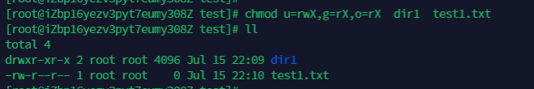
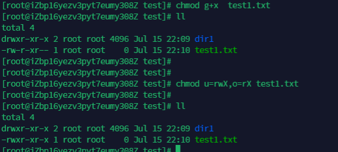
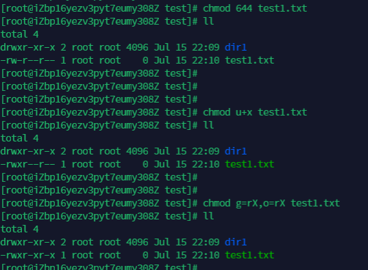
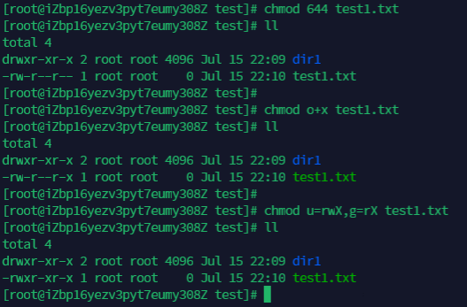
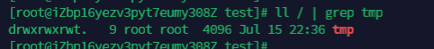

---
tags:
  - linux
  - chmod
---


## X 使用

 总结一下chmod中 X 的使用.
 ```
 execute/search only if the file is a directory or already has execute permission for some user (X)
```
man 手册中的接释如上.  也就是分为两种情况:
1. 针对目录
	1) X 可以正常修改目录的权限
2. 针对文件
	1) 如果文件没有执行权限, 那么X 对文件**没有作用**
	2) 如果文件本身有执行权限, 那么 X 对文件起作用


举个栗子:
```shell
## create file
mkdir dir1
touch file.txt
chmod 644 .

## 尝试修改权限
chmod u=rwX,g=RX,o=rX *

## 对文件添加x 权限
chmod g+x test1.txt

chmod u=rwX,o=rX test1.txt

## 添加 u+x 权限

```



可以看到对文件没有作用.


可以看到, 对g添加x权限中,  chmod的 X 生效了.


对u添加 x 权限， 也同样可以让X 生效。



## 特殊权限

```shell
set user or group ID on execution (s), restricted deletion flag or sticky bit (t)
```

chmod可以设置 setuid,  setgid 以及sticky bit.
> setuid可以让 其他用户执行带有此 bit的命令时, 使用命令 owner的权限.
> setgid可以让 其他用户执行带有此bit的命令时, 使用命令 grouper的权限
> sticky bit作用到目录上, 让此目录中的文件只有owner才可以删除. (/tmp)


passwd是 setuid典型的应用, 让执行此命令的用户 暂时拥有root权限.



tmp 是sticky bit的典型应用, 此目录中的文件, 只有属主才可以删除.

```shell
# setuid
chmod u+s file
chmod u-s file

# setgid
chmod g+x file
chmod g-x file

# sticky biy
chmod +t file
chmod -t file


```


