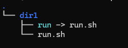
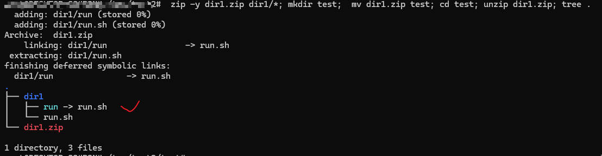
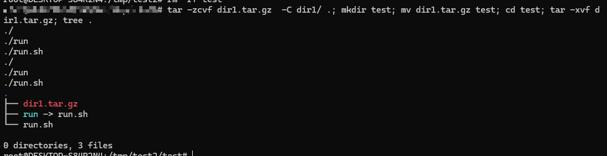

---
tags:
  - zip
  - linux
  - tar
---
## keep symbolic

在Linux中压缩文件夹时, 有symbolic存在其中,  要求压缩时 保存 symbolic文件.

```shell
# zip
zip -y dir.zip  *


# tar
tar -zcvf dir1.tar.gz -C dir1  .

```

目录结构





由此可见,  使用`tar`进行压缩时,  默认保存了其中的 symbolic属性.
