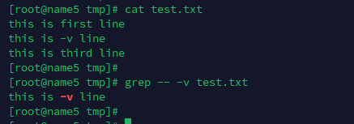

---
tags:
  - shell
  - --
---
在bash shell中经常使用的 `--`是什么意思呢?

```shell
# man bash
 --        A  --  signals the end of options and disables further option processing.  Any arguments after the -- are treated as filenames and arguments.  An argument of - is equivalent to --.

简单说就是 -- 后 全部是filename 和 argument, 不再进行option的解析.
```


example
```shell
# grep文件中 -v 内容

grep -- -v filename  ## 查看文件中包含 -v的行

```

