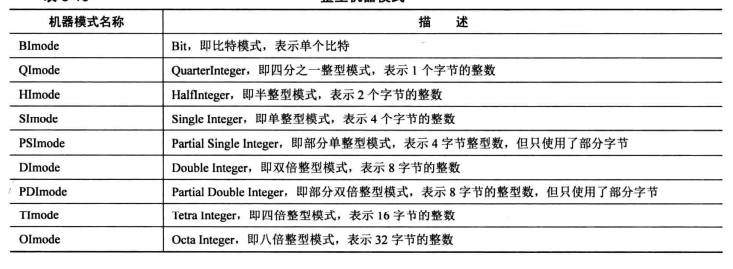
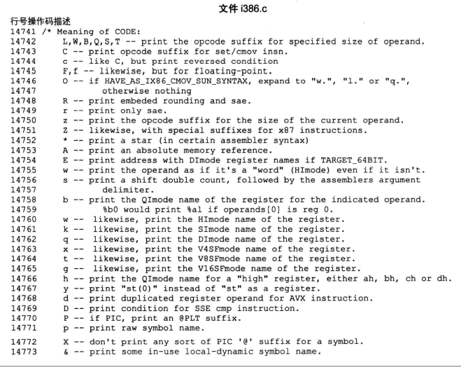

# **C**嵌入式汇编的使用(GNU编译器)

## 1.GCC 汇编语法

Linux上的GNU编译器gcc，使用AT&T/UNIX汇编语法。 AT&T 汇编语法跟Intel语法有些差别。

### 1. 源操作数和目的操作数

AT&T语法的操作数方向和Intel语法刚好相反，在Intel语法中，第一操作数为**目的**操作数，第二操作数为**源**操作数。然而在AT&T语法中，第一操作数为**源**操作数，第二操作数为**目的操作数**。

### 2.寄存器命名

寄存器名称有 "%"前缀，即如果必须使用寄存器 "eax"，那应该写为: "%eax"。

### 3. 立即数

AT&T立即数以"$" 为前缀，静态C变量也使用"$"为前缀， 在Intel语法中，十六进制常量以 "h" 为后缀，然而AT&T不使用这种语法，对于十六进制会首先看到"$"，然后是 "0x" 前缀，然后才是常量。

### 4. 操作数大小

在AT&T语法中，存储器操作数的大小取决于操作数码名字的最后一个字符。操作码后缀'b'，'w'，'l'分别指明了字节（8位），字（16位），长型（32位）存储器引用。 Intel语法通过给存储器操作数添加'byte ptr'，'word ptr'，和'dword ptr'，前缀来实现这一功能.

因此

```assembly
# Intel
mov al,byte ptr foo
# 对应AT&T语法为
movb foo,%al

```


### 5. 存储器操作数

在Intel语法中，基址寄存器包括在'[' 和 ']'中，然而在AT&T中，它们变为'('，')'。 另外，在Intel语法中，间接内存引用为

```assembly
section:[base + index*scale + disp]

##在AT&T中语法为
section:disp(base,index,scale)
```

**注意:**需要牢记的一点是，当一个常量用于disp或scale，不能添加"$"前缀。

部分Intel和AT&T的语法差别：

| Intel                           | At&T                                |
| ------------------------------- | ----------------------------------- |
| mov  eax,1                      | movl  $1, %eax                      |
| mov  ebx, 0ffh                  | movl  $0xff, %ebx                   |
| int     80h                     | int  $0x80                          |
| mov  ebx,  eax                  | movl  % eax,  %ebx                  |
| mov  eax, [ecx]                 | movl  (%ecx),   %eax                |
| mov  eax,   [ebx + 3]           | movl  3(%ecx), %eax                 |
| mov  eax,  [ebx + 20h]          | movl   0x20(%ecx),%eax              |
| mov  eax, [ebx +  ecx * 2h]     | movl   (%ebx , %ecx, 0x2),%eax      |
| mov  eax, [ebx + ecx]           | movl   (%ebx, %ecx) ,%eax           |
| mov  eax,[ebx + ecx * 4h - 20h] | movl   -0x20(%ebx, %ecx, 0x4), %eax |


## 2. 基本内联

```assembly
asm ("movl  %ecx, %eax"); # 将ecx寄存器的内容移至 eax
__asm__("movb  %bh  (%eax)"); # 将bh的一个字节数据, 移至 eax寄存器指向的内存
```

关键字`asm`和`__asm__`都是有效的。 如果关键字`asm`和程序中的一些标识符冲突了，则可以使用`__asm__`。 如果指令多于一条，可以每条指令一行，同时为指令添加'/n' '/t' 后缀，这是因为gcc将每一条指令当做字符串发送给as（GAS即GNU汇编器），并且通过使用换行符和制表符发送正确格式化后的行给汇编器。

```assembly
__asm__ (
	"movl  %eax, %ebx;"
	"movl  $56, %esi;"
	"movl  %ecx, $label(%edx, %ebx, 4);"
	"movl  %ah,  (%ebx)"
)
```

如果在代码中，我们涉及到了一些寄存器（即改变其内容），但在没有恢复这些变化的情况下从汇编中返回，这将导致一些意想不到的事情，这是因为GCC并不知道寄存器内容的变化，这是导致问题，特别是当编译器做了某些优化时。在没有告知GCC的情况下，它将会假设一些寄存器存储了一些值---而我们已经修改却没有告知GCC--它会像什么事都没有发生一样继续运行（什么事都没发生是指：GCC不会假设寄存器装入的值是有效的，当退出改变了寄存器值的内联汇编时，寄存器的值不会保存到相应的变量或内存空间）。我们可以做的是使用哪些没有副作用的指令，或者当我们退出时恢复这些寄存器，要不程序很大可能会发生崩溃。

## 3. 扩展汇编

在基本内联汇编中，我们只有指令，然而在扩展汇编中，我们可以同时制定操作数，它允许我们指定**输入寄存器，输出寄存器以及修饰寄存器列表**。GCC不强制用户必须使用指定使用的寄存器。我们可以把头疼的事交给GCC，这可以更好的适应GCC的优化。扩展内联基本格式为:

```assembly
asm (
	汇编程序模板
	: 输出操作数   # 可选的
	: 输入操作数	  # 可选的
	: 修饰寄存器   # 可选的
)
```

汇编程序模板由汇编指令构成，每一个操作数由一个操作数约束字符串所描述，其后紧接一个括号括起来的C表达式。 冒号用于将汇编程序模板和第一个输出操作数分开，第二个冒号用于将最后一个输出操作数和第一个输入操作数分开（如果输入操作数存在的话）。逗号用于分离每一个组内的操作数。 总操作数的数目限制在10个，或者机器描述中的任何指令格式中的最大操作数数目，以较大者为准。如果没有输出操作数但存在输入操作数，你必须将两个连续的冒号放置于输出操作数原本会放置的地方。

```assembly
asm (
	"cld ;"
	"rep ;"
	"stosl"
	:  #无输出寄存器
	: "c"(count),"a"(fill_value),"D"(dest)
	: "%ecx","%edi"
);

功能: 以上内联汇编是将: "fill_value" 值连续 "count" 次拷贝到寄存器 "edi" 所指位置. 也告诉gcc 寄存器"ecx" 和"edi"一直无效.
```

再看一下示例:

```assembly
int a=10, b;
asm (
	"movl  %1,  %%eax ;"
	"movl  %%eax, %0 ;"
	:"=r"(b)		#输出
	:"r"(a)			# 输入
	:"%eax"			# 修饰寄存器
)
```

这里所做的是使用汇编指令使 ’b‘ 变量的值等于 ’a‘ 变量的值。值得注意的地方：

1. "b"为输出操作数，用 %0引用，并且"a"为输入操作数，使用 %1 引用
2. "r"为操作数约束。"r"告诉gcc可以使用任意寄存器存储操作数， 输出操作数约束应有一个约束修饰符"="， 表明它是一个只读的输出操作数。
3. 寄存器名字以两个%为前缀，这有利于GCC区分操作数和寄存器，操作数以一个%为前缀
4. 第三个冒号之后的修饰寄存器%%eax 用于告诉gcc %eax寄存器的值将会在asm内部被修改，所以GCC将不会使用此寄存器存储任何其他值。

将asm执行完毕，"b"变量会映射到更新的值， 以为它被指定为输出操作数。 换句话说，asm内的b变量修改会被映射到asm的外部。

### 3.4 Volatile...?

如果汇编语句必须在我们放置它的地方执行(例如: 不能为了被优化而被移出循环语句),  将关键词 volatile 放在asm后面, 以防止它被移动, 删除或者其他操作.


## 4. 关于约束

### 4.1 常用约束

* 寄存器约束

寄存器约束就是要求gcc使用哪个寄存器, 将input或ouput中变量约束在某个寄存器中. 常见寄存器约束如下:

```assembly
a: 表示寄存器 eax/ax/al 
b: 表示寄存器 ebx/bx/bl
c: 表示寄存器 ecx/cx/cl
d: 表示寄存器 edx/dx/dl
D: 表示寄存器 edi/di
S: 表示寄存器 esi/si
q: 表示任意这4个通用寄存器之一: eax/ebx/ecx/edx
r: 表示任意这6个通用寄存器之一: eax/ebx/ecx/edx/esi/edi
g: 表示可以存放到任意地点(寄存器和内存). 相当于除了同q一样外, 还可以让gcc安排在内存中
A: 把eax和edx组合成64位整数
f: 表示浮点寄存器
t: 表示第一个浮点寄存器
u: 表示第二个浮点寄存器
```

```c
#include <stdio.h>
void main(){
    int in_a=1, in_b=2, out_sum;
    asm("addl %%ebx, %%eax"
        :"=a"(out_sum)
        :"a"(in_a),"b"(in_b)
       );
    printf("out=%d \n",out_sum);
}
```

**注意:** 扩展内联汇编中寄存器前缀是两个%%

* 内存约束

内存约束是要求gcc直接将位于input和output中的C变量的内存地址作为内联汇编代码的操作数, 不需要寄存器做中转, 直接进行内存读写, 也就是汇编代码的操作数是C变量的指针.

```assembly
m: 表示操作数可以使用任意一种内存形式
o: 操作数为内存变量, 但访问它是通过偏移量的形式访问,即 包含offset_address的格式
```

```c
#include <stdio.h>
void main(){
    int in_a=1,in_b=2;
    printf("in_b is %d\n", in_b);
    // 此操作是把 in_a的值放入到 in_b中
    // movb %b0, %1 其中%0 表示in_a,  %1 表示in_b
    // %b0 表示寄存器的低8位,即al
    // %h0 表示寄存器的 ah
    asm("movb %b0, %1"
        :
        :"a"(in_a),"m"(in_b)
       );
    printf("in_b is %d\n", in_b);
}
```


* 立即数约束

立即数即常数,  此约束要求gcc在传值的时候不通过内存和寄存器, 直接作为立即数传给汇编代码。由于立即数不是常量，只能作为右值，所以只能放在input中。

```assembly
i: 表示操作数为整数立即数
F: 表示操作数为浮点数立即数
I: 表示操作数为 0 - 31 之间的立即数
J: 表示操作数为0-63 之间的立即数
N: 表示操作数为0-255 之间的立即数
O: 表示操作数为0-32 之间的立即数
X: 表示操作数为任何类型的立即数
K: 0xff
L: 0xffff
```


* 序号占位符

序号占位符是对在output和input中的操作数，按照它们从左到右出现的次序从0开始编号，一直到9，也就是说最多支持10个序号占位符。 引用格式为：%0~ %9.

```c
// 两个等价的内联操作
asm ("addl %%ebx, %eax";
     :"=a"(out_sum)
     :"a"(in_a), "b"(in_b)
     );
     
asm("addl %2, %1;"
   :"=a"(out_sum)
   :"a"(in_a), "b"(in_b)
   )
/**
	其中"=a"(out_sum) 序号为0, %0对应的是eax
	"a"(in_a) 序号为1, %1对应的是eax
	"b"(in_b) 序号为2, %2对应的是ebx
*/
```

```c
#include <stdio.h>
void main(){
    int in_a = 0x12345678, in_b=0;
    asm("movw %w1, %0;"
       :"=m"(in_b)
       :"a"(in_a)
       );
    printf("word in_b is 0x%x\n",in_b);
    in_b=0;
    asm("movb %b1, %0;"
       :"=m"(in_b)
       :"a"(in_a)
       );
    printf("low byte in_b is 0x%x\n",in_b);
    in_b=0;
    asm("movb %h1, %0;"
       :"=m"(in_b)
       :"a"(in_a)
       );
    printf("high byte in_b is 0x%x\n",in_b);
}
```


* 名称占位符

名称占位符与符号占位符不同，序号占位符靠本身出现在output和input中的位置就能被编译器辨识出来。 而名称占位符需要在output和input中吧操作数显式的起个名字，它用这样的格式来标识操作数：

```assembly
[名称]"约束名"(C变量)
```

```c
#include <stdio.h>
void main(){
 int in_a=18, in_b=3, out=0;
  asm("divb %[divisor];"
      "movb %%al, %[result];"
      :[result]"=m"(out)
      :"a"(in_a),[divisor]"m"(in_b)
     );
    printf("result is: %d\n", out);
}
```


* output约束

```assembly
= : 表示操作数是只写, 相当于为output括号中的C变量赋值, 如=a(ina), 此修饰符相当于ina=eax;
+ : 表示操作数是可读写的,告诉gcc所约束的寄存器或内存先被读入, 再被写入
& : 表示此output中的操作数要独占所约束的寄存器,只供output使用,任何input中所分配的寄存器不能与此相同. 注意:当表达式中有多个修饰符时,&要与约束名挨着,不能分隔

在input中:
%: 该操作数可以和下一个输入操作数互换.

```

```C
#include <stdio.h>
void main(){
    int in_a=1, in_b=2;
    asm ("addl %%ebx, %%eax;"
        : "+a"(in_a)
        : "b"(in_b)
        );
    printf("a= %d, b=%d\n",in_a, in_b);
}
```


```C
#include <stdio.h>
void main(){
 int ret_cnt=0, test=0;
    char *fmt="Hello, world\n";
    asm ("push %1; \
    	 call printf; \
    	 addl $4, %%esp; \
    	 movl $6, %2; "
     	: "=a"(ret_cnt)
      	: "m"(fmt), "r"(test)
        );
    printf("number of bytes written: %d, test=%d\n",ret_cnt, test);
}
```

something error...


```C
#include <stdio.h>
void main(){
    int in_a=1, sum=0;
    asm("addl %1, %0;":"=a"(sum) :"%I"(2),"0"(in_a));
    printf("in_a=%d, sum=%d\n",in_a,sum);
}

```


* 关于第三部分声明修改了那些寄存器

```C
# 1. 如果修改了寄存器 bx
asm("movl %%eax, %0;"
    "movl %%eax, %%ebx;"
    :"=m"(ret_value)
    :
    :"bx"
   )
寄存器ebx被修改了,但只要在modify中声明bx就可以了.原因是即使寄存器只变动一部分,它的整体也会跟着受影响,所以在modify中声明寄存器时,可以用低8位,低16位或全32位寄存器名称.如:'al/ax/eax', 其他通用寄存器类似.
    
# 2. 如果内联代码修改了标志寄存器eflags中的标志位,同样需要在modify中使用 'cc' 声明;
# 3. 如果修改了内存,需要在modify中使用 "memory" 声明.    
 如果在output中使用了内存约束, gcc自然会得到那块内存被修改, 但如果被修改的内容并未在output中, 我们就需要使用memory告诉gcc.
    
```

* 机器模式简介

机器模式:





自己简单理解, 机器模式定义了操作寄存器时具体操作的是哪个部分.

目前先了解h,b,w,k这几个操作码:

```shell
h	输出寄存器高位部分中的那一字节对应的寄存器名称: ah, bh, ch, dh
b   输出寄存器中地部分1字节对应的名称:  al, bl, cl,dl
w   输出寄存器中大小为2字节对应的部分: ax, bx, cx, dx
k   输出寄存器中四字节部分: eax, ebx, ecx, edx
```


### 4.2 约束修饰符


## 5. 使用技巧


