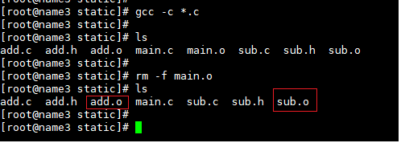
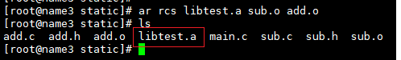
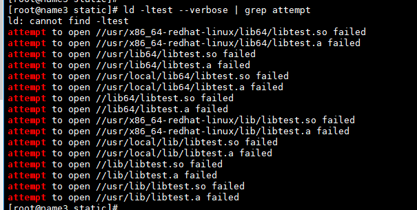
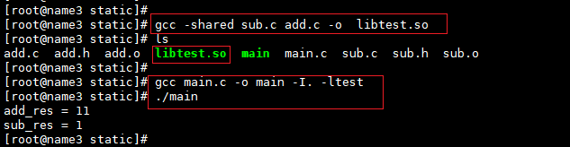
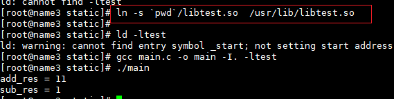

# 库文件创建

## 1. 静态库创建

### 1）把文件编译为 .o 文件

```shell
gcc -c *.c
```




### 2) 使用 ar创建静态库文件




因为静态库并没有在ld的搜索范围内，所以要把创建好的静态库放入到ld可以找到的位置。 有三种可用的方法，在介绍方法前，我们先看一下ld的搜索位置：



了解了方法，我们来让ld找到我们生产的静态文件;

1. 在上面的可用路径中创建一个软连接到生成的库文件
2. 在LD_LIBRARY_PATH中添加当前生成库的路径
3. 在 `/etc/ld.so.conf`文件中添加当前库的路径


我们选择第一个方式

```shell
ln -s `pwd`/libtest.a  /usr/lib/libtest.a
```


## 2. 共享库创建

### 1) 使用 gcc --shared 编译文件生成库文件



## 2) 设置连接文件

```shell
ln -s `pwd`/libtest.so  /usr/lib/libtest.so
```



