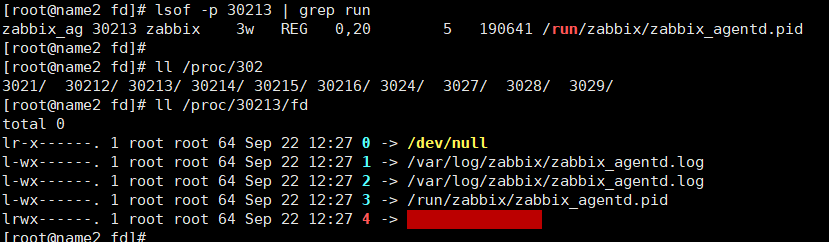
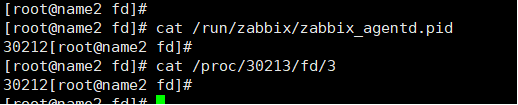
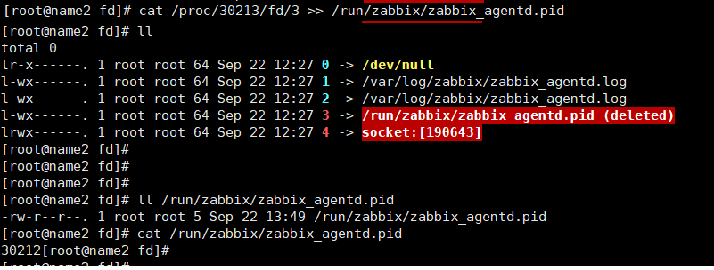

# linux删除文件的恢复

此方法有一些局限性，不过可以了解作为一个参考。在linux系统，当删除了一些正被打开的文件时，可以使用此方法。
在linux系统中，每个被进程打开的文件都有一个文件句柄 fd，用此来表示打开的文件。 

本文演示一个示例 ：删除一个被打开的文件，并进行恢复。

## 1. 查看某个进程打开了那些文件

```shell
# 方式一：
lsof -p pid  # 查看pid进程打开的文件

## 方式二:
ls -l /proc/pid/fd    # 同样展示了被此进程打开的文件
```



可以看到此进程打开了2个日志文件，以及一个socket   还有 .pid 文件。

## 2. 删除文件

先查看一些文件内容，然后删除。咱们这里删除 pid文件。



可以看到文件中记录了此进程的进程id号。

删除文件

```shell
rm -rf /run/zabbix/zabbix_agent.pid
```

查看文件删除后的状态:


可以看到文件后面多了一个(deleted)标志，表示此文件被删除。

## 3. 恢复

恢复文件。

  ```shell
# 简单理解此操作,就是被打开的文件在内存中已经有一份,相当于把此份内容重新写入到原来文件中
cat /proc/30213/fd/3  >> /run/zabbix/zabbix_agent.pid
  ```



可以看到被删除的文件已经恢复，内容也正确，只是在/proc 文件系统下的状态还时deleted状态。