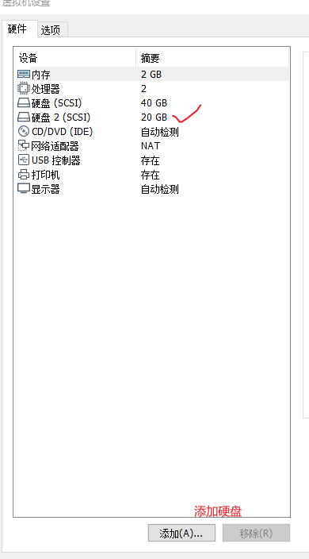
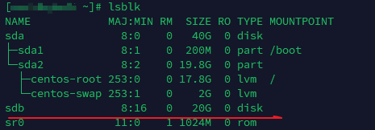
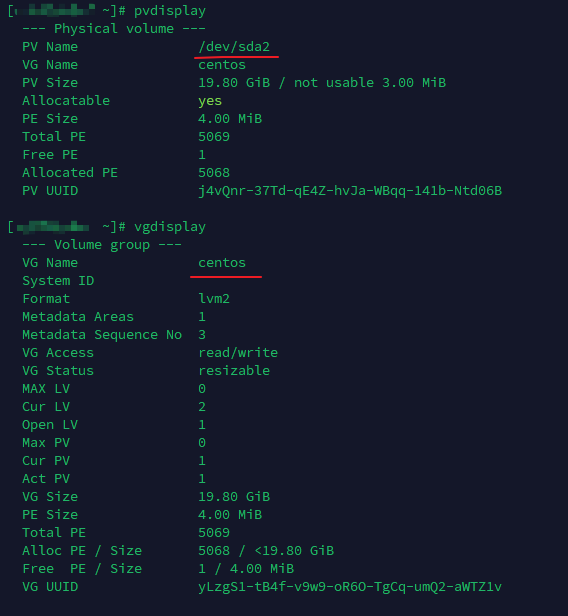
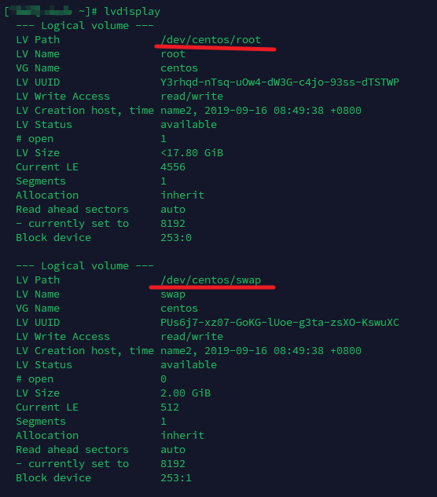
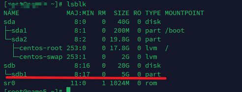
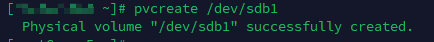
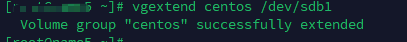
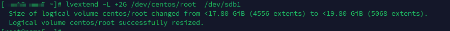
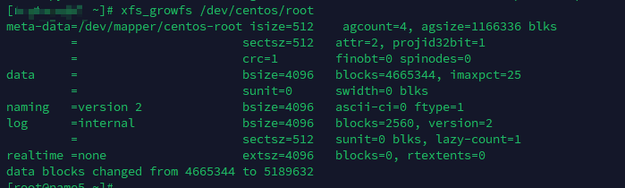

---
tags:
  - lvm
  - storage
---
在使用VM时, 肯定会遇见磁盘满的情况, 那么如何扩展磁盘大小呢?

环境:
1. Vmware 15
2. centos7


### 1. 添加硬盘到系统
此是通过GUI 操作添加的.



### 2. 查看添加的硬盘

```shell
lsblk
```



### 3. 查看当前的 lvm 信息

```shell
## 显示 physical Volume
pvdisplay

## 显示 Volume group
vgdisplay

## 显示 logical Volume
lvdisplay
```





### 4. 硬盘分区
```shell
[ ~]# fdisk /dev/sdb 
Welcome to fdisk (util-linux 2.23.2).

Changes will remain in memory only, until you decide to write them.
Be careful before using the write command.

Device does not contain a recognized partition table
Building a new DOS disklabel with disk identifier 0x565cc7d8.

Command (m for help): m
Command action
   a   toggle a bootable flag
   b   edit bsd disklabel
   c   toggle the dos compatibility flag
   d   delete a partition
   g   create a new empty GPT partition table
   G   create an IRIX (SGI) partition table
   l   list known partition types
   m   print this menu
   n   add a new partition
   o   create a new empty DOS partition table
   p   print the partition table
   q   quit without saving changes
   s   create a new empty Sun disklabel
   t   change a partition's system id
   u   change display/entry units
   v   verify the partition table
   w   write table to disk and exit
   x   extra functionality (experts only)

Command (m for help): n
Partition type:
   p   primary (0 primary, 0 extended, 4 free)
   e   extended
Select (default p): p
Partition number (1-4, default 1): 
First sector (2048-41943039, default 2048): 
Using default value 2048
Last sector, +sectors or +size{K,M,G} (2048-41943039, default 41943039): +5G
Partition 1 of type Linux and of size 5 GiB is set

Command (m for help): p

Disk /dev/sdb: 21.5 GB, 21474836480 bytes, 41943040 sectors
Units = sectors of 1 * 512 = 512 bytes
Sector size (logical/physical): 512 bytes / 512 bytes
I/O size (minimum/optimal): 512 bytes / 512 bytes
Disk label type: dos
Disk identifier: 0x565cc7d8

   Device Boot      Start         End      Blocks   Id  System
/dev/sdb1            2048    10487807     5242880   83  Linux

Command (m for help): w
The partition table has been altered!

Calling ioctl() to re-read partition table.
Syncing disks.
```

### 5. 添加分区后的硬盘到 physical Volume
```shell
pvcreate  /dev/sdb1
```


### 6. 扩展 Volume Group
```shell
vgextend centos /dev/sdb1
```


### 7. 扩展 Logical Volume
```shell
lvextend -L +2G /dev/centos/root  /dev/sdb1  
```


### 8. resize 文件系统, 识别新的大小
```shell
## 因为磁盘大小变了. 故刷新一下 文件系统
## xfs文件系统, 使用  xfs_growfs
xfs_growfs /dev/centos/root

## ext 系统, 使用下面命令
resize2fs /dev/centos/root
```



> reference

[lvm](https://www.cnblogs.com/despotic/p/11951886.html)
[lvm](https://linuxhandbook.com/lvm-guide/)
[lvm](https://medium.com/@shubnimkar/linux-logical-volume-manager-lvm-tutorial-67371ba8c371)
