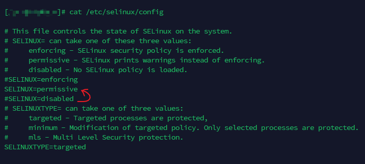
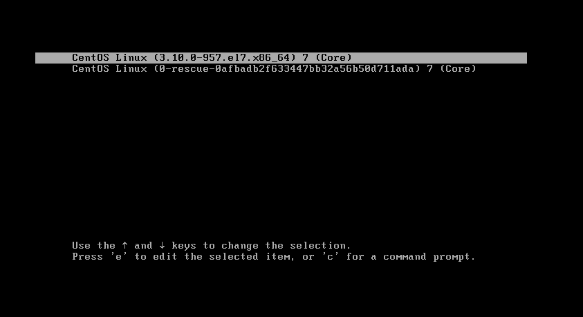
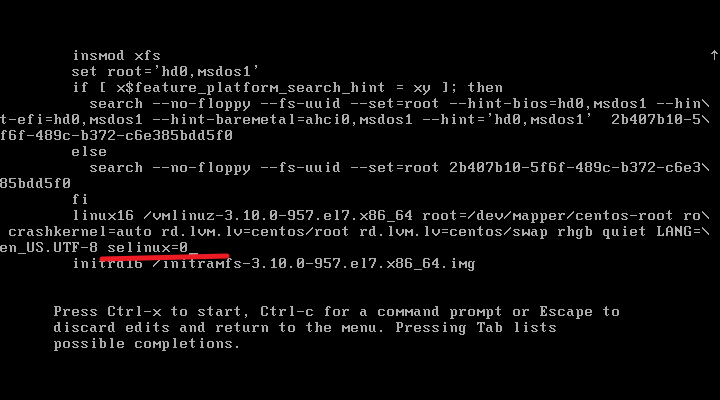

---
tags:
  - linux
  - SELinux
---

> issus:  之前selinux模式为disable,  转换为 enforce后,  导致系统不能进行正常登录.

在Linux中通过`/etc/selinux/config` 修改mode, 那么需要重启. 
那么如果之前的模式是disable, 然后把模式修改为 `enforce`, 重启.  那么很有可能导致系统启动失败, 或者通过`root`登录失败. 

原因:
因为之前是disable,  很多新的文件/目录其实并没有修改 selinux对应的 context. 那么系统启动重新进行 `relable`后, 引起的此种问题.

那么针对此种情况,  建议:
**如果SELinux之前是disabled, 那么就需要先设置为 permissive.**

添加 `selinux=0` 到 linux的 kernel 命令行参数, 就可以暂时disable selinux.  之后进入系统后再把模式修改为 permissive.

press `e` enter edit mode.

>reference

[SELinux Mode](https://docs.redhat.com/en/documentation/red_hat_enterprise_linux/8/html/using_selinux/changing-selinux-states-and-modes_using-selinux)

