---
tags:
  - linux
  - SELinux
  - command
---

## knowledge

SELinux 运行模式

```shell

Subject:  主体, 可以看成就是 进程

Object:  目标,  目标资源, 一般就是文件系统

Policy: 政策. 会根据某些服务来制定基本的存取安全性政策,政策内还会有详细的规则 rule 来指定不同的服务开放某些资源的存取. 在目前的 Centos7 中有3 个主要的政策:
	targeted:  针对网络服务限制较多,针对本机限制较少,是预设的政策
	minimum: 由targeted修正而来, 仅针对选择的进程来保护
	mls:  完整的SELinux 限制, 限制方面比较严格

Security Context:  安全性上下文.  主体是否能存取目标除了政策指定之外,  主体与目标的安全性文本必须一致才能顺利存取.  security context类似于文件系统的rwx, 如果设置错误,  某些服务(主体进程) 就无法存取文件系统(目标资源), 就会出现权限不符的错误信息.

domain 需要与 type 搭配, 该进程才能够顺利读取文件资源.

```


```shell
# secontext
## system_u:object_r:unlabeled_t:s0
user:role:type:sensitivity
or
identity:role:type:sensitivity
or
identity:role:type:domain
or
identify:role:type:level


## 字段含义
identify: 相当于是账户方面的身份识别, 常见有以下集中类型
	unconfined_u: 不受限的用户
	该文件来自不受限的进程所产生的,一般来说, 可以使用可登录账户来取得bash,  预设的bash是不受SELinux管制的,  因为bash并不是什么特别的网络服务,  因此在该bash进程所产生的文件, 其身份识别大多就是该类型了.
	system_u: 系统用户.
	 进本上, 如果是系统软件本身多提供的文件,  大多就是该类型, 如果是用户通过bash自己建立的文件,  大多则是不受限的 unconfined_u 身份, 如果是网络服务所产生的文件,  或是系统服务运行过程中所产生的文件, 则大部分是 system_u.
	

role: 角色.
	通过该字段, 可以知道这个资料是属于进程,文件资源还是代表使用者,  一本的角色由:
	object_r: 代表的是文件或目录等 文件资源
	system_r: 代表的是进程, 不过一般使用者也会被指定为 system_r

type: 类型. (在tergeted中 最重要)
在预设的targeted政策中,  identify 与 role字段基本上是不重要的,而type是最重要的,  基本上一个主体进程能不能读取到这个文件资源,  与类型字段有关,  而类型字段在文件与进程的定义不同.
	type:  在文件资源(object) 上面称为 type.
	domain: 在主体进程(subject)则称为 领域 (domain)


```

## domain transition

Domain transition 严格受三条规则约束:
1. The parent process of the source domain must have the execute permission for the application sitting between both the domains. (this is the entrypoint)
2. The file context for the application must be identified as an entrypoint for the targetdomain.  
3. The original domain must be allowed to transition to the target domain.

举一个VSFTP的栗子看一下:
条件一:
source domain `init_t`needs to have execute permission on the entrypoint application with the ftpd_exec_t context.
```shell
sesearch -s init_t -t ftpd_exec_t -c file -p execute -A -d
Found 1 semantic av rules:
   allow init_t ftpd_exec_t : file { ioctl read getattr map execute execute_no_trans open } ;


-s : rules with type/attribute NAME as source
-t : rules with type/attribute NAME as target
-c : rules with class NAME as the object class
-p : permission
-A : allow
-d :  do not search for type's attributes
```

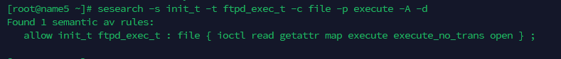

条件二:
check if the binary file is the entrypoint for the target domain ftpd_t
```shell
sesearch -s ftpd_t -t ftpd_exec_t -c file -p entrypoint -A
Found 1 semantic av rules:
   allow ftpd_t ftpd_exec_t : file { ioctl read getattr lock map execute execute_no_trans entrypoint open } ; 
```
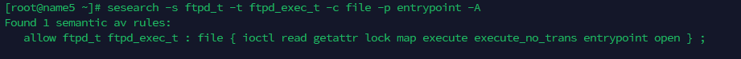

条件三:
the source domain init_t needs to have permission to transition to the target domain ftpd_t
```shell
sesearch -s init_t -t ftpd_t -c process -p transition -A -d
Found 1 semantic av rules:
   allow init_t ftpd_t : process transition ; 
```

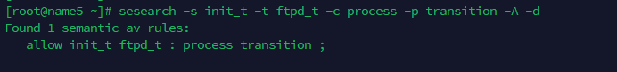
## command


```shell
semanage # manage se context,查询预设type, 增加,删除,修改预设的type
	
chcon    # update file se context

restorecon  # restore default se context

sesearch   # search se audio log

fixfiles  # check/restore  file 

seinfo     # SELinux的一些info

sestatus    # 查看seLinux的 status

getenforce  #获取SELinux的mode

setenforce  # 设置SELinux的mode

getsebool [-a] [规则名称]       # 获取某些规则状态

setsebool [-p] [规则名称] [0|1]  # 打开/关闭某些规则

ausearch # 可以查询audit  log

sealert # 查看某些se alert, 并可以看到对应的alert详细信息和解决建议

semodule # SE policy module 的管理 (add delete install list)

## 查看文件的 secontext
ls -lZ  .

## 查看process的secontext
ps -efZ


```


> semanage

```shell
##  修改目录的默认 fcontext
semanage fcontext -a -t httpd_sys_content_t '/src/www(/.*)?'

## fcontext 增删改查
semanage fcontext [--add (-t TYPE -f FTYPE) file_spec | --delete (-t TYPE -f FTYPE) file_spec | --deleteall | --modify (-t TYPE -f FTYPE) file_spec]

# list se user
semanage [user|login|fcontext|port] -l 


```

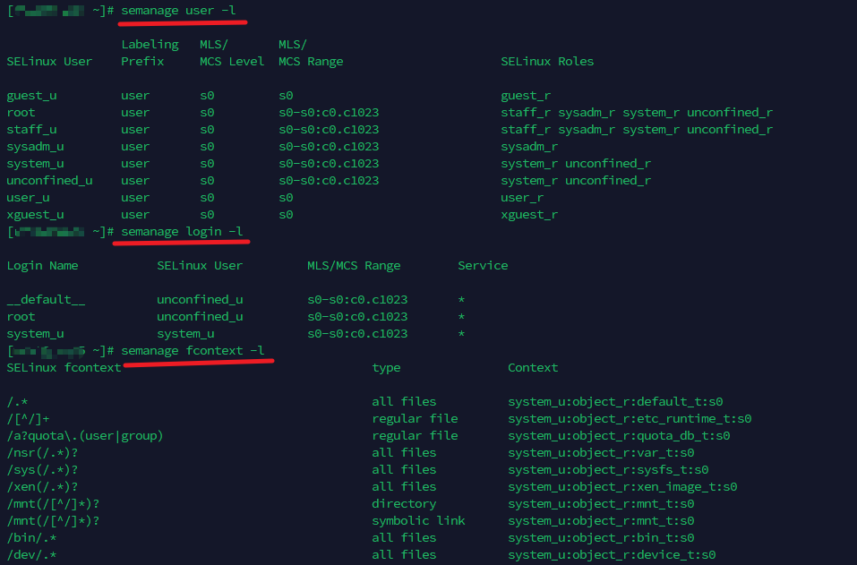
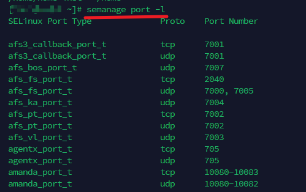

> chcon

```shell
# 改变文件的 user/role/type
chcon [OPTION]... [-u USER] [-r ROLE] [-l RANGE] [-t TYPE] FILE...
```

> restorecon

```shell
## restore default context
restorecon -Rv  /src/www

```

> fixfiles
```shell
##  check file 
fixfiles check filename

## relabel /tmp default context
fixfiles relabel

## restore file context to default
fixfiles restore ftpExpect.sh


```

> sesearch
```shell
## check allow action
sesearch -A/--allow

## neverallow
sesearch --neverallow 

## dont audit rule
sesearch -D

## all rules
sesearch --all

## display rules which [httpd_t] domain is allowed to access
## 查看http_t 可以访问那些资源
sesearch -s httpd_t --allow

## display allowed rules which domain can access to [httpd_sys_script_exec_t]  type
## 查看那些 domain 可以查看 httpd_sys_script_exec_t 资源
sesearch -t httpd_sys_script_exec_t --allow

## display allowed rules which domain can write to [shadow_t type] files
sesearch -t shadow_t -c file -p write --allow


```
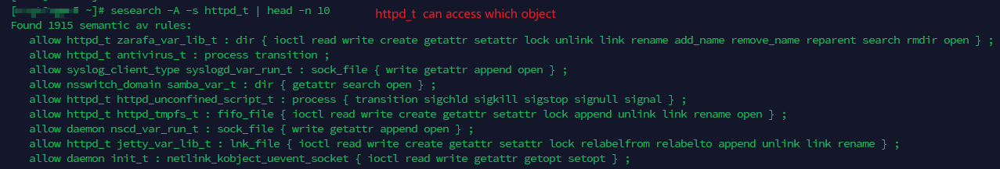

> sestatus

```shell
sestatus -vb

-v: 检查 /etc/sestatus.conf 内的文件与进程的安全性文本内容
-b: 将目前政策的规则boolean值列出.  即某些规则rule是否启动

```
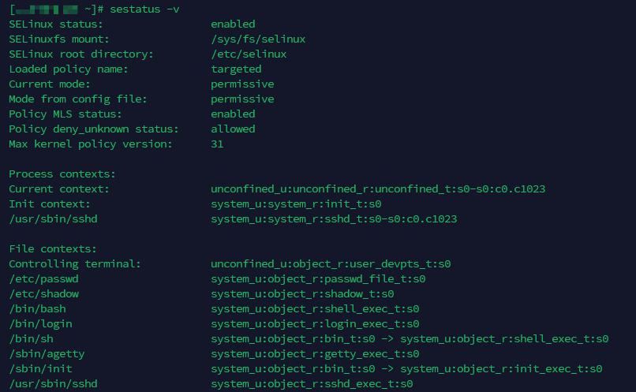
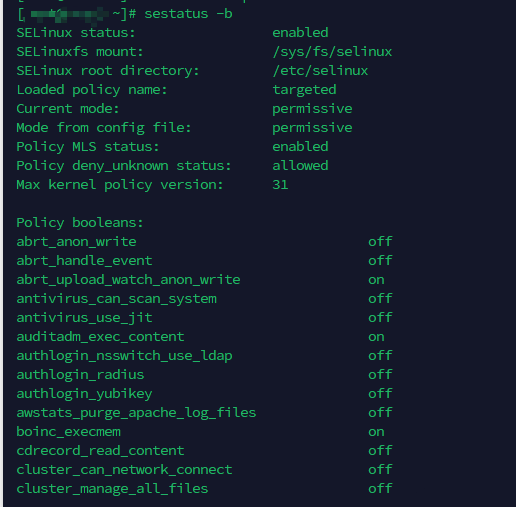


> getsebool
```shell
# getsebool 获取所有rule 状态(on|off)
getsebool -a

```
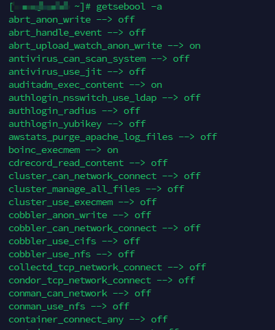

> setsebool
```shell
## 永久设置某个rule的状态 (on|off)
setsebool -P boolean value
```

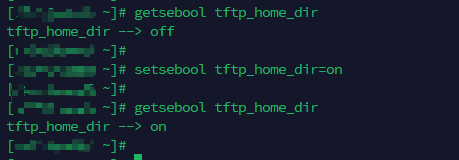


> ausearch

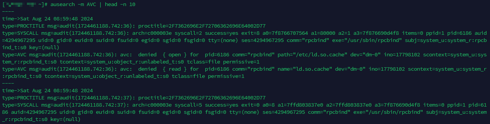


> reference

[鸟哥selinux](https://zq99299.github.io/linux-tutorial/tutorial-basis/16/05.html#selinux-%E7%9A%84%E8%BF%90%E4%BD%9C%E6%A8%A1%E5%BC%8F)
[SELinux Wiki](https://www.selinuxproject.org/page/Main_Page)
[digitalocean](https://www.digitalocean.com/community/tutorials/an-introduction-to-selinux-on-centos-7-part-2-files-and-processes)
[Redhat_SELinux](https://docs.redhat.com/en/documentation/red_hat_enterprise_linux/8/html/using_selinux/troubleshooting-problems-related-to-selinux_using-selinux#identifying-selinux-denials_troubleshooting-problems-related-to-selinux)
