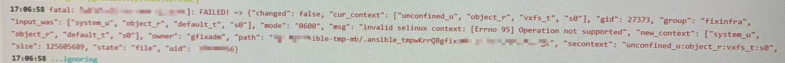

---
tags:
  - SELinux
  - exception
  - ansible
---
环境:
RH6, ansible-2.6

问题:
使用ansible playbook部署project 到server上, 其中有一个步骤是拷贝 文件到 VCS的一个硬盘上,  导致报错.
```yaml
- name: copy file
  copy:
	src: "../files/test.txt"
	dest: "/App/config/"
	mode: 0755
```

而且SELinux 的mode为 permissive.



```shell
-("changed-:false,"cur context"["unconfined u","object_""vxfs_t","s"]"gid":27373,"group":"fixinfra",
"input was":["system_u","object_r,default_t","s],"mode":600"msg":"invalid selinux context:[Errno 95]Operation not supported","new_context":["system_u","object_r","default_t","s0"],"owner":"gfixadm","path":"/App/ansible-tmp-mb/-ansible_tmpmiRkAggfix-mb-24.0.3.978.tar.gz",
"secontext: "size":125605689,"state":"fi1e","uid":200001166)
"unconfined_u:object_r:vxfs_t:s0")
```

原因:
Veritas 在RH6 应该是缺少某些 SELinux Policy, 在RH7.6 才修复.

Work around:
在copy文件前,  先把dest文件创建好.

```yaml
- name: create file
  file:
    path: "/App/config/test.txt"
    state: touch
    mode: 0755

- name: copy file
  copy:
	src: "../files/test.txt"
	dest: "/App/config/"
	mode: 0755
```


[github](https://github.com/ansible/ansible/issues/29728)


