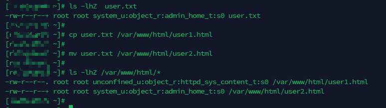
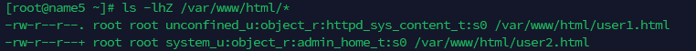
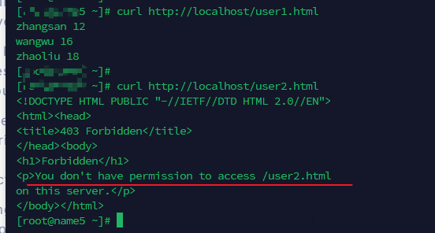
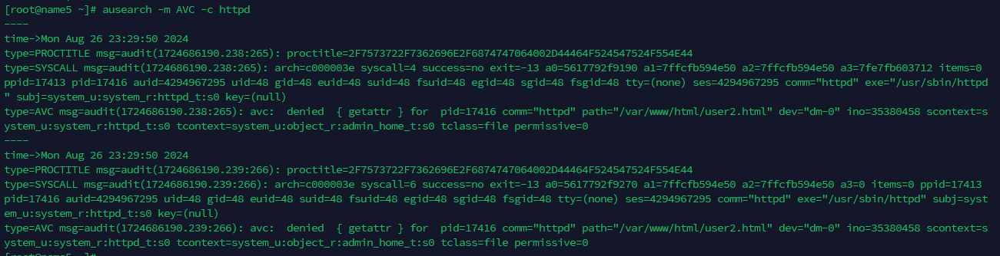
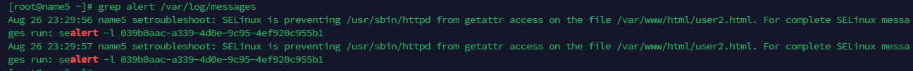
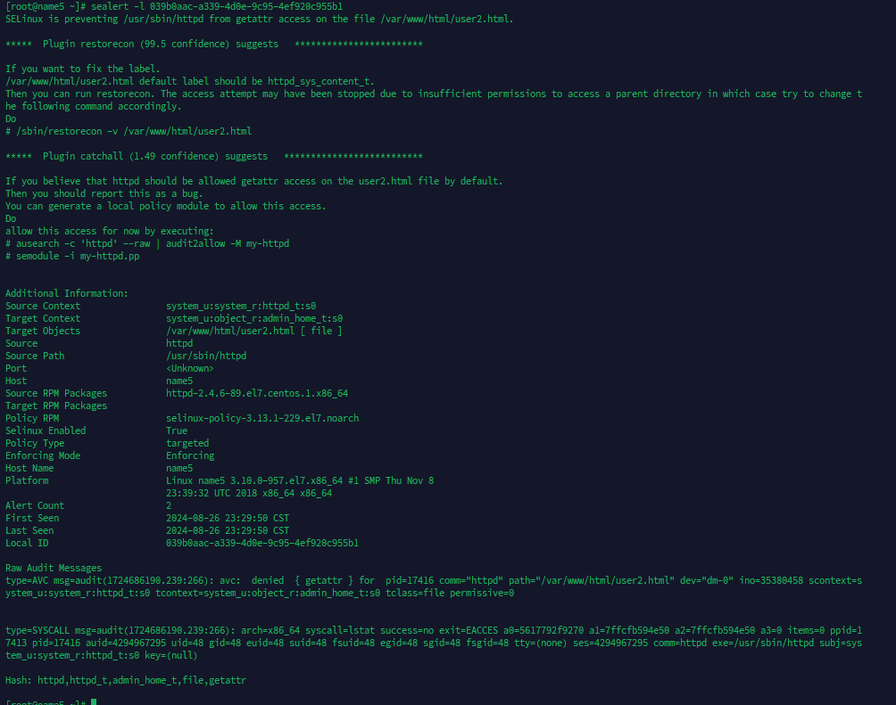

---
tags:
  - SELinux
  - example
---
## cp VS mv

```shell
cp file /var/www/html

mv file /var/ww/html
```

> 通过cp操作, 相当于是在 目的地址创建一个新文件, 故cp的 文件会变为dest dir的 secontext
> 而mv 操作会保存原来的secontext




## httpd file permission test

```shell
ls -lhZ /var/www/html/*
-rw-r--r--. root root unconfined_u:object_r:httpd_sys_content_t:s0 /var/www/html/user1.html
-rw-r--r--+ root root system_u:object_r:admin_home_t:s0 /var/www/html/user2.html
```





可见当user.html文件权限不对时, 返回403.

查看audit log



查看 `/var/log/message`  中的sealert





```shell
sealert -l 039b0aac-a339-4d0e-9c95-4ef920c955b1
SELinux is preventing /usr/sbin/httpd from getattr access on the file /var/www/html/user2.html.

*****  Plugin restorecon (99.5 confidence) suggests   ************************

If you want to fix the label. 
/var/www/html/user2.html default label should be httpd_sys_content_t.
Then you can run restorecon. The access attempt may have been stopped due to insufficient permissions to access a parent directory in which case try to change the following command accordingly.
Do
# /sbin/restorecon -v /var/www/html/user2.html

*****  Plugin catchall (1.49 confidence) suggests   **************************

If you believe that httpd should be allowed getattr access on the user2.html file by default.
Then you should report this as a bug.
You can generate a local policy module to allow this access.
Do
allow this access for now by executing:
# ausearch -c 'httpd' --raw | audit2allow -M my-httpd
# semodule -i my-httpd.pp


Additional Information:
Source Context                system_u:system_r:httpd_t:s0
Target Context                system_u:object_r:admin_home_t:s0
Target Objects                /var/www/html/user2.html [ file ]
Source                        httpd
Source Path                   /usr/sbin/httpd
Port                          <Unknown>
Host                          name5
Source RPM Packages           httpd-2.4.6-89.el7.centos.1.x86_64
Target RPM Packages           
Policy RPM                    selinux-policy-3.13.1-229.el7.noarch
Selinux Enabled               True
Policy Type                   targeted
Enforcing Mode                Enforcing
Host Name                     name5
Platform                      Linux name5 3.10.0-957.el7.x86_64 #1 SMP Thu Nov 8
                              23:39:32 UTC 2018 x86_64 x86_64
Alert Count                   2
First Seen                    2024-08-26 23:29:50 CST
Last Seen                     2024-08-26 23:29:50 CST
Local ID                      039b0aac-a339-4d0e-9c95-4ef920c955b1

Raw Audit Messages
type=AVC msg=audit(1724686190.239:266): avc:  denied  { getattr } for  pid=17416 comm="httpd" path="/var/www/html/user2.html" dev="dm-0" ino=35380458 scontext=system_u:system_r:httpd_t:s0 tcontext=system_u:object_r:admin_home_t:s0 tclass=file permissive=0


type=SYSCALL msg=audit(1724686190.239:266): arch=x86_64 syscall=lstat success=no exit=EACCES a0=5617792f9270 a1=7ffcfb594e50 a2=7ffcfb594e50 a3=0 items=0 ppid=17413 pid=17416 auid=4294967295 uid=48 gid=48 euid=48 suid=48 fsuid=48 egid=48 sgid=48 fsgid=48 tty=(none) ses=4294967295 comm=httpd exe=/usr/sbin/httpd subj=system_u:system_r:httpd_t:s0 key=(null)

Hash: httpd,httpd_t,admin_home_t,file,getattr
```

方案一:
在其中的 alert detail中给出了也给解决方案:
```shell
allow this access for now by executing:
# ausearch -c 'httpd' --raw | audit2allow -M my-httpd
# semodule -i my-httpd.pp
```

```shell
ausearch -c 'httpd' --raw | audit2allow -M my-http
******************** IMPORTANT ***********************
To make this policy package active, execute:

semodule -i my-http.pp
```

```shell
$$ cat my-http.te

module my-http 1.0;

require {
        type admin_home_t;
        type httpd_t;
        class file getattr;
}

#============= httpd_t ==============

#!!!! The file '/var/www/html/user2.html' is mislabeled on your system.  
#!!!! Fix with $ restorecon -R -v /var/www/html/user2.html
allow httpd_t admin_home_t:file getattr;
```

相当于是编写新的 SELinux rule module, 并进行安装.


方案二:
修改user.html文件的seLinux.
```shell
# chcon -t httpd_sys_content_t /var/www/html/user2.html

## or 恢复为默认
# restorecon  -Rv  /var/www/html/user2.html

```


