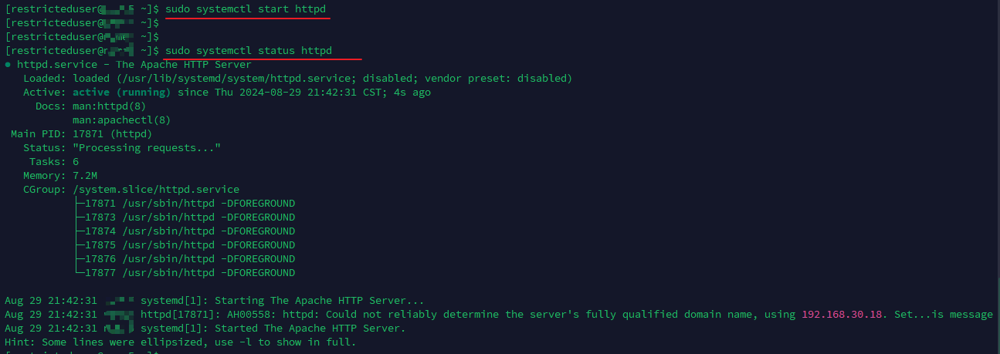
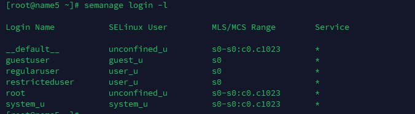
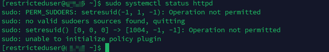

---
tags:
  - SELinux
  - linux
  - SEUser
---
正常Linux 用户会映射到 SELinux User.  正常Linux用户到SELinux User可以是一对多, 也可以是一对一.   简单看一下 其中的映射:


```shell
# 这里可以看到有三个用户
__default__: 普通用户都映射到此
root :  root 用户
sysetm_u: different class of user, mean for running processes or daemons.


# 其中 default 和root 映射到  SELinux的 unconfined_u 用户
default -> unconfined_u
root    -> unconfined_u
system_u-> system_u
```

> 从这里可以看到  普通用户和 root 是映射到同一个 SELinux user的.  那么普通用户的权限也会和root 一样.


看一下 SELinux中其他的User


从表中可以看到 unconfined_u 映射到 system_r, unconfined_r role,  SELinux policy 允许这些 role 运行 processes 在 unconfined_t domain中.  **也就是说普通用户也可以让process运行中 unconfined_t domain中.**  所以, Linux User 映射到 unconfined_u, 真正意义上是拥有 让processes 运行在 `unconfined_t` domain 的privileges.


```shell
# 可见除了刚刚见到的 root unconfined_u system_u 还有其他的用户
## 简单描述描述一下各个用户的权限.
guest_u: this User dont have access to X-window system(GUI) or networking and can't execute su/sudo command.
xguest_u: this User has access to GUI and networking is available via Firefox browser.
user_u: this user has more access than the guest accounts (GUI and networking), but can't switch users by running su or sudo.
staff_u: Same rights as user_u, except it can execute sudo command to have root privileges.
sysadm_u: this suer is meant for running system services and not to be mapped to regular user accounts.

```


### Prepare Action

添加用户
```shell
useradd -m regularuser -p a123456
useradd -m switcheduser -p a123456
useradd -m guestuser -p a123456
useradd -m restricteduser -p a123456

```

创建了4个普通用户,  其默认映射的SELinux user为  `unconfined_u`.


### Action 1:   Restricting Switched User Access

`regularuser`作为普通用户, 拥有和root一样的 SELinux User, 故其默认是可以通过 **su** 来切换用户的. 

那现在我们通过SELinux 来限制用户的su功能.

```shell
semanage login -a -s user_u  regularuser
```


可以看到 `regularuser` 用户的映射变了.
在测试一下其 **su** 功能.  测试前,  用户需要重新登出再登录.


### Action 2: Restricting Permissions to Run Scripts 

```shell
# 1. allow_guest_exec_content 设置是否允许执行脚本
getsebool allow_guest_exec_content
guest_exec_content --> on

#2. 添加用户到 guest_u
semanage login -a guest_u guestuser

#3. 家目录执行脚本测试


#4. 关闭allow_guest_exec_content
setsebool allow_guest_exec_content off
getsebool allow_guest_exec_content
guest_exec_content --> off

#5. 执行脚本测试
## 从结果可以看到, 直接执行脚本的话失败,  但是通过调用sh来执行脚本, 还是可以的.


```


step3 : 家目录测试脚本


查看sealert的警告信息以及解决建议:
```shell
[root@name5 ~]# sealert -l 3f3f2936-8dcb-4741-a1d3-7607064862da
SELinux is preventing /usr/bin/bash from execute access on the file test.sh.

*****  Plugin catchall_boolean (89.3 confidence) suggests   ******************

If you want to allow guest to exec content
Then you must tell SELinux about this by enabling the 'guest_exec_content' boolean.

Do
setsebool -P guest_exec_content 1

*****  Plugin catchall (11.6 confidence) suggests   **************************

If you believe that bash should be allowed execute access on the test.sh file by default.
Then you should report this as a bug.
You can generate a local policy module to allow this access.
Do
allow this access for now by executing:
# ausearch -c 'bash' --raw | audit2allow -M my-bash
# semodule -i my-bash.pp


Additional Information:
Source Context                guest_u:guest_r:guest_t:s0
Target Context                guest_u:object_r:user_home_t:s0
Target Objects                test.sh [ file ]
Source                        bash
Source Path                   /usr/bin/bash
Port                          <Unknown>
Host                          name5
Source RPM Packages           
Target RPM Packages           
Policy RPM                    selinux-policy-3.13.1-229.el7.noarch
Selinux Enabled               True
Policy Type                   targeted
Enforcing Mode                Enforcing
Host Name                     name5
Platform                      Linux name5 3.10.0-957.el7.x86_64 #1 SMP Thu Nov 8
                              23:39:32 UTC 2018 x86_64 x86_64
Alert Count                   2
First Seen                    2024-08-27 23:27:19 CST
Last Seen                     2024-08-27 23:27:34 CST
Local ID                      3f3f2936-8dcb-4741-a1d3-7607064862da

Raw Audit Messages
type=AVC msg=audit(1724772454.787:718): avc:  denied  { execute } for  pid=8804 comm="bash" name="test.sh" dev="dm-0" ino=18315746 scontext=guest_u:guest_r:guest_t:s0 tcontext=guest_u:object_r:user_home_t:s0 tclass=file permissive=0


Hash: bash,guest_t,user_home_t,file,execute
```

### Action 3: Restricting Access to Services
本例以 `httpd`服务为例.  在对用户进行限制之前, 我们先来看一下为什么root用户可以操作`httpd`.   然后再把 `restricteduser` 添加到 `sudoers`, 并验证在添加后, 确实是可以进行`httpd`的操作.  之后对 `restricteduser`进行限制.

#### root 为何可以操作 httpd
先来看一下`http`的上下文.

```shell
ls -lhZ /usr/sbin/httpd 
-rwxr-xr-x. root root system_u:object_r:httpd_exec_t:s0 /usr/sbin/httpd
```

接下来看一下root对应的 system_u 那些角色 
```shell
seinfo -uroot -x
   root
      default level: s0
      range: s0 - s0:c0.c1023
      roles:
         object_r
         staff_r
         sysadm_r
         system_r
         unconfined_r
```

看一下其中的 `system_r` 角色拥有哪些可以访问 `` domain的policy
```shell
sesearch -A -t httpd_exec_t  -d
Found 13 semantic av rules:
   allow httpd_t httpd_exec_t : file { ioctl read getattr lock map execute execute_no_trans entrypoint open } ; 
   allow piranha_web_t httpd_exec_t : file { ioctl read getattr lock map execute execute_no_trans open } ; 
   allow piranha_pulse_t httpd_exec_t : file { ioctl read getattr map execute execute_no_trans open } ; 
   allow system_cronjob_t httpd_exec_t : file { ioctl read getattr map execute execute_no_trans open } ; 
   allow svc_run_t httpd_exec_t : file { ioctl read getattr map execute execute_no_trans open } ; 
   allow httpd_exec_t httpd_exec_t : filesystem associate ; 
   allow dirsrvadmin_t httpd_exec_t : file { ioctl read getattr map execute execute_no_trans open } ; 
   allow cobblerd_t httpd_exec_t : file { ioctl read getattr map execute execute_no_trans open } ; 
   allow logrotate_t httpd_exec_t : file { ioctl read getattr map execute execute_no_trans open } ; 
   allow openshift_domain httpd_exec_t : file entrypoint ; 
   allow crond_t httpd_exec_t : file { ioctl read getattr map execute execute_no_trans open } ; 
   allow certwatch_t httpd_exec_t : file { ioctl read getattr map execute execute_no_trans open } ; 
   allow pki_apache_domain httpd_exec_t : file { ioctl read getattr lock map execute execute_no_trans entrypoint open } ; 
```

其中第一条rule比较明显, `allow httpd_t httpd_exec_t : file { ioctl read getattr lock map execute execute_no_trans entrypoint open } ;`  也就是说拥有 `httpd_t` domain就可以访问 `httpd_exec_t`.

*root -> system_r -> httpd_t*, root 拥有 `system_r`角色,  system_r 拥有 `httpd_t`的rule,  故 root就可以 访问 httpd 服务.
#### 限制 restricteduser 用户

添加 restricteduser 到 sudoers中.
```shell
visudo

# 
restricteduser  ALL=(ALL)  ALL
```



添加到 sudoer中, 可以见到 restricteduser 是可以通过sudo 来操作  httpd服务的.

因为 `restricteduser` 映射到 SELinux中的 default,  其中 defaut映射到 `unconfined_u`, 而 `unconfined_u` 拥有 `system_r` 角色.


现在我们把 `restricteduser` 添加到 `user_u`中,  那么此时 `restricteduser` 就不再拥有 `system_r` 角色,  也就不可以再操作 `httpd`服务,  也就达到了限制access service的功能.

```shell
semanage login -a -s user_u restricteduser
```






