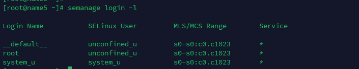
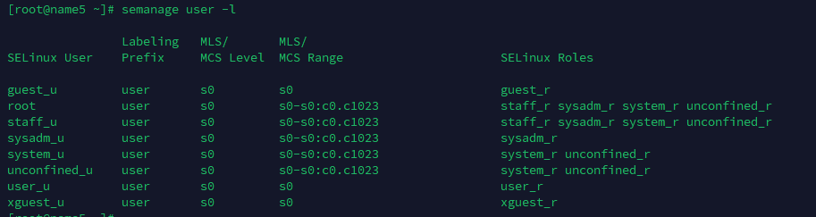
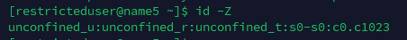
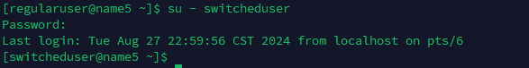
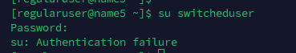
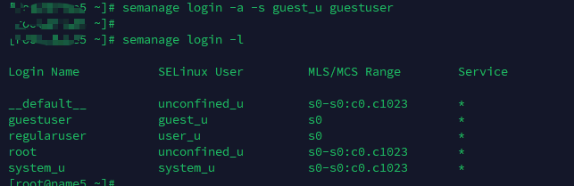
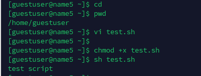
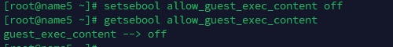
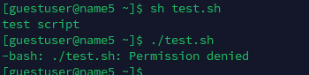

---
tags:
  - SELinux
  - linux
  - SEUser
---
正常Linux 用户会映射到 SELinux User.  正常Linux用户到SELinux User可以是一对多, 也可以是一对一.   简单看一下 其中的映射:


```shell
# 这里可以看到有三个用户
__default__: 普通用户都映射到此
root :  root 用户
sysetm_u: different class of user, mean for running processes or daemons.


# 其中 default 和root 映射到  SELinux的 unconfined_u 用户
default -> unconfined_u
root    -> unconfined_u
system_u-> system_u
```

> 从这里可以看到  普通用户和 root 是映射到同一个 SELinux user的.  那么普通用户的权限也会和root 一样.


看一下 SELinux中其他的User


从表中可以看到 unconfined_u 映射到 system_r, unconfined_r role,  SELinux policy 允许这些 role 运行 processes 在 unconfined_t domain中.  **也就是说普通用户也可以让process运行中 unconfined_t domain中.**  所以, Linux User 映射到 unconfined_u, 真正意义上是拥有 让processes 运行在 `unconfined_t` domain 的privileges.


```shell
# 可见除了刚刚见到的 root unconfined_u system_u 还有其他的用户
## 简单描述描述一下各个用户的权限.
guest_u: this User dont have access to X-window system(GUI) or networking and can't execute su/sudo command.
xguest_u: this User has access to GUI and networking is available via Firefox browser.
user_u: this user has more access than the guest accounts (GUI and networking), but can't switch users by running su or sudo.
staff_u: Same rights as user_u, exceptt it can execute sudo command to have root privileges.
sysadm_u: this suer is meant for running system services and not to be mapped to regular user accounts.

```


### Prepare Action

添加用户
```shell
useradd -m regularuser -p a123456
useradd -m switcheduser -p a123456
useradd -m guestuser -p a123456
useradd -m restricteduser -p a123456

```

创建了4个普通用户,  其默认映射的SELinux user为  `unconfined_u`.


### Action 1:   Restricting Switched User Access

`regularuser`作为普通用户, 拥有和root一样的 SELinux User, 故其默认是可以通过 **su** 来切换用户的. 

那现在我们通过SELinux 来限制用户的su功能.

```shell
semanage login -a -s user_u  regularuser
```


可以看到 `regularuser` 用户的映射变了.
在测试一下其 **su** 功能.  测试前,  用户需要重新登出再登录.




### Action 2: Restricting Permissions to Run Scripts 

```shell
# 1. allow_guest_exec_content 设置是否允许执行脚本
getsebool allow_guest_exec_content
guest_exec_content --> on

#2. 添加用户到 guest_u
semanage login -a guest_u guestuser

#3. 家目录执行脚本测试


#4. 关闭allow_guest_exec_content
setsebool allow_guest_exec_content off
getsebool allow_guest_exec_content
guest_exec_content --> off

#5. 执行脚本测试
## 从结果可以看到, 直接执行脚本的话失败,  但是通过调用sh来执行脚本, 还是可以的.


```


step3 : 家目录测试脚本






### Action 3: Restricting Access to Services


