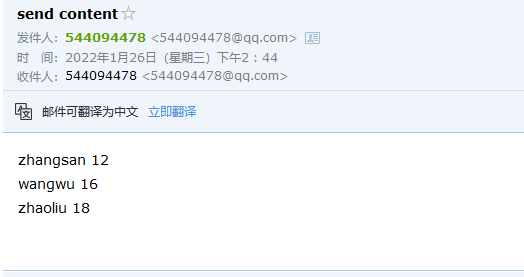

# mailx 使用

## 1. 安装

```shell
yum install -y mailx
yum install -y sendmail
```

 使用以上命令进行安装. 在centos7 上默认有安装此软件.


## 2. 配置

```ini
# 配置文件 /etc/mail.rc

set ssl-verify=ignore
set nss-config-dir=
# 发送地址
set from=544094478@qq.com
# 邮件服务商smtp地址
set smtp=smtp.qq.com
# 登录邮箱,同发送地址
set smtp-auth-user=544094478@qq.com
# 授权密码
set smtp-auth-password=edsxumdajjbkbdhh
set smtp-auth=login
```


## 3. 使用

测试:

```shell
mailx -s "send content" 544***478@qq.com < user.txt
```

检测:



可以看到接收到了邮件.


