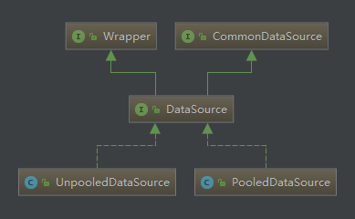
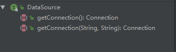

# myabtis连接池

前面分析了mybatis配置文件解析，接口和xml映射，接口函数的执行流程，以及sql参数的设置。在这其中有一个获取数据库连接操作，并且是通过连接池来进行管理的，当然了，此次分析没有使用第三方的连接池，就是看一下mybatis自带的连接池的一个实现。

先看一下mybatis的连接池类图:



在看一下DataSource接口的函数:


其中有两个实现类PooledDataSource 和 UnpooledDataSource，从名字就可了解到其大体功能了哈(可见取名字真的很重要)。接下来咱们就具体看看这两个类的实现。

## PooledDataSource 

先看下其属性吧:

```java
 // 此类是连接池实现的关键类
 private final PoolState state = new PoolState(this);

  private final UnpooledDataSource dataSource;

  // OPTIONAL CONFIGURATION FIELDS
 // 可选的配置属性
  protected int poolMaximumActiveConnections = 10;
  protected int poolMaximumIdleConnections = 5;
  protected int poolMaximumCheckoutTime = 20000;
  protected int poolTimeToWait = 20000;
  protected int poolMaximumLocalBadConnectionTolerance = 3;
  protected String poolPingQuery = "NO PING QUERY SET";
  protected boolean poolPingEnabled;
  protected int poolPingConnectionsNotUsedFor;

  private int expectedConnectionTypeCode;
```

看下PoolState的属性：

```java
  protected PooledDataSource dataSource;
	// 此容器记录了可用的连接
  protected final List<PooledConnection> idleConnections = new ArrayList<PooledConnection>();
 	// 此容器记录了正在使用的连接
  protected final List<PooledConnection> activeConnections = new ArrayList<PooledConnection>();
  protected long requestCount = 0;
  protected long accumulatedRequestTime = 0;
  protected long accumulatedCheckoutTime = 0;
  protected long claimedOverdueConnectionCount = 0;
  protected long accumulatedCheckoutTimeOfOverdueConnections = 0;
  protected long accumulatedWaitTime = 0;
  protected long hadToWaitCount = 0;
  protected long badConnectionCount = 0;
```

看一下此连接池获取连接的操作：

```java
 // 看一下哦，这里并不是直接获取连接，而是获取连接的代理类 
 public Connection getConnection(String username, String password) throws SQLException {
    return popConnection(username, password).getProxyConnection();
  }
```

获取连接：

看到这里有没有属性呢，前面分析过的哈。

```java
  private PooledConnection popConnection(String username, String password) throws SQLException {
    boolean countedWait = false;
    PooledConnection conn = null;
    long t = System.currentTimeMillis();
    int localBadConnectionCount = 0;
    while (conn == null) {
      synchronized (state) {
          // 先从idle容器中获取可用连接
        if (!state.idleConnections.isEmpty()) {
          // 注意看此处获取操作,是通过remove, 也就是获取到的连接从idle容器中移除了
          conn = state.idleConnections.remove(0);
          if (log.isDebugEnabled()) {
            log.debug("Checked out connection " + conn.getRealHashCode() + " from pool.");
          }
        } else { // idle容器没有可用的
          // Pool does not have available connection
            // 现在是用的连接数没有达到最大数
          if (state.activeConnections.size() < poolMaximumActiveConnections) {
            // Can create new connection
              // 创建新连接
            conn = new PooledConnection(dataSource.getConnection(), this);
            if (log.isDebugEnabled()) {
              log.debug("Created connection " + conn.getRealHashCode() + ".");
            }
          } else { // 不能创建新连接了
            // Cannot create new connection
              // 则从正在使用的连接中获取第一个
            PooledConnection oldestActiveConnection = state.activeConnections.get(0);
            long longestCheckoutTime = oldestActiveConnection.getCheckoutTime();
              // 并判断第一个active 连接是否已经达到最大的checkOuttime
            if (longestCheckoutTime > poolMaximumCheckoutTime) { // 如果达到了
              // Can claim overdue connection
              state.claimedOverdueConnectionCount++;
              state.accumulatedCheckoutTimeOfOverdueConnections += longestCheckoutTime;
              state.accumulatedCheckoutTime += longestCheckoutTime;
                // 移除此连接
              state.activeConnections.remove(oldestActiveConnection);
              if (!oldestActiveConnection.getRealConnection().getAutoCommit()) {
                try {
                    // 回滚此连接
                  oldestActiveConnection.getRealConnection().rollback();
                } catch (SQLException e) {
                  log.debug("Bad connection. Could not roll back");
                }  
              }
                // 创建一个新连接
              conn = new PooledConnection(oldestActiveConnection.getRealConnection(), this);
              conn.setCreatedTimestamp(oldestActiveConnection.getCreatedTimestamp());
              conn.setLastUsedTimestamp(oldestActiveConnection.getLastUsedTimestamp());
                // 失效老连接
              oldestActiveConnection.invalidate();
              if (log.isDebugEnabled()) {
                log.debug("Claimed overdue connection " + conn.getRealHashCode() + ".");
              }
            } else { // 如果没有大于最大checktime的连接
              // Must wait
              try { // 那就必须进行等待了
                if (!countedWait) {
                  state.hadToWaitCount++;
                  countedWait = true;
                }
                if (log.isDebugEnabled()) {
              log.debug("Waiting as long as " + poolTimeToWait + " milliseconds for connection.");
                }
                long wt = System.currentTimeMillis();
                state.wait(poolTimeToWait);
                state.accumulatedWaitTime += System.currentTimeMillis() - wt;
              } catch (InterruptedException e) {
                break;
              }
            }
          }
        }
        if (conn != null) { // 如果获取到了连接
          // ping to server and check the connection is valid or not
          if (conn.isValid()) { // 检查一下俩姐
            if (!conn.getRealConnection().getAutoCommit()) {
              conn.getRealConnection().rollback();
            }
              // 对连接进行一下配置
            conn.setConnectionTypeCode(assembleConnectionTypeCode(dataSource.getUrl(), username, password));
            conn.setCheckoutTimestamp(System.currentTimeMillis());
            conn.setLastUsedTimestamp(System.currentTimeMillis());
              // 添加到活动连接中
            state.activeConnections.add(conn);
            state.requestCount++;
            state.accumulatedRequestTime += System.currentTimeMillis() - t;
          } else { // 获取到的连接不可用
            if (log.isDebugEnabled()) {
              log.debug("A bad connection (" + conn.getRealHashCode() + ") was returned from the pool, getting another connection.");
            }
              // 更新失效链接数量
            state.badConnectionCount++;
            localBadConnectionCount++;
            conn = null;
            if (localBadConnectionCount > (poolMaximumIdleConnections + poolMaximumLocalBadConnectionTolerance)) {
              if (log.isDebugEnabled()) {
                log.debug("PooledDataSource: Could not get a good connection to the database.");
              }
              throw new SQLException("PooledDataSource: Could not get a good connection to the database.");
            }
          }
        }
      }

    }

    if (conn == null) {
      if (log.isDebugEnabled()) {
        log.debug("PooledDataSource: Unknown severe error condition.  The connection pool returned a null connection.");
      }
      throw new SQLException("PooledDataSource: Unknown severe error condition.  The connection pool returned a null connection.");
    }

    return conn;
  }
```

看一下创建新连接操作：

```java
// 创建新连接操作,创建了JDK代理,也就是返回的是一个数据库连接的代理类  
public PooledConnection(Connection connection, PooledDataSource dataSource) {
    this.hashCode = connection.hashCode();
    this.realConnection = connection;
    this.dataSource = dataSource;
    this.createdTimestamp = System.currentTimeMillis();
    this.lastUsedTimestamp = System.currentTimeMillis();
    this.valid = true;
      // 此处为创建的连接  创建了一个JDK代理
    this.proxyConnection = (Connection) Proxy.newProxyInstance(Connection.class.getClassLoader(), IFACES, this);
  }

	// getConnect操作，就是返回代理类
  public Connection getProxyConnection() {
    return proxyConnection;
  }
```

可以看到了，连接池会使用两个容器维护一个可用连接和正在使用连接，达到一个"池"的概念。


## UnpooledDataSource

看一下有哪些属性，属性在一定程度上反映了行为(函数)嘛。

```java
 // 加载器 
 private ClassLoader driverClassLoader;
	// 驱动的属性(用户名 密码等) 
  private Properties driverProperties;
  private static Map<String, Driver> registeredDrivers = new ConcurrentHashMap<String, Driver>();
	// 数据库连接的属性
  private String driver;
  private String url;
  private String username;
  private String password;
	// 是否自动提交
  private Boolean autoCommit;
	// 默认的隔离级别 
  private Integer defaultTransactionIsolationLevel;
```

静态初始化代码块:

```java
  static {
    Enumeration<Driver> drivers = DriverManager.getDrivers();
    while (drivers.hasMoreElements()) {
      Driver driver = drivers.nextElement();
      registeredDrivers.put(driver.getClass().getName(), driver);
    }
  }
```

获取数据库连接操作:

```java
 	// 获取连接操作
  public Connection getConnection(String username, String password) throws SQLException {
    return doGetConnection(username, password);
  }

	// 获取连接
  private Connection doGetConnection(String username, String password) throws SQLException {
    Properties props = new Properties();
    // 属性设置
    if (driverProperties != null) {
      props.putAll(driverProperties);
    }
    if (username != null) {
      props.setProperty("user", username);
    }
    if (password != null) {
      props.setProperty("password", password);
    }
      // 使用特定的属性去获取连接
    return doGetConnection(props);
  }

  private Connection doGetConnection(Properties properties) throws SQLException {
      // 先初始化驱动
    initializeDriver();
      // 通过驱动去获取连接
      // 这里多瞄两眼, 是不是就是平时JDBC的操作,熟悉吧
    Connection connection = DriverManager.getConnection(url, properties);
      // 配置连接
    configureConnection(connection);
    return connection;
  }

  private synchronized void initializeDriver() throws SQLException {
    if (!registeredDrivers.containsKey(driver)) {
      Class<?> driverType;
      try {
        if (driverClassLoader != null) {
            // 加载驱动类
          driverType = Class.forName(driver, true, driverClassLoader);
        } else {
          driverType = Resources.classForName(driver);
        }
          // 创建驱动类实例
        Driver driverInstance = (Driver)driverType.newInstance();
          // 创建DriverProxy,并注册一下此驱动
        DriverManager.registerDriver(new DriverProxy(driverInstance));
          // 把创建好的驱动放入到容器中
        registeredDrivers.put(driver, driverInstance);
      } catch (Exception e) {
        throw new SQLException("Error setting driver on UnpooledDataSource. Cause: " + e);
      }
    }
  }
	// 配置一下数据库连接
  private void configureConnection(Connection conn) throws SQLException {
    if (autoCommit != null && autoCommit != conn.getAutoCommit()) {
        // 设置是否自动提交
      conn.setAutoCommit(autoCommit);
    }
      // 设置隔离级别
    if (defaultTransactionIsolationLevel != null) {
      conn.setTransactionIsolation(defaultTransactionIsolationLevel);
    }
  }
```

这个类功能就如其名字一样，不提供连接池功能，每次获取连接就是通过驱动去创建一个连接，和JDBC操作获取连接时很类似。