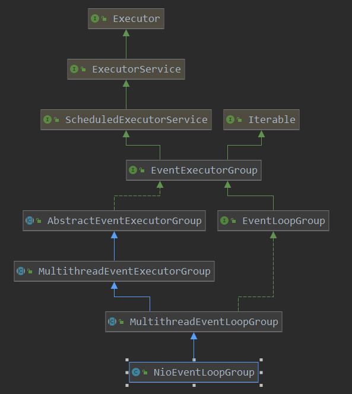

[TOC]

# NioEventLoopGroup的初始化

本篇开始了解一下netty相关的实现原理，以一个netty的server端案例为入口，代码如下：

```java
public class BaseServer {
    public static void main(String[] args) {
        NioEventLoopGroup parent = new NioEventLoopGroup(1);
        NioEventLoopGroup child = new NioEventLoopGroup();
        try {
            ServerBootstrap bootstrap = new ServerBootstrap()
                    .group(parent, child)
                    .channel(NioServerSocketChannel.class)
                    .option(ChannelOption.SO_BACKLOG, 128)
                    //.option(ChannelOption.SO_KEEPALIVE, true)
                    .handler(new LoggingHandler())  // parent handler
                    .childHandler(new ChannelInitializer<SocketChannel>() {
                        @Override
              protected void initChannel(SocketChannel ch) throws Exception {
                            ChannelPipeline pipeline = ch.pipeline();
                            pipeline.addLast(new ServerHandler());
                        }
                    });    // child handler
            System.out.println("server is ready .... ");
            // 绑定地址
ChannelFuture channelFuture = bootstrap.bind(8000).sync();
 channelFuture.addListener(new GenericFutureListener<Future<? super Void>>() {
                @Override
 public void operationComplete(Future<? super Void> future) throws Exception {
                    System.out.println("bind complete...");
                }
            });
            channelFuture.channel().closeFuture().sync();
        } catch (InterruptedException e) {
            e.printStackTrace();
        } finally {
            parent.shutdownGracefully();
            child.shutdownGracefully();
        }
    }
}
```

这是一个简单的server端的代码代码，总体的功能就是：

1. 创建两个工作线程组，parent，child；其中parent负责接收客户端的socket连接，child负责具体的读写处理。
2. 对两个线程组进行一些socket的参数设置
3. 添加自定义的处理器，进行业务相关的处理
4. 端口绑定，等待客户端的连接

本篇咱们以NioEventLoopGroup为入口，分析一下其初始化流程。

这是NioEventLoopGroup的类图：



> io.netty.channel.nio.NioEventLoopGroup#NioEventLoopGroup(int)

```java
 	// 开始创建
    // 从这里可以看到,此时的线程池是null,也就是还没有创建
    public NioEventLoopGroup(int nThreads) {
        this(nThreads, (Executor) null);
    }
```

```java
// 多了一个参数 SelectorProvider.provider
    public NioEventLoopGroup(int nThreads, Executor executor) {
        this(nThreads, executor, SelectorProvider.provider());
    }
```

```java
public NioEventLoopGroup(
    int nThreads, Executor executor, final SelectorProvider selectorProvider) {
    this(nThreads, executor, selectorProvider, DefaultSelectStrategyFactory.INSTANCE);
}
```

```java
// 到此开始从父类开始进行实例化操作
// RejectedExecutionHandlers.reject() 拒绝策略,直接抛出 exception
public NioEventLoopGroup(int nThreads, Executor executor, final SelectorProvider selectorProvider,final SelectStrategyFactory selectStrategyFactory) {
    super(nThreads, executor, selectorProvider, selectStrategyFactory, RejectedExecutionHandlers.reject());
}
```

> io.netty.channel.MultithreadEventLoopGroup#MultithreadEventLoopGroup(int, java.util.concurrent.Executor, java.lang.Object...)

```java
// 当传递的nThreads为0时, 那么就使用默认的 DEFAULT_EVENT_LOOP_THREADS
// 看一下默认的线程个数如何确定?
// 接着从父类实例化
protected MultithreadEventLoopGroup(int nThreads, Executor executor, Object... args) {
    super(nThreads == 0 ? DEFAULT_EVENT_LOOP_THREADS : nThreads, executor, args);
}
```

默认线程数:

```java
/**
     * 可以看到默认的线程数量是在静态代码中初始化的
     */
static {
    // 选择io.netty.eventLoopThreads属性值和io.netty.eventLoopThreads之间选择一个大的
    // 默认是可用cpu数*2
    DEFAULT_EVENT_LOOP_THREADS = Math.max(1, SystemPropertyUtil.getInt(
        "io.netty.eventLoopThreads", NettyRuntime.availableProcessors() * 2));
    if (logger.isDebugEnabled()) {
        logger.debug("-Dio.netty.eventLoopThreads: {}", DEFAULT_EVENT_LOOP_THREADS);
    }
}
```

> io.netty.util.concurrent.MultithreadEventExecutorGroup#MultithreadEventExecutorGroup(int, java.util.concurrent.Executor, java.lang.Object...)

```java
protected MultithreadEventExecutorGroup(int nThreads, Executor executor, Object... args) {
    this(nThreads, executor, DefaultEventExecutorChooserFactory.INSTANCE, args);
}
```

```java
protected MultithreadEventExecutorGroup(int nThreads, Executor executor,
                                        EventExecutorChooserFactory chooserFactory, Object... args) {
    // 相当于参数校验
    if (nThreads <= 0) {
        throw new IllegalArgumentException(String.format("nThreads: %d (expected: > 0)", nThreads));
    }
    // 创建线程池
    // 线程池在这里才开始创建
    if (executor == null) {
        // newDefaultThreadFactory() 使用了一个创建线程的功能类
        // 此ThreadPerTaskExecutor 也算不上线程池,其直接创建一个线程去执行任务
        executor = new ThreadPerTaskExecutor(newDefaultThreadFactory());
    }
	// children 数组存储子处理线程
    children = new EventExecutor[nThreads];
    // 在这里创建了 nThreads个 children
    for (int i = 0; i < nThreads; i ++) {
        boolean success = false;
        try {
       // 此处的线程池为ThreadPerTaskExecutor, 当执行任务时, 是通过创建一个线程来执行任务
            // 创建 NioEventLoop
            // 重点
            children[i] = newChild(executor, args);
            success = true;
        } catch (Exception e) {
            // TODO: Think about if this is a good exception type
          throw new IllegalStateException("failed to create a child event loop", e);
        } finally {
            // 如果child没有创建成功呢, 就执行关闭操作
            if (!success) {
                for (int j = 0; j < i; j ++) {
                    children[j].shutdownGracefully();
                }
                // 如果创建成功了呢,就等待此线程池结束
                for (int j = 0; j < i; j ++) {
                    EventExecutor e = children[j];
                    try {
                        while (!e.isTerminated()) {
                            e.awaitTermination(Integer.MAX_VALUE, TimeUnit.SECONDS);
                        }
                    } catch (InterruptedException interrupted) {
                        // Let the caller handle the interruption.
                        Thread.currentThread().interrupt();
                        break;
                    }
                }
            }
        }
    }
    // 对child创建选择器
    // 重点
    chooser = chooserFactory.newChooser(children);
    // 线程池关闭的 回调函数
    final FutureListener<Object> terminationListener = new FutureListener<Object>() {
        @Override
        public void operationComplete(Future<Object> future) throws Exception {
            if (terminatedChildren.incrementAndGet() == children.length) {
                terminationFuture.setSuccess(null);
            }
        }
    };
    // 注册线程池的关闭的回调函数
    for (EventExecutor e: children) {
        e.terminationFuture().addListener(terminationListener);
    }

    Set<EventExecutor> childrenSet = new LinkedHashSet<EventExecutor>(children.length);
    Collections.addAll(childrenSet, children);
    readonlyChildren = Collections.unmodifiableSet(childrenSet);
}

```

> io.netty.channel.nio.NioEventLoopGroup#newChild

```java
/**
     * 创建NioEventLoop
     */
@Override
protected EventLoop newChild(Executor executor, Object... args) throws Exception {
    // queueFactory为null
    EventLoopTaskQueueFactory queueFactory = args.length == 4 ? (EventLoopTaskQueueFactory) args[3] : null;
    // args[0]为selector
    // args[1]为selectStrategy
    // args[2]为拒绝策略
    // parent =this,也就是 NioEventLoop的parent为NioEventLoopGroup
    return new NioEventLoop(this, executor, (SelectorProvider) args[0],
                            ((SelectStrategyFactory) args[1]).newSelectStrategy(), (RejectedExecutionHandler) args[2], queueFactory);
}
```

由此可见 NioEventLoopGroup中包含了多个NioEventLoop。到此NioEventLoopGroup初始化就完成了。

下篇咱们继续分析一下NioEventLoop的初始化。