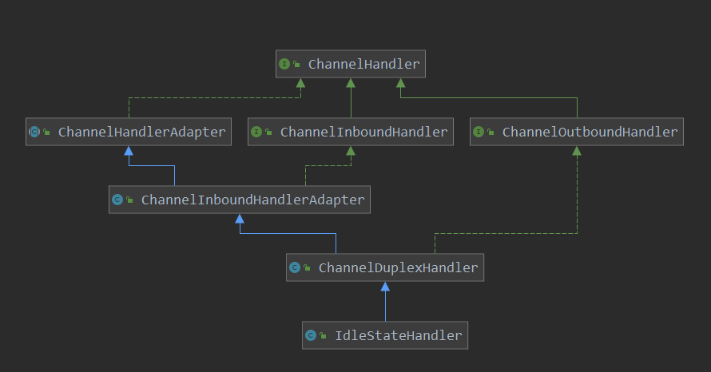

[TOC]

# IdleStateHandler

netty自带很多的handler来满足用户的不同需求，其中有一个IdleStateHandler用来监测注册的channel的read write 的idle的时间，如果idle的时间超过了用户设置的阈值，则发送idleState的事件，用户可以定义具体的handler来对此事件进行业务处理。

下面就来看一下此类的具体实现，类图如下：



构造方法:

```java
//
public IdleStateHandler(
    int readerIdleTimeSeconds,
    int writerIdleTimeSeconds,
    int allIdleTimeSeconds) {
    // 设置监控的 读 idle, write idle以及 读写都idle的时间,超过此阈值则会发送idle的事件
    // 可见默认的单位为 秒
    this(readerIdleTimeSeconds, writerIdleTimeSeconds, allIdleTimeSeconds,
         TimeUnit.SECONDS);
}
// 
public IdleStateHandler(
    long readerIdleTime, long writerIdleTime, long allIdleTime,
    TimeUnit unit) {
    //
    this(false, readerIdleTime, writerIdleTime, allIdleTime, unit);
}


public IdleStateHandler(boolean observeOutput,
                        long readerIdleTime, long writerIdleTime, long allIdleTime,
                        TimeUnit unit) {
    ObjectUtil.checkNotNull(unit, "unit");

    this.observeOutput = observeOutput;
    // 对设置的 读idle, 写idle以及 读写都idle的时间进行健康性检查
    // 如果小于等于0,则设置为0
    // 最下值为1,如果设置的小于最小值1,则设置为1
    if (readerIdleTime <= 0) {
        readerIdleTimeNanos = 0;
    } else {
        readerIdleTimeNanos = Math.max(unit.toNanos(readerIdleTime), MIN_TIMEOUT_NANOS);
    }
    if (writerIdleTime <= 0) {
        writerIdleTimeNanos = 0;
    } else {
        writerIdleTimeNanos = Math.max(unit.toNanos(writerIdleTime), MIN_TIMEOUT_NANOS);
    }
    if (allIdleTime <= 0) {
        allIdleTimeNanos = 0;
    } else {
        allIdleTimeNanos = Math.max(unit.toNanos(allIdleTime), MIN_TIMEOUT_NANOS);
    }
}
```

> io.netty.handler.timeout.IdleStateHandler#channelRegistered

```java
@Override
public void channelRegistered(ChannelHandlerContext ctx) throws Exception {
    // Initialize early if channel is active already.
    // 如果channel active,则初始化此 ctx
    if (ctx.channel().isActive()) {
        initialize(ctx);
    }
    super.channelRegistered(ctx);
}
```

```java
private void initialize(ChannelHandlerContext ctx) {
    // Avoid the case where destroy() is called before scheduling timeouts.
    // See: https://github.com/netty/netty/issues/143
    // 0 - none, 1 - initialized, 2 - destroyed
    switch (state) {
        case 1:
        case 2:
            return;
    }
    state = 1;
    // 监控输出的改变
    initOutputChanged(ctx);
    // 初始化 上次读取 和上次写的时间
    lastReadTime = lastWriteTime = ticksInNanos();
    // 如果设置了 监控读idle,则启动一个延迟执行的任务 ReaderIdleTimeoutTask
    // 此任务是延迟执行,并不是一个定时任务,也就是执行一次
    if (readerIdleTimeNanos > 0) {
        readerIdleTimeout = schedule(ctx, new ReaderIdleTimeoutTask(ctx),
                                     readerIdleTimeNanos, TimeUnit.NANOSECONDS);
    }
    // 写idle类似,启动一个延迟执行的函数 WriterIdleTimeoutTask
    if (writerIdleTimeNanos > 0) {
        writerIdleTimeout = schedule(ctx, new WriterIdleTimeoutTask(ctx),
                                     writerIdleTimeNanos, TimeUnit.NANOSECONDS);
    }
    // 读写全idle,启动延迟执行函数 AllIdleTimeoutTask
    if (allIdleTimeNanos > 0) {
        allIdleTimeout = schedule(ctx, new AllIdleTimeoutTask(ctx),
                                  allIdleTimeNanos, TimeUnit.NANOSECONDS);
    }
}
```

读写事件发生时的操作:

```java
@Override
public void channelRead(ChannelHandlerContext ctx, Object msg) throws Exception {
    // 如果设置了监控读,或 读写,则更新reading为true,表示进行过读取操作
    // 以及更新 firstReaderIdleEvent = firstAllIdleEvent = true
    if (readerIdleTimeNanos > 0 || allIdleTimeNanos > 0) {
        reading = true;
        firstReaderIdleEvent = firstAllIdleEvent = true;
    }
    // 传递 channelRead事件到后面的handler
    ctx.fireChannelRead(msg);
}
```

```java
@Override
public void write(ChannelHandlerContext ctx, Object msg, ChannelPromise promise) throws Exception {
    // Allow writing with void promise if handler is only configured for read timeout events.
    // 如果设置监控 写idle以及全idle
    // 则注册一个 writeListener 函数,用于更新write标志
    if (writerIdleTimeNanos > 0 || allIdleTimeNanos > 0) {
        ctx.write(msg, promise.unvoid()).addListener(writeListener);
    } else {
        ctx.write(msg, promise);
    }
}


// write事件的回调函数
private final ChannelFutureListener writeListener = new ChannelFutureListener() {
    @Override
    public void operationComplete(ChannelFuture future) throws Exception {
        // 记录上次写的事件
        lastWriteTime = ticksInNanos();
        // 更新field firstWriterIdleEvent = firstAllIdleEvent = true
        firstWriterIdleEvent = firstAllIdleEvent = true;
    }
};
```

监控读idle的任务

```java
// 读idle的监控任务
private final class ReaderIdleTimeoutTask extends AbstractIdleTask {

    ReaderIdleTimeoutTask(ChannelHandlerContext ctx) {
        super(ctx);
    }

    @Override
    protected void run(ChannelHandlerContext ctx) {
        // 延迟执行的间隔
        long nextDelay = readerIdleTimeNanos;
        // 如果一直没有进行过读取操作
        if (!reading) {
            // ticksInNanos() - lastReadTime  获取一直没有读取的时间
            nextDelay -= ticksInNanos() - lastReadTime;
        }
        // nextDelay <= 0 小于0,则表示nextDelay时间内,一直没有进行过数据读取操作
        if (nextDelay <= 0) {
            // Reader is idle - set a new timeout and notify the callback.
            // 再次启动一个延迟任务
            readerIdleTimeout = schedule(ctx, this, readerIdleTimeNanos, TimeUnit.NANOSECONDS);
            // 记录是否是第一个发 此idle事件
            boolean first = firstReaderIdleEvent;
            firstReaderIdleEvent = false;

            try {
                // 创建 IdleStateEvent 事件
                // newIdleStateEvent 根据读写 以及 读写全idle来创建不同的事件
                IdleStateEvent event = newIdleStateEvent(IdleState.READER_IDLE, first);
                // 发送 IdleStateEvent 事件到后面的handler
                channelIdle(ctx, event);
            } catch (Throwable t) {
                ctx.fireExceptionCaught(t);
            }
        } else {
            // Read occurred before the timeout - set a new timeout with shorter delay.
            // 到此说明在 nextDelay时间内,进行了数据读取的操作
            // 那么就 不会进行发送事件,直接启动一个延迟任务就可以了
            readerIdleTimeout = schedule(ctx, this, nextDelay, TimeUnit.NANOSECONDS);
        }
    }
}
```


监控写idle的任务

```java
private final class WriterIdleTimeoutTask extends AbstractIdleTask {

    WriterIdleTimeoutTask(ChannelHandlerContext ctx) {
        super(ctx);
    }

    @Override
    protected void run(ChannelHandlerContext ctx) {
        // 获取上次 写的时间
        long lastWriteTime = IdleStateHandler.this.lastWriteTime;
        // 此处和read类似, 查看nextDelay时间内,是否有写操作发生
        // nextDelay<=0 表示没有写操作发生
        // nextDelay>0 表示有写操作的发生
        long nextDelay = writerIdleTimeNanos - (ticksInNanos() - lastWriteTime);
        // 有写操作发生
        if (nextDelay <= 0) {
            // Writer is idle - set a new timeout and notify the callback.
            // 再次提交一个 写Idle的 延迟任务
            writerIdleTimeout = schedule(ctx, this, writerIdleTimeNanos, TimeUnit.NANOSECONDS);

            boolean first = firstWriterIdleEvent;
            firstWriterIdleEvent = false;

            try {
                // 由此可见,如果设置了observeOutput,则当输出缓存变化时,也会当做是有些事件的发生
                if (hasOutputChanged(ctx, first)) {
                    return;
                }
                // 创建writeIdle事件 并发送到后面的handler进行处理
                IdleStateEvent event = newIdleStateEvent(IdleState.WRITER_IDLE, first);
                channelIdle(ctx, event);
            } catch (Throwable t) {
                ctx.fireExceptionCaught(t);
            }
        } else {
            // Write occurred before the timeout - set a new timeout with shorter delay.
            // 如果发生改过 写操作,则直接启动一个 写操作的监控 延迟任务
            writerIdleTimeout = schedule(ctx, this, nextDelay, TimeUnit.NANOSECONDS);
        }
    }
}
```


监控allIdle的任务

```java
private final class AllIdleTimeoutTask extends AbstractIdleTask {

    AllIdleTimeoutTask(ChannelHandlerContext ctx) {
        super(ctx);
    }

    @Override
    protected void run(ChannelHandlerContext ctx) {

        long nextDelay = allIdleTimeNanos;
        if (!reading) {
            nextDelay -= ticksInNanos() - Math.max(lastReadTime, lastWriteTime);
        }
        // 小于0,表示此nextDelay时间内,没有发生过 读写操作
        if (nextDelay <= 0) {
            // Both reader and writer are idle - set a new timeout and
            // notify the callback.
            // 再次提交一个 延迟执行的任务
            allIdleTimeout = schedule(ctx, this, allIdleTimeNanos, TimeUnit.NANOSECONDS);

            boolean first = firstAllIdleEvent;
            firstAllIdleEvent = false;

            try {
                // 如果输出缓存有变化, 也当做是有写操作发生的
                if (hasOutputChanged(ctx, first)) {
                    return;
                }
                // 到此,说明没有读写操作
                // 那么就创建AllIdle事件,进行发送
                IdleStateEvent event = newIdleStateEvent(IdleState.ALL_IDLE, first);
                channelIdle(ctx, event);
            } catch (Throwable t) {
                ctx.fireExceptionCaught(t);
            }
        } else {
            // Either read or write occurred before the timeout - set a new
            // timeout with shorter delay.
            // 发生过读或写的操作, 则不发送事件,直接提交一个延迟执行任务
            allIdleTimeout = schedule(ctx, this, nextDelay, TimeUnit.NANOSECONDS);
        }
    }
}
```

思路总体还是比较清晰的，利用延迟任务来做监控，很巧妙，值得借鉴。

