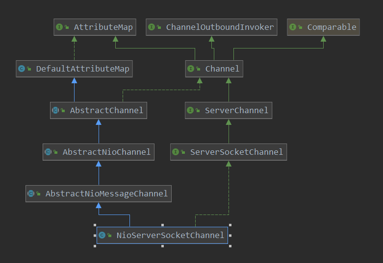
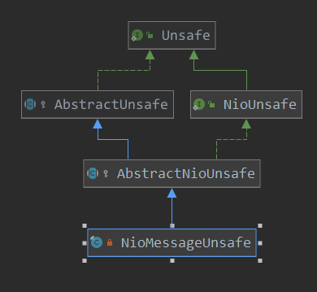
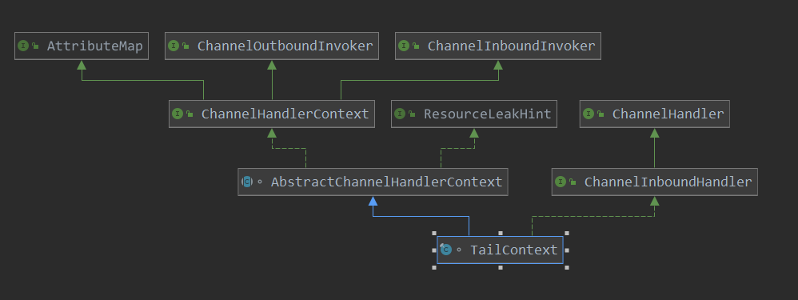
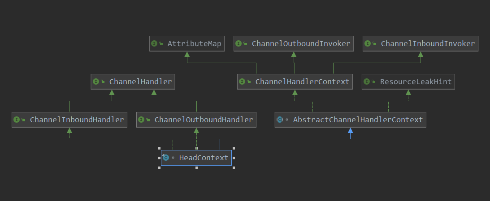
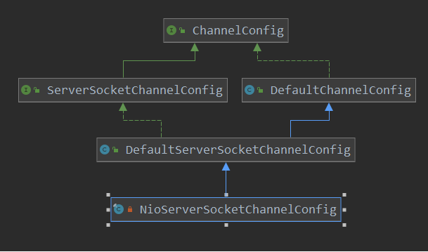
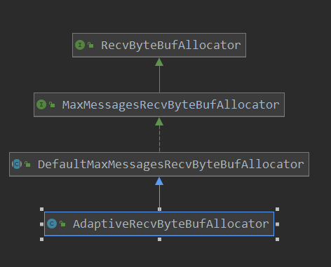

[TOC]

# NioServerSocketChannel 的初始化

ServerBootstrap端口绑定时，会做channel的初始化，而在Server端初始化的channel就是用户设置的：

```java
 ServerBootstrap bootstrap = new ServerBootstrap()
                    .group(parent, child)
                    .channel(NioServerSocketChannel.class)  // 就是在这里设置的
```

本篇，就来看一下此类的初始化操作。

先来回顾一下ServerBootstrap实例化此类的操作：

```java
// 省略部分代码, 只看关键点 
final ChannelFuture initAndRegister() {
        Channel channel = null;
        try {
            // 此处其实就是通过反射, 创建一个通过 channel 执行的class的 实例
            // 此时看的是server端的绑定,故此应该看一下 NioServerSocketChannel的构造器
            // 此处创建了 NioServerSocketChannel
            // 重点
            channel = channelFactory.newChannel();
            // 对创建的channel 进行初始化
            // 重点
            init(channel);
        } catch (Throwable t) {
            .....
        }
 }
```

看一下类图:




> io.netty.channel.socket.nio.NioServerSocketChannel#NioServerSocketChannel()

```java
    private static final SelectorProvider DEFAULT_SELECTOR_PROVIDER = SelectorProvider.provider();
	// NioServerSocetChannel的构造函数
    // 调用了newSocket
    public NioServerSocketChannel() {
        // newSocket创建了ServerSocketChannelImpl
        this(newSocket(DEFAULT_SELECTOR_PROVIDER));
    }
```

```java
private static ServerSocketChannel newSocket(SelectorProvider provider) {
        try {
            // 创建selector
            return provider.openServerSocketChannel();
        } catch (IOException e) {
            throw new ChannelException(
                    "Failed to open a server socket.", e);
        }
    }
```

> io.netty.channel.socket.nio.NioServerSocketChannel#NioServerSocketChannel(java.nio.channels.ServerSocketChannel)

```java
    // 看到此处创建的ServerSocketChannelImpl  感兴趣的事件是 accept
    public NioServerSocketChannel(ServerSocketChannel channel) {
        super(null, channel, SelectionKey.OP_ACCEPT);
        // 记录此 此channel的config
        config = new NioServerSocketChannelConfig(this, javaChannel().socket());
    }
```

> io.netty.channel.nio.AbstractNioMessageChannel#AbstractNioMessageChannel

```java
// 此处的parent 为null
protected AbstractNioMessageChannel(Channel parent, SelectableChannel ch, int readInterestOp) {
    super(parent, ch, readInterestOp);
}
```

> io.netty.channel.nio.AbstractNioChannel#AbstractNioChannel

```java
protected AbstractNioChannel(Channel parent, SelectableChannel ch, int readInterestOp) {
    super(parent);
    // 也可以看到 javaChannel方法 返回的就是jdk底层创建的ServerSocketChannelImpl
    this.ch = ch;
    // 记录感兴趣的事件
    this.readInterestOp = readInterestOp;
    try {
        // 把创建的NioServerSocket设置为非阻塞
        ch.configureBlocking(false);
    } catch (IOException e) {
        try {
            ch.close();
        } catch (IOException e2) {
            logger.warn(
                "Failed to close a partially initialized socket.", e2);
        }

        throw new ChannelException("Failed to enter non-blocking mode.", e);
    }
}
```

> io.netty.channel.AbstractChannel#AbstractChannel(io.netty.channel.Channel)

```java
protected AbstractChannel(Channel parent) {
    // 记录此 NioServerSocketChannel 对应的parent,默认是null
    this.parent = parent;
    id = newId();
    // buffer的操作函数实例
    // 当实例化 NioServerSocketChannel时,此处是AbstractNioMessageChannel类 (看类图)
    // 当实例化 NioSocketChannel时, 次数时AbstractNioByteChannel(看类图)
    unsafe = newUnsafe();
    // 为socketChannel创建pipeline
    // 为此channel创建handler调用链
   // 也就是当selector接收到socket或者 读写数据时,会挨个调用此 pipeline中的handler进行处理
    pipeline = newChannelPipeline();
}
```

> io.netty.channel.nio.AbstractNioMessageChannel#newUnsafe

```java
    // 创建NioServerSocketChannel的 unsafe操作
    @Override
    protected AbstractNioUnsafe newUnsafe() {
        return new NioMessageUnsafe();
    }io.netty.channel.nio.AbstractNioMessageChannel#newUnsafe
```

此NioMessageUnsafe的类图：



此是对channel的读写操作类，此处不做详细介绍，后面专门开一篇说此操作。

> io.netty.channel.AbstractChannel#newChannelPipeline

具体的handler处理链

```java
    // 创建handler处理链, 默认 为DefaultChannelPipeline
    protected DefaultChannelPipeline newChannelPipeline() {
        return new DefaultChannelPipeline(this);
    }
```

> io.netty.channel.DefaultChannelPipeline#DefaultChannelPipeline

```java
protected DefaultChannelPipeline(Channel channel) {
    // 记录此 pipeline 对应的 channel
    this.channel = ObjectUtil.checkNotNull(channel, "channel");
    succeededFuture = new SucceededChannelFuture(channel, null);
    voidPromise =  new VoidChannelPromise(channel, true);
	// 尾部节点
    tail = new TailContext(this);
    // 开头节点
    head = new HeadContext(this);
	// 可以看到 pipeline对handler的管理是形成 双向链表
    head.next = tail;
    tail.prev = head;
}
```

这里简单看一下TailContext和HeadContext的实现及其类图。

> TailContext



```java
    // 可以看到 TailContext 中都是对具体的事件的处理
    // 不过没有具体的实现
final class TailContext extends AbstractChannelHandlerContext implements ChannelInboundHandler {

    TailContext(DefaultChannelPipeline pipeline) {
        super(pipeline, null, TAIL_NAME, TailContext.class);
        setAddComplete();
    }

    @Override
    public ChannelHandler handler() {
        return this;
    }

    @Override
    public void channelRegistered(ChannelHandlerContext ctx) { }

    @Override
    public void channelUnregistered(ChannelHandlerContext ctx) { }

    @Override
    public void channelActive(ChannelHandlerContext ctx) {
        onUnhandledInboundChannelActive();
    }

    @Override
    public void channelInactive(ChannelHandlerContext ctx) {
        onUnhandledInboundChannelInactive();
    }

    @Override
    public void channelWritabilityChanged(ChannelHandlerContext ctx) {
        onUnhandledChannelWritabilityChanged();
    }

    @Override
    public void handlerAdded(ChannelHandlerContext ctx) { }

    @Override
    public void handlerRemoved(ChannelHandlerContext ctx) { }

    @Override
    public void userEventTriggered(ChannelHandlerContext ctx, Object evt) {
        onUnhandledInboundUserEventTriggered(evt);
    }

    @Override
    public void exceptionCaught(ChannelHandlerContext ctx, Throwable cause) {
        onUnhandledInboundException(cause);
    }

    @Override
    public void channelRead(ChannelHandlerContext ctx, Object msg) {
        onUnhandledInboundMessage(ctx, msg);
    }

    @Override
    public void channelReadComplete(ChannelHandlerContext ctx) {
        onUnhandledInboundChannelReadComplete();
    }
}
```

> io.netty.channel.AbstractChannelHandlerContext#AbstractChannelHandlerContext

```java
AbstractChannelHandlerContext(DefaultChannelPipeline pipeline, EventExecutor executor,String name, Class<? extends ChannelHandler> handlerClass) {
    // 此 handler的name
    this.name = ObjectUtil.checkNotNull(name, "name");
    // 此handler所在的pipeline
    this.pipeline = pipeline;
    // 默认此 线程池 为null
    this.executor = executor;
    // 此handler执行的mask 计算
    this.executionMask = mask(handlerClass);
    // Its ordered if its driven by the EventLoop or the given Executor is an instanceof OrderedEventExecutor.
    ordered = executor == null || executor instanceof OrderedEventExecutor;
}
```


> HeadContext 



```java
// 从继承关系 ChannelOutboundHandler, ChannelInboundHandler看到
// 此HeadContext 既可以处理输入事件,又可以处理输出事件
// 从headContext来看,当有事件发生时,其会 pipeline中下一个handler传播事件
// 也就是调用下一个handler的对应的事件处理函数
// 换句话说,此才是事件发生后,处理的开始地方
final class HeadContext extends AbstractChannelHandlerContext
    implements ChannelOutboundHandler, ChannelInboundHandler {

    private final Unsafe unsafe;
    HeadContext(DefaultChannelPipeline pipeline) {
        super(pipeline, null, HEAD_NAME, HeadContext.class);
        // 获取此channel的操作类
        unsafe = pipeline.channel().unsafe();
        setAddComplete();
    }
    @Override
    public ChannelHandler handler() {
        return this;
    }

    @Override
    public void handlerAdded(ChannelHandlerContext ctx) {
        // NOOP
    }

    @Override
    public void handlerRemoved(ChannelHandlerContext ctx) {
        // NOOP
    }
    // 真实的端口绑定操作
    @Override
    public void bind(
        ChannelHandlerContext ctx, SocketAddress localAddress, ChannelPromise promise) {
        unsafe.bind(localAddress, promise);
    }
    // 连接操作
    @Override
    public void connect(
        ChannelHandlerContext ctx,
        SocketAddress remoteAddress, SocketAddress localAddress,
        ChannelPromise promise) {
        unsafe.connect(remoteAddress, localAddress, promise);
    }
    // 断链操作
    @Override
    public void disconnect(ChannelHandlerContext ctx, ChannelPromise promise) {
        unsafe.disconnect(promise);
    }
    // 关闭操作
    @Override
    public void close(ChannelHandlerContext ctx, ChannelPromise promise) {
        unsafe.close(promise);
    }
    // 取消注册
    @Override
    public void deregister(ChannelHandlerContext ctx, ChannelPromise promise) {
        unsafe.deregister(promise);
    }
    // 读取操作
    @Override
    public void read(ChannelHandlerContext ctx) {
        unsafe.beginRead();
    }
    // 写操作
    @Override
    public void write(ChannelHandlerContext ctx, Object msg, ChannelPromise promise) {
        // 调用unsafe方法来进行真实的操作
        unsafe.write(msg, promise);
    }
    // flush 操作
    @Override
    public void flush(ChannelHandlerContext ctx) {
        // 进行flush操作
        unsafe.flush();
    }
    // 异常出现时的处理操作
    @Override
    public void exceptionCaught(ChannelHandlerContext ctx, Throwable cause) {
        ctx.fireExceptionCaught(cause);
    }
    // channel注册的事件操作
    @Override
    public void channelRegistered(ChannelHandlerContext ctx) {
        invokeHandlerAddedIfNeeded();
        ctx.fireChannelRegistered();
    }
    // channel 取消注册的事件 操作
    @Override
    public void channelUnregistered(ChannelHandlerContext ctx) {
        ctx.fireChannelUnregistered();

        // Remove all handlers sequentially if channel is closed and unregistered.
        if (!channel.isOpen()) {
            destroy();
        }
    }
    // channel active的事件
    @Override
    public void channelActive(ChannelHandlerContext ctx) {
        ctx.fireChannelActive();

        readIfIsAutoRead();
    }
    // channel inactive的事件
    @Override
    public void channelInactive(ChannelHandlerContext ctx) {
        ctx.fireChannelInactive();
    }
    // channel的读 事件
    @Override
    public void channelRead(ChannelHandlerContext ctx, Object msg) {
        ctx.fireChannelRead(msg);
    }
    // channel的读取完成事件
    @Override
    public void channelReadComplete(ChannelHandlerContext ctx) {
        ctx.fireChannelReadComplete();

        readIfIsAutoRead();
    }
    // 是否设置channel自动读
    private void readIfIsAutoRead() {
        if (channel.config().isAutoRead()) {
            channel.read();
        }
    }
    // 用户事件
    @Override
    public void userEventTriggered(ChannelHandlerContext ctx, Object evt) {
        ctx.fireUserEventTriggered(evt);
    }
    // channel WritabilityChanged 事件
    @Override
    public void channelWritabilityChanged(ChannelHandlerContext ctx) {
        ctx.fireChannelWritabilityChanged();
    }
}
```

此pipeline就介绍到此，咱们在看一下构造函数：

```java
// 看到此处创建的ServerSocketChannelImpl  感兴趣的事件是 accept
public NioServerSocketChannel(ServerSocketChannel channel) {
    super(null, channel, SelectionKey.OP_ACCEPT);
    // 记录此 此channel的config
    config = new NioServerSocketChannelConfig(this, javaChannel().socket());
}
```

这里还有一个config的配置：

```java
 config = new NioServerSocketChannelConfig(this, javaChannel().socket());
```

先看一下参数：

> io.netty.channel.socket.nio.NioServerSocketChannel#javaChannel

```java
@Override
protected ServerSocketChannel javaChannel() {
    // 注意这里哦, 把channel强转为 ServerSocketChannel
    return (ServerSocketChannel) super.javaChannel();
}
```

> io.netty.channel.nio.AbstractNioChannel#javaChannel

```java
    // 在server端此处的channel就是 NioServerSocketChannel
// 具体赋值是在构造函数中进行的
    protected SelectableChannel javaChannel() {
        return ch;
    }
```

> sun.nio.ch.ServerSocketChannelImpl#socket

```java
public ServerSocket socket() {
    synchronized(this.stateLock) {
        if (this.socket == null) {
            this.socket = ServerSocketAdaptor.create(this);
        }
        return this.socket;
    }
}
```

这样参数就解析完了，看一下NioServerSocketChannelConfig的创建。

下面是类图：



> io.netty.channel.socket.nio.NioServerSocketChannel.NioServerSocketChannelConfig#NioServerSocketChannelConfig

```java
private NioServerSocketChannelConfig(NioServerSocketChannel channel, ServerSocket javaSocket) {
    super(channel, javaSocket);
}
```

> io.netty.channel.socket.DefaultServerSocketChannelConfig#DefaultServerSocketChannelConfig

```java
// 在DefaultChannelConfig中创建了recvBuffer的分配器
public DefaultServerSocketChannelConfig(ServerSocketChannel channel, ServerSocket javaSocket) {
    super(channel);
    this.javaSocket = ObjectUtil.checkNotNull(javaSocket, "javaSocket");
}
```

> io.netty.channel.DefaultChannelConfig#DefaultChannelConfig(io.netty.channel.Channel)

```java
// 真实的recvBuffer的分配器 AdaptiveRecvByteBufAllocator
// 在这里创建的 接收内存分配器 AdaptiveRecvByteBufAllocator
public DefaultChannelConfig(Channel channel) {
    this(channel, new AdaptiveRecvByteBufAllocator());
}
```

此分配器的类图：



```java
protected DefaultChannelConfig(Channel channel, RecvByteBufAllocator allocator) {
    setRecvByteBufAllocator(allocator, channel.metadata());
    this.channel = channel;
}

```

````java
// 记录创建的 接收内存分配器
private void setRecvByteBufAllocator(RecvByteBufAllocator allocator, ChannelMetadata metadata) {
    if (allocator instanceof MaxMessagesRecvByteBufAllocator) {
        ((MaxMessagesRecvByteBufAllocator) allocator).maxMessagesPerRead(metadata.defaultMaxMessagesPerRead());
    } else if (allocator == null) {
        throw new NullPointerException("allocator");
    }
    // 记录接收内存 内存分配器
    setRecvByteBufAllocator(allocator);
}
````

```java
public ChannelConfig setRecvByteBufAllocator(RecvByteBufAllocator allocator) {
    rcvBufAllocator = checkNotNull(allocator, "allocator");
    return this;
}
```

到这里NioServerSocketChannel就初始化完了，主要的几个工作有几个：

1. 具体操作channel的类
2. pipeline
3. 接收内存分配器