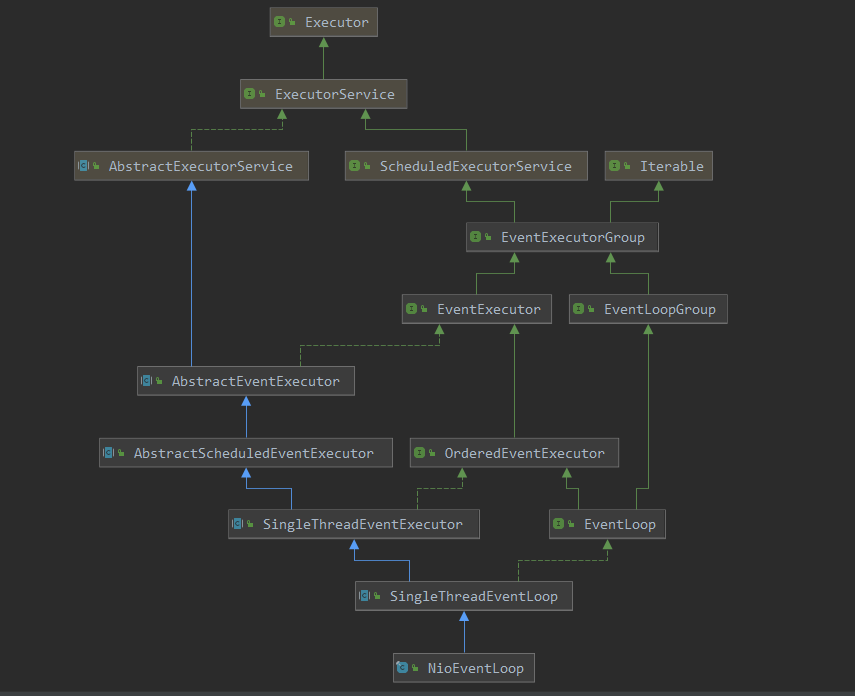

[TOC]

# NioEventLoop 启动

经过上篇，ServerBootstrap端口绑定好了，开始等待客户端的连接；那么有一个问题：就算客户端连接，也需要有一个线程来对selector的read  write  conenct 等事件进行处理才可以的，具体的处理是在哪里进行的呢？

本篇咱们就带着这个问题来进行分析。

首先，经过前面的分析，已经可以了解到具体的处理类应该是 NioEventLoop，而且此时一个线程池，虽然可以暂定是此类进行处理，那么何时开始进行处理的呢？

回顾一下此类的类图:



回顾了类图，再看一下 NioEventLoop，其中有一个run方法，从其 实现来看就是对selector的操作，那什么时候开始执行了此方法呢？

在server端口绑定时有一个函数:

> io.netty.bootstrap.AbstractBootstrap#doBind0

```java
private static void doBind0(
    final ChannelFuture regFuture, final Channel channel,
    final SocketAddress localAddress, final ChannelPromise promise) {
    // 在这里向 eventLoop中添加一个任务,变相的启动了NioEventLoop
    channel.eventLoop().execute(new Runnable() {
        @Override
        public void run() {
            if (regFuture.isSuccess()) {
                // 注册到selector成功了, 则进行端口的绑定
                channel.bind(localAddress, promise).addListener(ChannelFutureListener.CLOSE_ON_FAILURE);
            } else {
                promise.setFailure(regFuture.cause());
            }
        }
    });
}
```


经过分析，其启动的方法如下：

> io.netty.util.concurrent.SingleThreadEventExecutor#execute

```java
// 当向 NioEventLoop添加任务时,就会启动具体的操作进行
@Override
public void execute(Runnable task) {
    ObjectUtil.checkNotNull(task, "task");
    execute(task, !(task instanceof LazyRunnable) && wakesUpForTask(task));
}
```

> io.netty.util.concurrent.SingleThreadEventExecutor#execute

```java
// 执行任务
private void execute(Runnable task, boolean immediate) {
    boolean inEventLoop = inEventLoop();
    // 添加任务到队列中
    addTask(task);
    if (!inEventLoop) {
        startThread();  // 如果是server,这里就会启动接收的处理
        // 如果是client,这里就会启动具体的read/write请求
        if (isShutdown()) { // 如果线程池已经关系,则移除此添加的任务
            boolean reject = false;
            try {
                if (removeTask(task)) {
                    reject = true;
                }
            } catch (UnsupportedOperationException e) {
            }
            if (reject) {
                reject();
            }
        }
    }
    // wakeup 就是添加一个空任务到 任务列表中
    if (!addTaskWakesUp && immediate) {
        wakeup(inEventLoop);
    }
}
```

> io.netty.util.concurrent.SingleThreadEventExecutor#startThread

```java
// 启动当前的NioEventLoop 对selector 事件的处理
private void startThread() {
    if (state == ST_NOT_STARTED) {
        if (STATE_UPDATER.compareAndSet(this, ST_NOT_STARTED, ST_STARTED)) {
            boolean success = false;
            try {
                doStartThread();
                success = true;
            } finally { // 如果没有启动成功,则再次把状态更新为 ST_NOT_STARTED
                if (!success) {
                    STATE_UPDATER.compareAndSet(this, ST_STARTED, ST_NOT_STARTED);
                }
            }
        }
    }
}
```

> io.netty.util.concurrent.SingleThreadEventExecutor#doStartThread

```java
// 真正启动的操作
private void doStartThread() {
    assert thread == null;
    executor.execute(new Runnable() {
        @Override
        public void run() {
            thread = Thread.currentThread();
            if (interrupted) {
                thread.interrupt();
            }

            boolean success = false;
            updateLastExecutionTime();
            try {
                // 运行具体的处理任务
                // 此run方法在 NioEventLoop中重写
                SingleThreadEventExecutor.this.run();
                success = true;
            } catch (Throwable t) {
                logger.warn("Unexpected exception from an event executor: ", t);
            } finally {
                for (;;) {
                    int oldState = state;
                    if (oldState >= ST_SHUTTING_DOWN || STATE_UPDATER.compareAndSet(
                        SingleThreadEventExecutor.this, oldState, ST_SHUTTING_DOWN)) {
                        break;
                    }
                }

                // Check if confirmShutdown() was called at the end of the loop.
                if (success && gracefulShutdownStartTime == 0) {
                    if (logger.isErrorEnabled()) {
                        logger.error("Buggy " + EventExecutor.class.getSimpleName() + " implementation; " + SingleThreadEventExecutor.class.getSimpleName() + ".confirmShutdown() must " + "be called before run() implementation terminates.");
                    }
                }
                try {
                    for (;;) {
                        if (confirmShutdown()) {
                            break;
                        }
                    }
                    for (;;) {
                        int oldState = state;
                        if (oldState >= ST_SHUTDOWN || STATE_UPDATER.compareAndSet(
                            SingleThreadEventExecutor.this, oldState, ST_SHUTDOWN)) {
                            break;
                        }
                    }
                    confirmShutdown();
                } finally {
                    try {
                        cleanup();
                    } finally {
                        FastThreadLocal.removeAll();
                        STATE_UPDATER.set(SingleThreadEventExecutor.this, ST_TERMINATED);
                        threadLock.countDown();
                        int numUserTasks = drainTasks();
                        if (numUserTasks > 0 && logger.isWarnEnabled()) {
                            logger.warn("An event executor terminated with " +
                                   "non-empty task queue (" + numUserTasks + ')');
                        }
                        terminationFuture.setSuccess(null);
                    }
                }
            }
        }
    });
}
```

> io.netty.channel.nio.NioEventLoop#run

```java
/**
     * todo  重要 重要
     * 此函数就是具体工作的入口点
     * 如果是 boss呢, 此函数就是处理 刚accept上的socket,并把其注册到  worker上 进行具体的读写操作
     * 如果是worker呢, 此函数就是处理 从boss注册到此上的socket的具体的读写事件
     * 1. 先看一下 boss的处理逻辑
     * 2. 再看一下worker的处理逻辑
     */
@Override
protected void run() {
    int selectCnt = 0;
    for (;;) {
        try {
            int strategy;
            try {
                /**
                     * 此处的策略选择:
                     * 1. 有任务,则执行一次 selectNow()
                     * 2. 没有任务则返回 select策略
                     */
       strategy = selectStrategy.calculateStrategy(selectNowSupplier, hasTasks());
                switch (strategy) {
                    case SelectStrategy.CONTINUE:
                        continue;

                    case SelectStrategy.BUSY_WAIT:
                    case SelectStrategy.SELECT:
                        long curDeadlineNanos = nextScheduledTaskDeadlineNanos();
                        if (curDeadlineNanos == -1L) {
                            curDeadlineNanos = NONE; // nothing on the calendar
                        }
                        nextWakeupNanos.set(curDeadlineNanos);
                        try {
                            if (!hasTasks()) {
                                strategy = select(curDeadlineNanos);
                            }
                        } finally {
                            nextWakeupNanos.lazySet(AWAKE);
                        }
                        // fall through
                    default:
                }
            } catch (IOException e) {
                rebuildSelector0();
                selectCnt = 0;
                handleLoopException(e);
                continue;
            }
            // 增加select 次数
            selectCnt++;
            cancelledKeys = 0;
            needsToSelectAgain = false;
            final int ioRatio = this.ioRatio;
            boolean ranTasks;
            if (ioRatio == 100) {
                try {
                    if (strategy > 0) {
                        // 处理select 事件
                        processSelectedKeys();
                    }
                } finally {
                    // Ensure we always run tasks.
                    // 处理taskQueue 以及 scheduledTaskQueue 中的任务
                    ranTasks = runAllTasks();
                }
            } else if (strategy > 0) {
                final long ioStartTime = System.nanoTime();
                try {
                    processSelectedKeys();
                } finally {
                    // Ensure we always run tasks.
                    final long ioTime = System.nanoTime() - ioStartTime;
                    ranTasks = runAllTasks(ioTime * (100 - ioRatio) / ioRatio);
                }
            } else {
                ranTasks = runAllTasks(0); // This will run the minimum number of tasks
            }
            if (ranTasks || strategy > 0) {
                if (selectCnt > MIN_PREMATURE_SELECTOR_RETURNS && logger.isDebugEnabled()) {
                    logger.debug("Selector.select() returned prematurely {} times in a row for Selector {}.",selectCnt - 1, selector);
                }
                selectCnt = 0;
            } else if (unexpectedSelectorWakeup(selectCnt)) { // Unexpected wakeup (unusual case)
                selectCnt = 0;
            }
        } catch (CancelledKeyException e) {
            // Harmless exception - log anyway
            if (logger.isDebugEnabled()) {
                logger.debug(CancelledKeyException.class.getSimpleName() + " raised by a Selector {} - JDK bug?", selector, e);
            }
        } catch (Throwable t) {
            handleLoopException(t);
        }
        // Always handle shutdown even if the loop processing threw an exception.
        try {
            if (isShuttingDown()) {
                closeAll();
                if (confirmShutdown()) {
                    return;
                }
            }
        } catch (Throwable t) {
            handleLoopException(t);
        }
    }
}
```

可以看到此run方法是一个for的死循环，在持续进行selector的事件的处理；换句话说也就是NioEventLoop到此就启动起来了。

下篇继续介绍socket的具体接入方式。