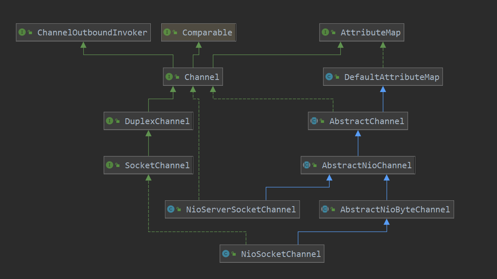
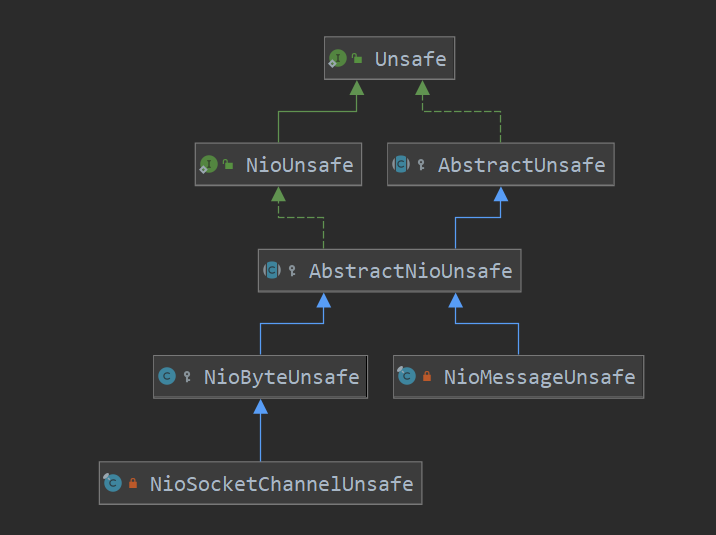

[TOC]

# NioSocketChannel 的初始化

此处说一下此 NioSocketChannel的初始化，此类和NioServerSocketChannel的初始化有很大的相同的，不过有一个特别需要注意的地方是 操作此NioSocketChannel的 unsafe类和 NioServerSocketChannel的是不相同的。

类图：



> io.netty.channel.socket.nio.NioSocketChannel#NioSocketChannel

```java
private static final SelectorProvider DEFAULT_SELECTOR_PROVIDER = SelectorProvider.provider();
public NioSocketChannel() {
    this(DEFAULT_SELECTOR_PROVIDER);
}

public NioSocketChannel(SelectorProvider provider) {
    this(newSocket(provider));
}

public NioSocketChannel(SocketChannel socket) {
    this(null, socket);
}

public NioSocketChannel(Channel parent, SocketChannel socket) {
    super(parent, socket);
    config = new NioSocketChannelConfig(this, socket.socket());
}
```

> io.netty.channel.nio.AbstractNioByteChannel#AbstractNioByteChannel

```java
protected AbstractNioByteChannel(Channel parent, SelectableChannel ch) {
    super(parent, ch, SelectionKey.OP_READ);
}
```

> io.netty.channel.nio.AbstractNioChannel#AbstractNioChannel

```java
protected AbstractNioChannel(Channel parent, SelectableChannel ch, int readInterestOp) {
    super(parent);
    // 也可以看到 javaChannel方法 返回的就是jdk底层创建的ServerSocketChannelImpl
    this.ch = ch;
    // 记录感兴趣的事件
    this.readInterestOp = readInterestOp;
    try {
        // 把创建的NioServerSocket设置为非阻塞
        ch.configureBlocking(false);
    } catch (IOException e) {
        try {
            ch.close();
        } catch (IOException e2) {
            logger.warn("Failed to close a partially initialized socket.", e2);
        }
        throw new ChannelException("Failed to enter non-blocking mode.", e);
    }
}
```

> io.netty.channel.AbstractChannel#AbstractChannel(io.netty.channel.Channel)

```java
protected AbstractChannel(Channel parent) {
    // 记录此 NioServerSocketChannel 对应的parent,默认是null
    this.parent = parent;
    id = newId();
    // buffer的操作函数实例
    // 当实例化 NioServerSocketChannel时,此处是AbstractNioMessageChannel类 (看类图)
    // 当实例化 NioSocketChannel时, 次数时AbstractNioByteChannel(看类图)
    // 看一下这里创建 unsafe的操作
    unsafe = newUnsafe();
    // 为socketChannel创建pipeline
    // 为此channel创建handler调用链
    // 也就是当selector接收到socket或者 读写数据时,会挨个调用此 pipeline中的handler进行处理
    pipeline = newChannelPipeline();
}
```

> io.netty.channel.socket.nio.NioSocketChannel#newUnsafe

```java
protected AbstractNioUnsafe newUnsafe() {
    return new NioSocketChannelUnsafe();
}
```

```java
private final class NioSocketChannelUnsafe extends NioByteUnsafe {
    @Override
    protected Executor prepareToClose() {
        try {
            if (javaChannel().isOpen() && config().getSoLinger() > 0) {
                doDeregister();
                return GlobalEventExecutor.INSTANCE;
            }
        } catch (Throwable ignore) {
        }
        return null;
    }
}
```

channel操作类的类图：



需要特别注意的就是对于NioSocketChannel的操作 Unsafe和 NioServerSocketChannel的是不一样的，在这里说此类的初始化，就是为后面的channel读写做一下铺垫。


