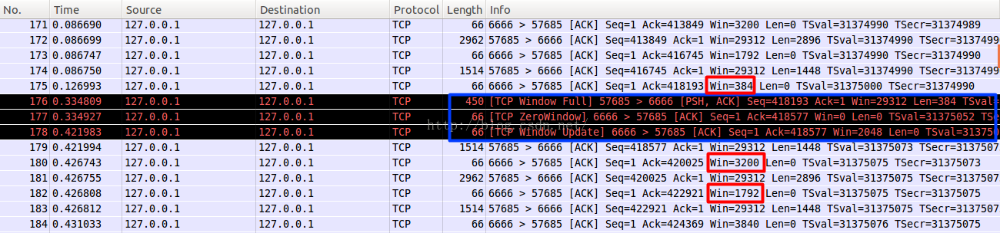

# TCP 三次握手

为什么需要三次握手?

TCP作为一个可靠传输, 其基于seq(序列号) 实现了数据有序, 重传, 滑动窗口等功能.  而seq是一个0-2^32-1 的序列号,  而client端  和 server端都有一个自己的 开始seq, 那三次握手就是同步 client和server端的seq号, 并记录下来, 用于下面的数据传输使用.

其中`seq`是client和server端随机生成的,  `ACK`表示希望对端下次传输的开始seq号. 

`有序性:` 举一个例子说明有序性:

1. client端发送packet  1,2,3,4,5 共五个包到server端
2. server先接收到了1,2,5包, 那么会把1,2,5缓存到buffer中, 并留出3,4包的位置
3. 如果超时3,4包也没有发送过来,那么 tcp会响应接收到了1,2包,  并把5包drop掉
4. 下次client端从3包开始发送

## TCP 握手

###  1.正常三次握手

```shell
     TCP A                                                TCP B

  1.  CLOSED                                               LISTEN

  2.  SYN-SENT    --> <SEQ=100><CTL=SYN>               --> SYN-RECEIVED

  3.  ESTABLISHED <-- <SEQ=300><ACK=101><CTL=SYN,ACK>  <-- SYN-RECEIVED

  4.  ESTABLISHED --> <SEQ=101><ACK=301><CTL=ACK>       --> ESTABLISHED

  5.  ESTABLISHED --> <SEQ=101><ACK=301><CTL=ACK><DATA> --> ESTABLISHED

          Basic 3-Way Handshake for Connection Synchronization
```


### 2. 同时打开连接时的握手

```shell
     TCP A                                            TCP B

  1.  CLOSED                                           CLOSED

  2.  SYN-SENT     --> <SEQ=100><CTL=SYN>              ...

  3.  SYN-RECEIVED <-- <SEQ=300><CTL=SYN>              <-- SYN-SENT

  4.               ... <SEQ=100><CTL=SYN>              --> SYN-RECEIVED

  5.  SYN-RECEIVED --> <SEQ=100><ACK=301><CTL=SYN,ACK> ...

  6.  ESTABLISHED  <-- <SEQ=300><ACK=101><CTL=SYN,ACK> <-- SYN-RECEIVED

  7.               ... <SEQ=101><ACK=301><CTL=ACK>     --> ESTABLISHED

                Simultaneous Connection Synchronization
```


### 3. recovery from old  duplicate SYN

```shell
      TCP A                                                TCP B

  1.  CLOSED                                               LISTEN

  2.  SYN-SENT    --> <SEQ=100><CTL=SYN>               ...

  3.  (duplicate) ... <SEQ=90><CTL=SYN>               --> SYN-RECEIVED

  4.  SYN-SENT    <-- <SEQ=300><ACK=91><CTL=SYN,ACK>  <-- SYN-RECEIVED

  5.  SYN-SENT    --> <SEQ=91><CTL=RST>               --> LISTEN

  6.              ... <SEQ=100><CTL=SYN>               --> SYN-RECEIVED

  7.  SYN-SENT    <-- <SEQ=400><ACK=101><CTL=SYN,ACK>  <-- SYN-RECEIVED

  8.  ESTABLISHED --> <SEQ=101><ACK=401><CTL=ACK>      --> ESTABLISHED

                    Recovery from Old Duplicate SYN
```

1. 从line2 和 3 可以看到 TCP A 发送两次SYN同步
2. TCP B 先接收到了 SEQ=90的(line3). 此时TCP B 并不能识别这是 Old Duplicate SYN, 所以其正常响应了数据给TCP A (LINE 4)
3. LINE 5, TCP A 接收到LINE 4 的响应后, 发现ACK 响应中的 sequence number不对, 故其发送了 RST 包, TCP B 接收到 RST后, `返回了LISTEN状态, 即 准备接收下次连接`
4. LINE 6, TCP B 接收到了 SEQ=100的连接

之后就是正常的TCP 三次握手了


### 4.Half-Open 连接

```shell
      TCP A                                           TCP B

  1.  (CRASH)                               (send 300,receive 100)

  2.  CLOSED                                           ESTABLISHED

  3.  SYN-SENT --> <SEQ=400><CTL=SYN>              --> (??)

  4.  (!!)     <-- <SEQ=300><ACK=100><CTL=ACK>     <-- ESTABLISHED

  5.  SYN-SENT --> <SEQ=100><CTL=RST>              --> (Abort!!)

  6.  SYN-SENT                                         CLOSED

  7.  SYN-SENT --> <SEQ=400><CTL=SYN>              -->

                     Half-Open Connection Discovery
```

1. 从 LINE 1 2 可以看到TCP A 由于某些原因crash了, 状态转换为了CLOSED; 由于TCP A crash时并没有正常通知TCP B, 导致 TCP B 仍然认为和TCP A的连接是正常的
2. LINE 3 , TCP A 恢复后, 发送SYN 到TCP B
3. LINE 4 ,  TCP B 响应了其希望接收的数据的sequence number
4. LINE 5, TCP A 发现LINE 4 接收的ACK  sequence number不对, 响应了一个 RST 包到B
5. LINE 7 ,  TCP A 再次发送正常的 三次握手信息


### 5. Half Open 

```shell
        TCP A                                              TCP B

  1.  (CRASH)                                   (send 300,receive 100)

  2.  (??)    <-- <SEQ=300><ACK=100><DATA=10><CTL=ACK> <-- ESTABLISHED

  3.          --> <SEQ=100><CTL=RST>                   --> (ABORT!!)

           Active Side Causes Half-Open Connection Discovery
```

1. TCP A  意外CRASH了, 并且没有正常通知 TCP B , 导致TCP B 认为此连接还是正常的
2. LINE 2, TPC B 发送数据到 TCP A
3. TCP A 已经是closed状态了, 响应一个 RST 告诉TCP B 此连接abort 此connection


### 6. 被动连接

```shell
      TCP A                                         TCP B

  1.  LISTEN                                        LISTEN

  2.       ... <SEQ=Z><CTL=SYN>                -->  SYN-RECEIVED

  3.  (??) <-- <SEQ=X><ACK=Z+1><CTL=SYN,ACK>   <--  SYN-RECEIVED

  4.       --> <SEQ=Z+1><CTL=RST>              -->  (return to LISTEN!)

  5.  LISTEN                                        LISTEN

       Old Duplicate SYN Initiates a Reset on two Passive Sockets
```

1. LINE 1, TCP A  和  TCP B 都监听在某个地址, 等待其他的连接
2. LINE 2 3 ,一个 Old Duplicate SYN  被TCP B 接收, 并且 TCP B 对其进行了处理, 并响应
3. LINE 4 , TCP A 接收到了一些不可接收的ACK 消息, 响应了RST 到 B
4. LINE 5,  TCP B 接收到 RST后, 正常处理, 并转换到 LISTEN 状态 , 继续等待其他连接


### 7. 发送RST(reset)情况

1. 如果连接不存在(closed), 那么会发送reset响应到任何其他非reset的任何传入 segment.

   ```shell
   If the incoming segment has an ACK field, the reset takes its sequence number from the ACK field of the segment, otherwise the reset has sequence number zero and the ACK field is set to the sum of the sequence number and segment length of the incoming segment.
   The connection remains in the CLOSED state.
   # 权限相关的也会引起发送ACK
   ```

2. ```shell
   	# 如果连接在非同步状态(LISTEN,SYN-SENT,SYN-RECEIVED)并且接收到的segment 的ack还没有发送(segment携带了不可接收的ack), 或则 segment 拥有不同的 security level, reset包会发送
      	If the connection is in any non-synchronized state (LISTEN,
       SYN-SENT, SYN-RECEIVED), and the incoming segment acknowledges
       something not yet sent (the segment carries an unacceptable ACK), or
       if an incoming segment has a security level or compartment which
       does not exactly match the level and compartment requested for the
       connection, a reset is sent.
      
       If our SYN has not been acknowledged and the precedence level of the
       incoming segment is higher than the precedence level requested then
       either raise the local precedence level (if allowed by the user and
       the system) or send a reset; or if the precedence level of the
       incoming segment is lower than the precedence level requested then
       continue as if the precedence matched exactly (if the remote TCP
       cannot raise the precedence level to match ours this will be
       detected in the next segment it sends, and the connection will be
       terminated then).  If our SYN has been acknowledged (perhaps in this
       incoming segment) the precedence level of the incoming segment must
       match the local precedence level exactly, if it does not a reset
       must be sent.
      	# 如果发送过来的额segment有ACK 字段,那么reset包使用其sequence number, 否则reset包设置其sequence number为0, ACK 字段为 sum of the sequence number and segment length
       If the incoming segment has an ACK field, the reset takes its
       sequence number from the ACK field of the segment, otherwise the
       reset has sequence number zero and the ACK field is set to the sum
       of the sequence number and segment length of the incoming segment.
       The connection remains in the same state.
      
    
   ```

3. ```shell
       # 如果连接在同步状态(ESTABLISHED,FIN-WAIT-1, FIN-WAIT-2, CLOSE-WAIT, CLOSING, LAST-ACK, TIME-WAIT),任何非可接收的segment(超出window sequence number 或者 不是可接收的 ack number), 会发送一个空的 ACK 包, 其包含了当前的 send-sequence number, 并且ACK 字段暗示了下次期望接收到的 sequence number.
       If the connection is in a synchronized state (ESTABLISHED,
       FIN-WAIT-1, FIN-WAIT-2, CLOSE-WAIT, CLOSING, LAST-ACK, TIME-WAIT),
       any unacceptable segment (out of window sequence number or
       unacceptible acknowledgment number) must elicit only an empty
       acknowledgment segment containing the current send-sequence number
       and an acknowledgment indicating the next sequence number expected
       to be received, and the connection remains in the same state.
   
       If an incoming segment has a security level, or compartment, or
       precedence which does not exactly match the level, and compartment,
       and precedence requested for the connection,a reset is sent and
       connection goes to the CLOSED state.  The reset takes its sequence
       number from the ACK field of the incoming segment.
   ```

   ## sliding window
   
   

其中6666端口为server端, 57685为client端

1. 175包, server响应client  win=384, 并且ACK=418193
2. 176包, client发送消息, 序列号 seq=418193, len=384,  此处的数据长度就是server端的win大小
3. 177包, server响应client端, 当前的win=0, 即目前server端的buffer已经满了, 不能再接收数据了; 其响应的ACK=418577,  418577-418193=384, 表示对接收到的数据的一个响应
4. 178包, server响应client端, 告知其目前的win=2048, ACK=418577, 表示告诉client端server的buffer目前有空间了, 你可以继续发送消息了, `此消息没有占用seq号`
5. 179包, client发送消息到server, 数据长度为 len=1448,  seq=418577
6. 180包, server响应ACK=418577+1448=420025, win=3200;  可以看到本次ACK表示的计算为`上次SQE+LEN`

`TCP利用sliding window来控制client的数据发送, 也避免了server端的 buffer溢出.`


